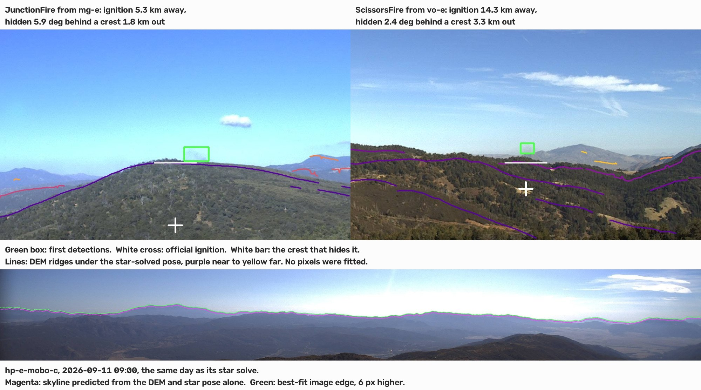

# Working notes

Running state of the investigation. Findings that shape the design, and open questions
that could still move the numbers.

## Pipeline state

`ingest.py` -> `fires.py` -> `truth.py` -> `resolve.py` -> `detect_yolo.py` -> `viz.py`

| Quantity | Value |
|---|---|
| Archives / sequences | 189 / **191** (two archives carry two annotation passes and are split) |
| Frames | 14,827 (7,316 pre-ignition, usable as negatives) |
| Sequences with camera pose | 167 / 191 |
| Distinct fires after t0 clustering | **69** (from only 48 event labels) |
| Triangulable (>=2 posed sites) | 42, stable at 42/42/44 for 900/1800/3600 s thresholds |
| Fires with usable ground truth | **33** (10 name-confirmed, 23 probable) |
| **Ground truth AND triangulable** | **26** <- the geolocation scoring set |

## Findings

**FIgLib event labels are not fires.** An unnamed `..._FIRE` label covers every unnamed
fire the network saw that date. `20180603_FIRE` is three ignitions: three cameras at
20:20-20:22 UTC, two at 23:09, one at 01:24 next morning. Clustering on the per-camera
plume clock at 1800 s recovers real fires; grouping by name overcounts multi-camera
coverage and misattributes ground truth.

**Official discovery coincides with plume appearance.** Across the 33 resolved fires,
`FireDiscoveryDateTime` minus annotated plume appearance has median **+1.0 min**
(IQR -4.2 to +9.1); on the 10 name-confirmed alone, median -0.6 min. Humans reported 7
of those 10 *before* the plume was annotated as visible.

*Consequence:* "minutes of warning gained over official reporting" is not a claim this
data supports. What it does support is stronger, because it is measured rather than
assumed: the FIgLib clock is a **validated proxy for when a human knew**, so alerting
N minutes before t0 is N minutes of real warning. The WFIGS join is the evidence for
the metric, not the metric itself.

**Camera pose can be checked without a detector.** A fixed camera sees a 90 deg wedge,
so an incident outside it cannot be the fire. That filter cut 151 candidates to 87 and
discarded none of the ten name-confirmed truths.

**Plumes are visible from cameras that cannot see their source.** Validating pose against
name-confirmed truth, 35 of 40 camera-fire pairs put the official coordinate inside the
field of view. The five that miss are physical, not erroneous: at `20260629_JunctionFire`,
`vo-w` holds the fire at +35.9 deg while `vo-n` at the same site is 54 deg off axis. The
annotator saw smoke in both because the plume drifted into a frame whose wedge never
contained its origin. This is the same displacement that makes plume-axis correction
necessary, and it is why the visibility filter carries a margin.

**Three independent estimates agree.** On the Valley fire, pose plus the WFIGS coordinate
put the smoke at x=0.636 across `pi-w-mobo-c`; the detector, from pixels alone, fires at
0.63 with confidence 0.759.

**Confidence does not separate cloud from plume; bearing does.** On the 8-acre Junction
fire, `mg-e-mobo-c` returns **0.81 on a cumulus** -- more confident than most true
detections. No threshold removes it. It sits ~0.2 of a frame from where the other cameras
agree the fire is, so geometric consistency does -- which suggested triangulation is a
false-alarm filter and not only a locator. **Measured, that does not hold** (see the
sweep below): geometry removes that particular cumulus, but across the corpus simply
raising the threshold buys more per false alarm than requiring cross-site agreement
does. The anecdote was real and the generalisation from it was wrong.

**The training-free differencer does not work yet.** On the Valley fire it fails to
separate pre-ignition from post (max 202.7 vs 189.0). Absolute rather than signed
difference, a 20-minute background lag, and a rootedness term measuring descent below the
terrain silhouette each helped; none sufficed. Cumulus drifting along the skyline changes
as much as the plume does. Camera jitter was ruled out by phase correlation (max 0.21 px
over a whole sequence). Kept as the uncontaminated floor, and the difficulty is itself
the argument for a learned detector.

## Geolocation results (2026-09-09, full detection pass, 189/189 sequences)

Likelihood field over the ground, bearings from the most confident detection per camera.

| Set | n | median error | max | <=1 km | <=2 km | <=5 km |
|---|---|---|---|---|---|---|
| all scoring fires | 26 | 2.58 km | 62.10 | 6 | 12 | 19 |
| **confirmed tier** | 10 | **1.90 km** | **3.61 km** | | | |
| probable tier | 16 | 4.37 km | 62.10 km | | | |

Best: `20240701_Kitchenfire` at **0.08 km** from the official ignition point, four sites.
Every confirmed-tier fire lands within 3.61 km; the probable tier carries the whole tail.

**The tier split is the finding.** Geometry is not the limiting factor when the ground
truth is right. Where probable-tier fires fail they fail in a specific shape -- bearings
agreeing among themselves to within a few km2 while sitting 20-60 km from the assigned
incident -- `20191006_FIRE` is 27.9 km out with a 2.7 km2 95% region. Independent cameras
do not agree by accident, so **error much larger than sqrt(area95) indicts the ground
truth, not the geometry**. **Geolocation error is therefore an audit of the weaker resolution tier**,
and the 23 probable fires should be re-examined against it rather than trusted.

**Uncertainty earns its place.** On `20200813_Ranch2Fire` the three cameras are nearly
collinear with the fire, so the surface is a long ridge with a 27.8 km2 95% region. The
point estimate is 2.10 km out, but the truth lies well inside the contour. A crossing
point would report only the 2.10 km and hide the fact that the geometry never supported
better.

**Wind correction is a wash.** Taking the upwind box edge rather than the center moves
the median from 2.58 to 2.55 km, better on 10 fires and worse on 11. Preferring early
detections, which have drifted less, is worse (3.68 km).
Reported as measured. The likely reason looked like the box being a crude stand-in for the
plume base -- so a mask should give the real axis. Tested 2026-09-10 and it does not: see
"Segmentation and per-plume wind fits" below. No mask-derived bearing beats the box edge.

## Does the estimate evolve? (2026-09-09)

Yes, and not in the direction expected. Locating the fire from every detection up to time
`t` after the plume appeared:

| since plume | fires locatable | median error | p75 | median area95 |
|---|---|---|---|---|
| 180 s | 17/26 | 4.73 km | 8.20 | 3.5 km2 |
| 360 s | 24/26 | 2.88 km | 7.98 | 4.0 km2 |
| 600 s | 25/26 | 2.79 km | 4.76 | 3.7 km2 |
| **900 s** | 25/26 | **2.26 km** | 4.76 | 3.7 km2 |
| 1800 s | **26/26** | 2.26 km | 6.00 | 3.7 km2 |
| 2400 s | 26/26 | 2.58 km | 6.00 | 3.7 km2 |

Confirmed tier alone: 2.91 km at three minutes from 7 of 10 fires, 1.90 km at fifteen
minutes from all ten.

**Accuracy improves rather than decaying, then plateaus.** Waiting buys coverage and
precision up to about fifteen minutes and nothing after; the slight worsening by forty
minutes is the plume growing away from its source. So the operational tradeoff is
coverage against latency, not accuracy against latency -- at three minutes two thirds of
fires are locatable at 4.7 km, by fifteen minutes nearly all of them at 2.3 km.

**Uncertainty does not tighten.** area95 sits near 3.7 km2 throughout. Extra cameras
arrive roughly as fast as the region would otherwise shrink.

**The estimate wanders, and neither wind nor geometry explains where.** Holding the
camera set fixed across windows -- necessary, since a camera joining the solution can
move it kilometers on its own -- the estimate still moves a median 1.79 km. The angle
between that motion and the wind direction has median 45.9 deg, and against the major
axis of its own uncertainty ellipse 41.4 deg. Both are indistinguishable from random
(n=11). The motion is the detector's box wandering over a growing diffuse plume, not
advection, which is why correcting bearings with wind was a wash.

## Accumulating evidence rather than picking the best detection (2026-09-09)

Taking each camera's single most confident detection discards nearly everything seen, and
in particular discards the *agreement* between a faint early detection and a solid later
one at the same bearing -- which is the part that says the bearing is real rather than a
passing cloud.

Summing log-likelihoods over all detections is not the fix either: one confident false
positive at the wrong bearing then contributes an unbounded penalty and drags the peak.
These detectors do produce those (0.81 on a cumulus). So each detection is a mixture,

    P(detection | fire at x) = pi * Normal(bearing | bearing_to_x, sigma)
                             + (1 - pi) * Uniform(field of view)

with `pi` rising with confidence. Agreement contributes evidence; disagreement falls back
on the uniform term and its influence is **bounded** -- an outlier stops mattering instead
of dominating. Frames are not independent, so per-camera evidence is scaled to grow as
n**alpha rather than n; alpha was swept, and between 0 and 0.75 it barely matters
(2.28 km throughout), with full summation at alpha=1 measurably worse (2.75 km).

**The gain is concentrated early, exactly where evidence is weakest.**

| since plume | max-confidence | accumulated |
|---|---|---|
| **3 min** | 17/26 fires, 4.73 km | **21/26 fires, 3.93 km** |
| 6 min | 24/26, 2.88 km | 25/26, 3.33 km |
| 15 min | 25/26, 2.26 km | 25/26, 3.09 km |
| 40 min | 26/26, 2.58 km | 26/26, 2.28 km |

Four more fires locatable at three minutes and 17% lower median error there. Mid-window
it is slightly worse, which is consistent with weak detections adding noise once strong
ones exist. Raising the confidence floor trades exactly that way -- floor 0.10 gives
21 fires at three minutes, 0.20 gives 19, 0.30 gives 15, while mid-window median improves
from 3.09 to 2.41 km. No single setting wins everywhere; a low floor is right because the
operational question is how fast a fire can be located, not how well it can be located
once it is obvious.

## Animations (2026-09-09)

`python -m src.figlib.animate <fire_id>` writes an mp4 to `out/videos/`: camera frames
with detection boxes on the left, the accumulated posterior with bearings and the
estimate's track on the right, error-vs-time underneath. Five rendered so far.

Worth watching for: on the Kitchen fire a **second bright intersection** appears early,
a spurious crossing of two false-positive rays, and is extinguished as further evidence
accumulates -- the robust mixture visibly outvoting an outlier. On Ranch2 the posterior
is a long ellipse throughout and the truth sits inside it while the point estimate is
~1.8 km out.

Two bugs the animation exposed, both of which had been silently degrading results:

* **Grid centered on the camera centroid.** Ranch2 has sites 78 and 81 km from the fire,
  so a 35 km window about their centroid did not contain the true peak at all and argmax
  returned an edge cell -- reported as a 19 km error that was pure artifact. Fixed with a
  coarse pass followed by a fine grid about its peak. The correct answer is 1.88 km.
* **Camera selection ignored sites.** Ranking by detection count picked four cameras from
  one site on the Club fire, two of them the same camera twice (that archive holds two
  annotation passes), leaving one site and nothing to triangulate. Now takes the best
  camera per site before a second from any site.

## Seconds-to-alert vs false alarms per camera-day (2026-09-09)

`python -m src.figlib.falsealarm` -> `out/falsealarm.json`, `out/figures/falsealarm.png`.

The operational question is not mAP. A network of 505 cameras asks "is anything burning"
1,440 times per camera per day, so the only number that means anything is **how fast a
real ignition is called at a false-alarm rate an operator can live with**. FIgLib is
well suited to measuring it, because the ~40 min of pre-ignition frames in every sequence
are negatives from the *same camera under the same light* -- the same haze, cumulus and
glint the positives sit in, not unrelated images.

Frames within 120 s of annotated plume appearance are discarded rather than counted as
negatives: the annotation is a human judgement, so the minute before it is genuinely
ambiguous, and scoring a detection there as a false alarm would flatter latency at the
expense of the rate. Repeat alarms within 600 s are one alarm, since an operator
dismisses an alarm once.

**Single camera, one frame over threshold** (189 sequences, 4.99 camera-days of negatives):

| tau | FA/camera-day | fires alerted | median s | p75 |
|---|---|---|---|---|
| 0.25 | 25.8 | 98% | 180 | 360 |
| 0.40 | 8.0 | 94% | 240 | 540 |
| 0.50 | 3.6 | 90% | 360 | 734 |
| 0.60 | 1.6 | 76% | 540 | 840 |
| 0.70 | 0.40 | 59% | 660 | 1080 |

**The gap between what this detector does and what a network needs is three orders of
magnitude.** At tau=0.25 -- an unremarkable default -- 25.8 false alarms per camera-day
is **13,000 alerts a day** across 505 cameras. One false alarm per camera-week, which is
roughly what a human dispatcher could absorb, is 0.14/camera-day; the detector reaches
that only past tau=0.7, where it misses 41% of fires and takes 11 minutes on the rest.
Nothing here is a knock on pyronear -- it is what per-frame operation costs at scale, and
it is the argument for spending the effort on temporal and cross-camera structure rather
than on another point of AP.

**Persistence is cheap and it works.** Requiring 2 of the last 3 frames over threshold
cuts the rate by about half at a matched threshold (8.0 -> 4.2 FA/camera-day at tau=0.40)
and by about a quarter at matched *recall*, which is the fair comparison: at ~91% recall,
5.6 FA/camera-day single-frame against 4.2 for 2-of-3, for one extra minute of latency
(300 s -> 360 s). 3-of-5 goes further and costs more; the frontier is smooth, so the choice is
genuinely an operator's to make. Isolated frame-scale flicker dominates the negatives.

**Cross-site agreement does NOT beat thresholding -- the negative result.** Scored on the
42 triangulable fires with the same cameras and the same negative time, requiring two
sites to detect within 180 s with bearings passing within 3 km of each other halves the
false-alarm rate at fixed threshold. But so does raising the threshold, and more cheaply:
the any-camera curve dominates the cross-site curve at every operating point measured.

| budget | any camera | two sites agree |
|---|---|---|
| ~1.35 FA/cam-day | 98% alerted, 301 s | 90% alerted, 270 s |
| ~0.81 FA/cam-day | ~92% alerted, ~426 s (interp.) | 88% alerted, **240 s** |
| ~0.54 FA/cam-day | 88% alerted, 480 s | 83% alerted, 480 s |

Two structural costs explain it: 2 of the 42 fires never produce a cross-site coincidence
at any threshold, capping recall at 95%, and a second site adds observation time to the
denominator as well as a constraint. What survives is narrower and worth stating as such
-- **geometry buys latency, not recall.** Because agreement carries the evidence, the
detector can be run at tau=0.45 instead of 0.7, and a low threshold is a fast one: at a
matched 0.81 FA/camera-day the cross-site rule alerts at a median 240 s against roughly
426 s. That is the honest version of the Junction-cumulus anecdote.

**The corpus cannot resolve the region that matters, and that is itself the finding.**
Forty minutes of negatives per sequence is 4.99 camera-days in total (3.71 for the
triangulable subset). Rates below ~1 FA/camera-day therefore rest on between zero and
three events; the tail of every curve is one alarm wide, and the Poisson upper bound at
zero observed alarms is still 0.74/camera-day. **A rate of one false alarm per camera-week
cannot be measured on FIgLib at all** -- it would need on the order of a hundred
camera-days of negatives, which is exactly the unglamorous data a fielded network already
has and a public benchmark does not. `fa_hi95` is carried in the JSON for every row so
the bare ratios are never read as more than they are.

Caveat on extrapolation: FIgLib negatives are daytime, drawn from the hour before a real
ignition, so they oversample fire weather and undersample night -- optimistic in one
direction and pessimistic in the other. The 1,440 frames/camera-day figure assumes the
60 s cadence holds around the clock.

## Edge deployment: Apple M3, measured (2026-09-09)

**Full write-up: [`docs/edge-m3.md`](docs/edge-m3.md)** (committed, with the figure, so a
README can link it -- unlike everything under `out/`). Summary below.

`src/figlib/detect_coreml.py`, `bench_edge.py`, `power.py`, `quantization.py`.
Figure `out/figures/edge_m3.png`; raw in `out/bench_latency.json`,
`out/bench_thermal_fp16_ane.json`, `out/quantization.json`.

The M3 MacBook Air is a defensible stand-in for a fielded camera in the ways that matter:
real ARM64, a real NPU, per-unit wattage from `powermetrics`, and -- being fanless -- a
genuine sustained-throughput curve rather than a burst number. Fielded fire cameras sit in
sealed enclosures on mountaintops; a laptop that cannot dump heat is closer to that than
any rented GPU. Host: M3, 8 GB, macOS 15.6, AC power, Low Power Mode off, batch 1.

`detect_coreml` is a drop-in for `detect_yolo` -- same letterbox, same NMS, same JSON --
so bearings, the likelihood field, evidence accumulation and the false-alarm sweep all run
against Core ML detections unchanged. Core ML FP32 reproduces the ONNX detections
**exactly** on a sampled sequence (14/14 boxes, zero delta at stored precision), so the
export contributes no error of its own.

**A requested compute unit is only a request.** This is the result that justified the
exercise, and it is invisible without instrumentation:

| variant | ANE ops | GPU | CPU | ask for ANE -> | ms | ANE mW |
|---|---|---|---|---|---|---|
| FP32 | **0** | 241 | 0 | lands on **CPU** | 97.3 | **0** |
| FP16 | 226 | 2 | 15 | ANE | **11.0** | 4857 |
| INT8-weight | 226 | 2 | 15 | ANE | 10.4 | 4978 |

The Neural Engine cannot run FP32. Ask for `CPU_AND_NE` with an FP32 model and every
operation lands on the CPU at 97 ms a frame, drawing zero ANE power, and **Core ML reports
no error and returns correct results throughout**. Two independent instruments agree --
`MLComputePlan` op placement and the ANE wattage rail. A benchmark that ran FP32
and called the result "ANE performance" would be 9x wrong and would never find out.

**Latency and energy, model-only, batch 1:**

| placement | FP16 ms | fps | frames/joule |
|---|---|---|---|
| CPU | 48.6 | 20.6 | 2.3 |
| GPU | 24.0 | 41.6 | 5.6 |
| **ANE** | **11.0** | **91.0** | **12.0** |

Total draw barely moves across all of these (7.0-9.6 W); what changes is work done per
watt. **13.3 frames/joule on the ANE against 2.3 on the CPU** -- 5.8x -- and for a
solar-powered enclosure that ratio is the design constraint, not latency.

**Weight-only INT8 buys size, not speed -- confirmed rather than cited.** Identical op
placement, 10.4 ms against 11.0, 12.8 frames/joule against 12.0: all inside the noise.
Through the M3 generation the ANE does weight-only INT8; full INT8 activation compute
arrives with A17 Pro / M4. The measured win is **9.3 MB against 18.2 MB** of model. On an
A17 Pro the same export should show a real speedup, and that is a prediction this rig
cannot test.

**Preprocessing becomes the bottleneck once the model leaves the CPU.** End-to-end is
20.2 ms against 11.0 ms model-only, so JPEG decode plus letterbox costs ~9.2 ms -- about
45% of the frame budget. (Corrected 2026-09-14: this first said ~9.4 ms and 47%, which took
the end-to-end time from the "all units" row, 20.4 ms, against ANE-only model time.) Move inference to the NPU and the next thing to optimize is
image handling, which no model-only benchmark would ever reveal.

*Capacity, since the false-alarm sweep showed alert latency is partly sampling-bound:* 49
fps end-to-end means one M3 could serve roughly **49 cameras at 1 fps** at about 7.4 W, or
one camera at 1 fps for a small fraction of a watt. Running at video rate is affordable at
the edge in a way that streaming frames to a datacenter is not.

**Fanless sustained throughput: -9.8% over twenty minutes, as a step rather than a decay.**

| minutes | fps | ANE W | total W | thermal pressure |
|---|---|---|---|---|
| 0-3 | 94.0 | 5.13 | 7.86 | Nominal -> Moderate |
| 3-6 | 94.3 | 5.16 | 7.72 | -> **Heavy** |
| 6-10 | 90.2 | 4.79 | 7.34 | Heavy |
| 10-13 | 87.1 | 4.68 | 7.29 | Heavy |
| 13-16 | 85.9 | 4.54 | 7.08 | Heavy |
| 16-20 | 85.2 | 4.36 | 6.88 | Heavy |

Throughput holds at 94 fps for about eight minutes, steps down roughly 10%, and stays
there. Two things worth noticing. **Thermal pressure reads Heavy at ~4 minutes, four
minutes before throughput moves** -- a three-minute burst benchmark would have reported 94
fps and missed the effect entirely, which is why every condition here runs for a fixed
duration rather than a fixed iteration count. And **throttling costs throughput but not
efficiency**: frames/joule goes 12.0 -> 12.4 as fps falls 94 -> 85, because the part holds
its thermal ceiling by dropping clocks and power together. For a battery- or
solar-constrained enclosure that is the benign form of throttling -- you lose frame rate,
not energy per frame.

## What did quantization cost? In kilometers and seconds (2026-09-09)

"INT8 lost 0.4 mAP" tells an operator nothing. Every variant was therefore run through the
same pipeline over the same 93 sequences -- the FP32 reference restricted to that identical
set, since comparing a subset against a full-corpus baseline would confound quantization
with the choice of fires.

| variant | 3 min: n, median | 40 min: n, median | <=2 km | FA/cam-day @0.25 | recall | median s |
|---|---|---|---|---|---|---|
| FP32 | 21/26, 3.93 km | 26/26, 2.28 km | 12 | 25.9 | 0.979 | 240 |
| FP16 | 21/26, 4.01 km | 26/26, **2.28 km** | 12 | 25.9 | 0.979 | 240 |
| INT8w | 21/26, **3.57 km** | 26/26, 2.67 km | 13 | 24.7 | 0.979 | 180 |

**FP16 is free.** Identical median error, identical recall, identical false-alarm rate,
half the model. There is no argument for shipping FP32 to this hardware -- it is slower,
less accurate per watt, and cannot even reach the NPU.

**INT8-weight was expected to cost false alarms, and did not.** On a 72-frame sample it
invented 17 detections and shifted confidences by up to 0.39, so the hypothesis was that
its price would show up in the alarm rate. Measured across all 93 sequences that is wrong,
and the confidence histogram says why:

| tau | FP32 | FP16 | INT8w |
|---|---|---|---|
| 0.05 | 8731 | 8741 | 10698 (+22%) |
| 0.25 | 3436 | 3413 | 3975 (+16%) |
| 0.50 | 1594 | 1598 | 1719 (+8%) |
| **0.70** | **603** | **603** | **603** |

The extra detections are **low-confidence and they thin out with threshold, reaching
exactly parity at 0.7**. Quantization noise perturbs marginal detections and leaves
confident ones untouched, so nothing that would ever raise an alarm changes.

What those extra weak detections do change is early localisation, and they *help*:
**3.57 km against 3.93 km at three minutes, with 9 fires inside 2 km against 6.** That is
the robust mixture doing its job -- disagreement falls back on the uniform term and is
bounded, so extra noisy bearings cost little while extra true ones accumulate. It is worth
being honest that this is a small sample and the 40-minute figure moves the other way
(2.67 vs 2.28 km); the defensible claim is that weight-only INT8 is not measurably worse
where it matters operationally, not that it is better.

*Throughput note:* the 93-sequence pass takes **182 s on the ANE** against roughly 90
minutes for the same work on four x86 cores.

## Terrain-refined pose: a four-fold better fit that made everything worse (2026-09-09)

`src/figlib/calibrate.py`, `pose_validate.py`, `viz_terrain.py`.
Figure `docs/figures/pose_fit.png`; raw in `out/terrain_audit.json`, `out/pose_fit.json`,
`out/pose_fit_staged.json`, `out/pose_geo_compare.json`.

**First: the earlier claim was wrong.** "Camera pose validated against a DEM-synthesised
skyline to within 13 px" came from **one** camera, computed ad hoc, and `viz_terrain.py`
had no `main()` so it could not even be re-run. Made reproducible and swept over all 71
posed cameras:

| | |
|---|---|
| cameras with usable sky | 61 (the 10 monochrome units fail by construction -- the sky test is blue dominance) |
| median absolute residual | **106 px** |
| p90 / max | 223 px / 674 px |
| within 20 px | **6 of 61** |

The 13 px camera was the best in the set.

**The obvious next step, and why it failed.** Fit four parameters per camera against the
observed skyline -- azimuth, pitch, roll, and one radial distortion coefficient -- under a
Huber loss with multi-start. Skyline MAD improved **106 -> 24 px**, four-fold.

Then the held-out test: re-run geolocation against WFIGS coordinates, which the fit never
saw (it only ever looked at ridgelines in pre-ignition frames).

| | median error | <=2 km | |
|---|---|---|---|
| published pose | 2.16 km | 12/26 | |
| **terrain-refined** | **3.38 km** | **6/26** | worse on 17 of 26 |

**The surface metric improved four-fold while the metric that matters got 56% worse.**
Held-out evaluation is the only reason this was caught; on the fitted objective it looked
like a triumph.

**The diagnosis is quantitative.** Perturbing each parameter by one degree and measuring
the loss response:

| parameter | delta loss per degree |
|---|---|
| azimuth | ~0.5 |
| pitch | ~50 |

**An 80:1 ratio.** A ridgeline is nearly horizontal, so sliding it sideways barely changes
it -- azimuth is close to unidentifiable from dense skyline matching. Given free rein the
optimizer spent azimuth on noise: **24 of 61 cameras pegged at the +-6 deg azimuth bound
and 34 of 61 at the k1 bound.** Parameters at their bounds are the tell.

**Second attempt: separate the identifiable from the not.** Azimuth information lives in
*distinctive* ridgeline features, not in the skyline's overall height, so fit shape
(pitch/roll/k1) first with azimuth pinned, then estimate azimuth alone by correlating
skyline gradients, and accept it only where the correlation actually picks a shift out.

Estimates immediately became plausible -- **median +0.40 deg, sd 2.01 deg, centered on
zero** rather than +-6 deg. But the correlation is weak: **azimuth is identifiable on 1 of
61 cameras**, and that one wants 0.30 deg. Applying the staged fit (azimuth pinned, k1
applied, since distortion *does* feed bearings through `undistort_x`) is a wash: median
2.16 -> 2.28 km, better on 7 fires and worse on 9.

A real bug surfaced while chasing this: the gradients were being taken at sigma = 9 px,
which is skyline-extraction jitter rather than terrain. On `vo-n` the predicted and
observed **rows** correlated at 0.910 while their **gradients** correlated at 0.011.
At sigma = 101 px it reaches 0.24 -- still under the gate, but the fix was real and the
symptom was diagnostic.

**What this actually establishes**, which is more useful than the refinement would have
been:

* **The published azimuths hold up.** An independent, feature-based estimate proposes
  corrections centered on zero with sd 2.01 deg -- comparable to the 2 deg sigma already
  assumed per bearing. This is the pose parameter that reaches a bearing, and it is fine.
* **The published pitch often does not hold up, and it does not matter.** A 106 px vertical
  residual is a pitch/elevation error, and pitch does not enter a bearing at all. That
  reconciles the two facts that looked contradictory: badly misaligned skylines alongside
  1.90 km geolocation on the confirmed tier.
* **Terrain is an audit instrument, not a correction.** It catches bad pitch and elevation
  metadata, and it can say when azimuth is unconstrained. It cannot improve azimuth here.

**Deliberately not done:** the fitted poses are kept in `out/` rather than beside the
published metadata, because they are not an improvement and should not be mistaken for one.

### The audit number is an upper bound, not a measurement (corrected 2026-09-09)

Looking at the rendered overlays (`python -m src.figlib.fig_peaks png` regenerates them
into `out/terrain_png/`, sorted by residual; `docs/figures/dem_skyline_peaks_examples.png` is six
spanning the range, and is committed) undermines part of the audit
above. On the two *worst* cameras -- `sm-n` at -614 px and `bh-n` at -674 px -- the orange
predicted skyline traces the distant crest about right and its summits land on visible
peaks. It is the **blue observed skyline that is wrong**, locked onto a nearer ridge, a
haze band, or in `bh-n` the roof of the building the camera sits on.

The signed statistics say the same thing: **median -93 px, and predicted sits above
observed on 48 of 61 cameras.** A one-sided bias in exactly the direction a nearer,
lower ridge would produce. Within-frame scatter (median IQR 61 px) is large too, which is
not what a rigid pose error looks like -- a pose error offsets the whole curve.

So **106 px conflates pose error with skyline-extraction error and is an upper bound on
the former.** It cannot be separated until the extractor is fixed. This also supplies a
second and probably more damning reason the pose fit failed: it was regressing onto a
target that is frequently not the skyline. Degeneracy in azimuth explains why the
optimizer *could* wander; an unreliable target explains why it was *rewarded* for it.

**`observed_skyline` is the weak link, and it is weak by construction.** It segments sky
by blue dominance and brightness. That fails on haze, on backlit scenes, on layered
ridges (it has no notion of *which* ridge is the skyline), and completely on the ten
monochrome units, where "blue dominant" is not expressible. Replacing it is the highest-
value next step in this thread -- see Open questions.

**Peaks are now selected by topographic prominence** (`terrain.prominent_peaks`) rather
than by local maximum. A smooth crest carries twenty local maxima that are a tenth of a
degree of noise apiece; prominence keeps the handful a person would point at, typically
1-6 per camera. This does not change any residual, but it makes the overlays legible and
it is a precondition for any real peak-to-peak matching. `bm-w` is instructive: exactly
**one** prominent peak in a 90 deg field, and a +1 px residual that means only "a flat
line matches a flat line" -- a good score carrying no azimuth information at all.

## There are no intrinsics, and the extrinsics are a nameplate (2026-09-09)

Worth stating plainly, because every pose result in this file rests on it. `cams.json`
carries eleven fields per camera. Counting how many are actually populated across all
505:

| field | populated | what it really is |
|---|---|---|
| `lat` / `lon` / `elev` / `agl` | 505 / 505 | surveyed, varied, credible |
| `az` | 505, but **482 are exactly 0/90/180/270** | the cardinal direction in the camera's own name |
| `fov` | 505, but **483 are exactly 90 or 60** | a spec-sheet number |
| `pitch` | **9 non-zero** | placeholder |
| `roll` | **14 non-zero** | placeholder |
| `yaw` | **3 non-zero** | placeholder |

So there is no focal length, no principal point, no distortion coefficients, no sensor
size -- and no measured orientation. `pitch`, `roll` and `yaw` exist as columns and are
literal `0.0` for 96%, 97% and 99% of cameras respectively. What the code has been
calling "published pose" is a position, a compass heading rounded to a quadrant, and a
lens model assumed to be the rectilinear ideal.

That is not a complaint about HPWREN -- the network was built to give people pictures,
not to be photogrammetry. But it does mean the pose numbers were never measurements to
begin with, and the honest framing of the earlier fit is not "the published pose is
wrong" but "there was nothing published to be wrong."

### Why the skyline could never have calibrated it

The failed four-parameter fit was diagnosed as an 80:1 conditioning problem between
azimuth and pitch. That was true but shallow. The real reason, measured:

| camera | skyline points | vertical spread | ridge points | vertical spread | gain |
|---|---|---|---|---|---|
| bh-n | 531 | 43 px | 2 397 | 226 px | 5.3x |
| sm-s | 531 | 42 px | 4 982 | 247 px | 5.8x |
| vo-n | 531 | 34 px | 1 879 | 137 px | 4.1x |
| stgo-e | 531 | 46 px | 5 985 | 442 px | 9.5x |
| wc-n | 531 | 43 px | 5 287 | 268 px | 6.3x |

**The skyline occupies 34-46 px of a 1536 px frame.** It is, to within a couple of
percent of frame height, a horizontal line. Fitting pitch, roll, focal length and radial
distortion to a horizontal line is degenerate no matter how good the extractor is: every
correspondence sits at essentially the same image row and the same range, so a pitch
error, a camera-height error and a focal-length error all produce very nearly the same
residual. No amount of care with the blue curve fixes that, which is why replacing the
extractor was the wrong first move.

The ridge field spans 137-442 px and 2-24 km. The vertical lever arm is 4-10x longer,
and -- more important -- correspondences now sit at *different ranges*, so a camera-height
error (which falls off with range) separates from a pitch error (which does not).

`docs/figures/dem_ridge_layers_examples.png` (`python -m src.figlib.fig_peaks ridges`)
renders the nested-layer structure this argument depends on, over these same five cameras
-- the companion to `docs/figures/dem_skyline_peaks_examples.png`'s single curve. Nothing
here has calibrated a pose against it; see "Monocular depth does not reach these ranges"
and the sections after it for why that never happened.

## Monocular depth does not reach these ranges (2026-09-09)

Tested, because layered ridges at different distances is exactly what a depth model
claims to give, and it would have replaced the whole skyline-extraction problem.

### The control that matters

The obvious test -- does predicted depth correlate with the DEM's range? -- is worthless
here, and finding that out was the useful part. Elevation angle already predicts range in
these scenes, so **image row alone scores Spearman +0.84 to +0.98** against DEM range.
Any monotone function of height passes. The test that means something is the **partial**
correlation with image row held fixed: within a horizontal band, do the pixels the DEM
calls distant look further than the ones it calls near? That is the only kind of range
information that can separate a near ridge from a far one at the same elevation angle.

| camera | row-only rho | dark-channel haze, partial | Depth Anything V2, partial |
|---|---|---|---|
| sm-s | +0.934 | -0.162 | +0.129 |
| sm-n | +0.984 | -0.120 | -0.195 |
| bh-n | +0.839 | +0.277 | +0.634 |
| stgo-e | +0.840 | -0.249 | -0.305 |
| wc-n | +0.973 | -0.072 | -0.061 |
| vo-n | +0.394 | -- | +0.296 |

### Dark channel prior: a confounded +0.83 that is really +0.00

He et al.'s transmission estimate is a physically motivated depth proxy -- Koschmieder
gives t = exp(-beta*d), so -log t is proportional to range, and haze is the cue a person
actually uses on these scenes. Raw correlation looked convincing at +0.48 to +0.89.
Controlled for row it collapses to between -0.25 and +0.28, mostly slightly negative. It
was measuring "higher in the frame is further", which the DEM already states exactly.

### Depth Anything V2: correct, and useless here

`onnx-community/depth-anything-v2-small`, run through the onnxruntime already in the
project -- no torch, 99 MB, ~900 ms/frame on four x86 cores. Partial correlation -0.31 to
+0.63, median near zero. Not better than the free physics baseline.

The depth map says why, and says it more clearly than the statistic. On `sm-s` the model
resolves the antenna masts, the equipment huts and the foreground scrub beautifully --
sharp, correctly ordered, genuinely impressive. **Everything past about a kilometer is one
saturated value, indistinguishable from the sky.** The entire ridge stack from 2 to 24 km
is flat. Its dynamic range is spent on the 0-100 m foreground, which is what MDE training
sets contain: NYU tops out around 10 m, KITTI around 80. Our shortest useful ridge is
twenty times KITTI's longest.

Metric models (Depth Pro, ZoeDepth) are worse candidates for the same reason: they emit
meters calibrated on scenes a thousand times closer. Video variants would fix flicker,
which is not the problem.

### The honest caveat

Pose is wrong, so the predicted ridge polylines do not land exactly on the ridges they
name, and both methods are being scored on partly mismatched pixels. The correlations are
a lower bound. But the saturation visible in the depth map is not a pose artifact, and no
correspondence fix recovers information the model never encoded.

### What this changes about the open question

The requirement was never metric depth -- the DEM already gives exact ranges. What is
missing is which *image* pixels belong to which layer, i.e. **ordinal layer segmentation**,
and a saturated depth map cannot supply an ordering it does not represent. Options that
remain: contrast/texture statistics computed *within* a band rather than across the frame,
so the row confound cannot leak in; or a segmentation model asked for boundaries rather
than depth. Either way the partial-correlation control above is the acceptance test, and
it is now written down.

## Classical edge detection: the same confound, and a flat alignment surface (2026-09-09)

Tried after the depth models failed, on the reasonable argument that a silhouette is an
edge and that edge *contrast* has a physical claim depth did not: airlight adds a constant
to both sides of a ridge line, so it cancels in the difference, while intrinsic contrast is
attenuated by exp(-beta*d). Edge magnitude should therefore fall off with range while being
immune to the additive haze offset.

Vertical Sobel on a horizontally smoothed gray image -- smoothing along rows because ridges
are near-horizontal, which lifts a long faint crest above noise while leaving masts and
poles unreinforced.

### Three tests, three negatives

**Does edge strength rank range?** No. Partial Spearman with image row held fixed:
-0.04 to +0.19 across six cameras. Same result as the dark channel and Depth Anything.

**Are edges even present at predicted crests?** The first measurement said yes -- median
gradient at predicted crest pixels was **1.7 to 3.6x** the column median. That figure is
wrong, and wrong in exactly the way this file had just finished warning about. Crests
concentrate in the middle rows where terrain texture lives, while a column median is
dragged down by flat sky. Against a **row-matched** control -- the same rows, random
columns -- the ratio is **0.76 to 1.09**. No better than chance, and below it on three
cameras.

| camera | vs column median | vs same-row random |
|---|---|---|
| sm-s | 2.04 | 0.76 |
| sm-n | 2.22 | 0.89 |
| bh-n | 1.89 | 0.77 |
| stgo-e | 3.56 | 1.09 |
| wc-n | 1.69 | 1.08 |
| vo-n | 2.31 | 1.07 |

**Does the whole stack align anywhere?** This is the only pose-robust test of the three,
and the one worth having run. Render every predicted ridge as a soft mask, correlate it
against the edge map by FFT, and look across every shift in +-400 px of pitch and +-260 px
of azimuth. If the layered structure is in the image, one shift should line the whole stack
up at once and stand clear of the rest.

It does not. Peak z is 1.3 to 2.0, and the peak stands clear of the best rival shift by
**0.01 to 0.08** -- a flat surface with no unique solution. Four of six pegged near the dy
search bound, which is the usual signature of no peak at all rather than a peak outside the
window.

### What this does and does not establish

It does not establish that ridges are invisible to classical CV. Two limitations are real.
The search was a **rigid translation**, but the actual pose error is pitch, roll, azimuth
and distortion together, which is not a pure shift -- a stack that would align under the
right four-parameter warp can look unalignable under two. And raw gradient magnitude is
dominated by terrain texture, roads and vegetation boundaries, which are as horizontal as
the ridges and far more numerous.

What it does establish is that **nothing tried so far -- learned depth, haze physics, or
edge magnitude -- carries range information once image row is controlled for.** Three
independent methods, one control, same answer. The next attempt should extract *long
coherent* structures rather than per-pixel response (dynamic programming along a path,
or matching the count and spacing of layer boundaries per column rather than pixel
overlap), and it must clear the row-matched control before anything else is claimed.

### Why none of it worked: the step is at the noise floor (2026-09-09)

The edge maps make the statistics unnecessary. On `sm-s` a bright continuous line marks the
near ridge on the left of frame, and the hazy right two-thirds -- where the layered ridges
actually are -- is a near-uniform wash with no gradient structure at all. The brightest
features in the whole image are the antenna masts.

Measured directly: the gray-level step across a predicted crest, smoothed along the ridge
only, against the standard deviation of a flat sky patch put through the same filter.

**Noise floor: 4.48 gray levels.**

| range | n | median step | p75 | below 2 levels |
|---|---|---|---|---|
| 2-4 km | 9 230 | 5.99 | 13.89 | 22% |
| 4-8 km | 6 548 | 6.70 | 13.64 | 19% |
| 8-15 km | 4 844 | 5.68 | 11.09 | 24% |
| 15-25 km | 1 152 | 4.49 | 9.88 | 28% |
| **25-45 km** | 611 | **1.52** | 2.74 | **62%** |
| 45-90 km | 120 | 3.95 | 4.79 | 22% |

A ridge step is about **6 gray levels against a 4.48-level floor -- SNR near 1.3** even in
the near field, and at 25-45 km it is 1.5 levels, three times *below* the floor, with 62%
of crests under two levels. The last row is 120 samples and should not be read as a
recovery; it is small-n, and those crests are mostly true skyline against bright sky.

That is the answer to why learned depth, haze inversion and edge magnitude all returned the
same nothing. It is not that the methods are unsuited. **Beyond roughly 20 km the ridge
step is not in the pixels** -- haze has taken it below what an 8-bit JPEG preserves. No
filter, classical or learned, recovers information that was destroyed before the file was
written.

Two caveats hold the claim honest. Pose error means these samples are taken slightly off
the true crests, which *understates* the step, so the numbers are a lower bound. And the
noise floor measured on sky includes JPEG blocking, which is the relevant floor for this
data but not a property of the scene.

What survives is narrow and worth keeping: the **outermost** silhouette does produce a
strong, clean, continuous edge, on every camera looked at. That is a much better skyline
extractor than `observed_skyline`'s blue-dominance heuristic, and it needs no model and no
sky segmentation. It just cannot deliver the *layers*, which was the thing wanted.

Diagnostic figures: `python -m src.figlib.fig_edges [cameras]` -> `out/edges/`.

## Segmentation and per-plume wind fits: measured, and none beat the box (2026-09-10)

`wind.py` corrects the downwind centroid bias by taking the box's upwind *edge*. That edge
is set by whichever plume pixel reaches furthest, which is almost always high in the column
where the smoke has drifted longest -- so it over-corrects in the axis the centroid
under-corrects. A pixel mask can do better in principle: the **foot** of the mask, the
lowest visible smoke, is the least-drifted part of the plume and the closest thing in the
image to the source. Two mask sources, both training-free so neither adds a FIgLib
contamination asterisk (`masks.py`): **diff**, the temporal-differencing mask `detect_diff`
already builds; **sam**, Segment Anything prompted with the pyronear box.

Five ways to turn a mask into a source column (`plumefit.py`), each scored as its own
geolocation variant against `upwind`, pairwise on the fires where both solved, split by
tier:

| variant | masks used | confirmed n=10 | probable n=16 | all n=26 (better/worse) |
|---|---|---|---|---|
| **upwind (box)** | -- | **1.86** | **3.81** | **2.53** |
| foot (diff) | 75/93 | 1.97 | 4.16 | 2.89  (11 / 12) |
| foot (sam) | 93/93 | 2.00 | 4.50 | 2.49  (9 / 13) |
| axis PCA (diff) | 33/93 | 1.86 | 4.07 | 2.85  (3 / 10) |
| axis PCA (sam) | 43/93 | 1.84 | 4.77 | 2.87  (6 / 10) |
| wedge apex (diff) | 25/93 | 2.25 | 3.81 | 2.75  (1 / 10) |
| wedge apex (sam) | 32/93 | 2.15 | 3.81 | 2.75  (2 / 12) |
| sequence apex (diff) | 60/93 | 1.90 | 6.61 | 3.09  (8 / 12) |
| sequence apex (sam) | 68/93 | 1.76 | 4.67 | 3.15  (6 / 13) |
| field log-lik curve (diff) | 68/93 | 2.83 | 5.34 | 3.52  (6 / 14) |
| field log-lik curve (sam) | 92/93 | 3.00 | 4.93 | 3.36  (8 / 17) |

**Not one variant wins.** The closest is `sequence apex (sam)` at 1.76 km on the confirmed
tier -- but 2 fires better, 5 worse, and it costs the probable tier badly. On the full 26
every variant is worse or within noise, and the more the method commits to the pixels the
worse it does: the `field` mode, which hands `geolocate.py` a whole log-likelihood curve
over direction instead of a bearing and a sigma, is the worst of all (2.53 -> 3.36).

The reason is visible in `out/masks/*.jpg` and measured in `plumefit.fit_report`. By the
time the detector is most confident the plume has flattened into a horizontal sheet:

- **the foot degenerates into the mask centroid.** The lowest fifth of a horizontal sheet
  is most of the sheet, so `foot_x` loses exactly the vertical selectivity it was for,
  with extra variance on top.
- **the cone fits refuse.** `wedge_fit` needs width to shrink downward and `axis_fit` needs
  a non-horizontal principal axis; a flattened sheet has neither, so they return `None` on
  60-75% of frames and the variant falls back to the box on most of its bearings. The few
  frames where they do fit are the early, still-vertical ones -- which is the argument for
  the sequence fit, and the sequence fit is the one that blows up the probable tier.
- **SAM's failure mode is worse than diff's.** SAM always returns *a* mask (93/93), but on a
  diffuse plume against haze it snaps to the ridgeline or fills the prompt box, so its extra
  coverage is extra noise, not extra signal.

This is the same shape as the terrain/depth/edge negatives: the information wanted is not in
the pixels at the range and JPEG quality this data has. The box edge is a crude estimator,
but it is crude in a bounded way, and nothing built here improves on it.

Kept opt-in, not deleted: `masks.build_all` builds the cache (~25 min on the GTX 1070,
hours on CPU), then `FIGLIB_VARIANTS=upwind,foot_diff,...` on `geolocate.py` re-scores the
comparison. `python -m src.figlib.plumefit [diff|sam]` prints why each fit refused.
Diagnostic stills: `python -m src.figlib.masks <fire_id>` -> `out/masks/`; mask video
`python -c "from src.figlib.masks import mask_video; mask_video('<fire_id>')"`.

## All of FIgLib, scored by what the detector cannot have seen (2026-09-12)

The published numbers come from 189 archives. The other 267 FIgLib archives were fetched
separately (`out/figlib_extra/tgz/`, not `fetch.sh`) and scored as their own corpus, to
answer two things the core corpus cannot: are the false-alarm and latency numbers inflated
by pyronear having trained on FIgLib, and does doubling the negatives resolve the rates that
matter?

### Provenance first

- `FIGLIB_CORPUS=core|extra|all` gives each corpus its own metadata and result directories;
  unset means core and the original paths. Re-running every core stage through the new code
  reproduced sequences, fires, truth, resolved, geolocation and falsealarm JSON **byte for
  byte**, and the 26 core scoring fires come out identical inside the all corpus.
- `data/meta/manifests/` hashes all 456 archives (32.8 GB); every local size matches the
  CDN's `Content-Length`. `data/meta/**/runs.jsonl` records commit, model pin, input manifest
  hashes, parameters and output hashes for every stage run.
- Contamination tier comes from the fire date (`corpus.contamination`): `possibly_seen` on or
  before pyronear's 2025-04-14 FIgLib snapshot, `likely_unseen` up to the model's 2026-05-25
  release, `unseen` after it.

### What the rest of FIgLib contained

- **Three unusable archives**, kept in the manifest with the reason: two empty placeholders
  (`20250123_GilmanFire_tdllns-mobo-c`, 150 B; `20260909_GettyFire_wilson-ws-mobo-c`, 258 B)
  and `20200831_FIRE_wc-n-mobo-c`, 180 frames named by epoch alone -- no plume clock.
- **Two names joined with a hyphen** (`20190814_FIRE-pi-s-mobo-c`,
  `20190825_FIRE-smer-tcs8-mobo-c`) that ingest had skipped as unsplittable.
- **A URL-encoded, wrong sign.** `20250801_BernardoFire_bl-n-mobo-c` and
  `20250804_CoolFire_bi-w-mobo-c` name pre-ignition frames `%%2B` -- epoch is t0 *minus* the
  offset. Detection crashed on both and ingest dropped the frames. Bernardo's are copies of
  its plainly named negatives; Cool's are its only 40 negatives. One shared parser
  (`ingest.resolve_frame_names`) now repairs the sign against t0 and drops exact repeats; on
  the other 454 archives it yields exactly the frames of both parsers it replaced.

Result: 456 sequences, 35,914 frames, 17,771 pre-ignition; 296 fires, 60 triangulable, 160
with confirmed or probable truth, **37 scoring** (26 core + 11 new).

### Seconds-to-alert by tier (single-frame rule)

| selection | sequences | negatives, camera-days | τ=0.4 FA/day (hi95) | recall | median s | τ=0.7 FA/day (hi95) | recall |
|---|---|---|---|---|---|---|---|
| core, published | 191 | 4.99 | 8.0 (10.9) | 94% | 240 | 0.40 (1.45) | 59% |
| all | 456 | 11.99 | 8.3 (10.1) | 92% | 250 | 0.75 (1.43) | 51% |
| possibly_seen | 391 | 10.18 | 8.5 (10.5) | 92% | 240 | 0.88 (1.68) | 51% |
| likely_unseen + unseen | 65 | 1.81 | 7.2 (12.3) | 95% | 276 | 0 (2.04) | 52% |
| unseen | 20 | 0.53 | 3.8 (13.7) | 95% | 421 | 0 (7.02) | 45% |

- **No sign that memorization inflated false alarms or recall.** The clean tiers sit inside
  the possibly-seen intervals at every threshold. That is a weak statement -- 1.81
  camera-days bounds τ=0.4 only to ≤12 per day -- but it is the first measurement on data the
  model cannot have trained on, and it points the right way.
- **Latency is about one frame slower on clean sequences** (276 s vs 240 s at τ=0.4; 239 vs
  180 at τ=0.25). Consistent with memorization helping on the faint early frames, or with
  these 65 simply being different fires; 65 sequences at a 60 s cadence cannot separate the
  two.
- **More negatives did not reach the target.** 11.99 camera-days put τ=0.7 at 0.75 per day
  with an upper bound of 1.43. One alarm per camera-week (0.14) is still not measurable on
  FIgLib; that needs the streaming negatives in `out/NOTES-hpwren-archive.md`.

### Geolocation by tier

36 of 37 scoring fires solve; confirmed median **2.00 km** (n=17; core 1.90, n=10). The eight
fires past the snapshot, center bearings:

| fire | tier | sites | error km | area95 km² |
|---|---|---|---|---|
| Steele | likely_unseen | 3 | 0.75 | 1.3 |
| Scissors | likely_unseen | 3 | 0.82 | 3.4 |
| Creelman | unseen | 3 | 1.77 | 7.2 |
| Club | likely_unseen | 2 | 2.00 | 0.2 |
| Posta | likely_unseen | 2 | 2.06 | 5.0 |
| Junction | unseen | 4 | 2.21 | 1.1 |
| Rainbow | unseen | 2 | 2.98 | 25.8 |
| Crosley | likely_unseen | 2 | **52.39** | 134.4 |

Seven of eight within 3 km, in line with the core confirmed tier -- as expected, since
geolocation tests geometry rather than detector generalization.

**Crosley is a static false positive winning best-confidence selection.** `mpo-w`'s most
confident box sits at x=0.148, y=0.521 at 0.70-0.71 in every post-ignition frame -- and was
detected 43 times *before* ignition. Its bearing is 78° from the official point, which lies
2° inside the camera's right edge; `hp-w`'s bearing is 4° from truth. With two sites there is
no third ray to outvote it. **The triangulation figure shows what it is: the white dome of
the Palomar Observatory** (`mpo` is Mount Palomar), in frame all day. The real plume is
probably among the nine lower-confidence boxes at x>0.85 (max 0.58). It is the Kitchen
fire's bird made permanent, and the rejection signal is already in the data: a detection at a
fixed pixel before ignition is scenery.

**`20200806_BorderFire` does not solve because the detector missed it**: highest
post-ignition confidence 0.17 on `om-e`, nothing on `lp-s`.

**Discovery lag grows with the sample.** Official discovery minus plume appearance over the
160 resolved fires: median **+4.5 min** (IQR +0.8 to +10.2), against +1.0 min on the core 33.
The README's statement -- median +1.0 min, and 7 of the 10 name-confirmed fires reported
before the plume was annotated visible -- is a core-corpus figure. Both samples include
probable-tier matches; it should be re-derived on the 160 before it is quoted again.

### Left as they were

`detect_diff` and `viz_terrain` still parse frame names themselves and only read core
archives; the mask variants (`FIGLIB_VARIANTS`) have caches for core fires only.

Reproduce, after placing the extra archives:

```sh
python -m src.figlib.provenance verify extra
FIGLIB_CORPUS=extra ./run_detect.sh               # ~100 min on 4 cores
python -m src.figlib.corpus link
for s in ingest fires truth resolve geolocate falsealarm; do FIGLIB_CORPUS=all python -m src.figlib.$s; done
FIGLIB_CORPUS=all FIGLIB_TIER=likely_unseen,unseen python -m src.figlib.falsealarm
```

## A second opinion on the ground truth (2026-09-15)

WFIGS is not the only agency record. CAL FIRE publishes its own per-year incident list,
unauthenticated, with coordinates, start time, acreage and a street location:

```
https://incidents.fire.ca.gov/umbraco/api/IncidentApi/List?inactive=true&year=YYYY
```

`src/figlib/calfire.py` joins it to the corpus the same way `truth.py` joins WFIGS -- a
bounding box around the posed cameras, a +/-6 h window around plume appearance -- and then
picks the best-ranked candidate whose *name* corresponds to the WFIGS name. The name is the
important detail: choosing the CAL FIRE record by proximity to our own estimate would make
the check circular, and the first version of this did exactly that by ranking on time alone,
which matched `CLUB` to the `Vail Fire` 55 km away and `CREELMAN` to `Rainbow 3` 47 km away.
Neither fire is in CAL FIRE's lists at all; a missing record is not a disagreement, and is
now excluded rather than scored.

**`20171010_FIRE` is a genuinely wrong record.** WFIGS gives PORTOLA as 33.300000,
-116.999722 in San Diego County -- 33 deg 18' 00", 116 deg 59' 59", rounded to the arcminute,
with null acreage, matched by elimination and not by name. CAL FIRE has the Portola Fire at
33.50488, -117.02132, Riverside County, "De Portola Road east of Pauba Road, Temecula",
23 acres, started 2017-10-10T21:57:00Z. The two records are 22.87 km apart. Our three
bearings land 1.02 km from CAL FIRE's point, inside the 8.5 km^2 credible region at 0.089 of
the peak posterior density; the WFIGS point falls outside that region entirely, at 0.0000.
The README's geolocation error for this fire drops from 23.63 km to 1.02 km against the
better record. Note that the *time* agreement is not independent evidence -- FIgLib's t0 comes from
the frame-name annotation, which its annotators plausibly took from the same incident
record. The spatial agreement is the evidence.

**It does not generalize, and the earlier framing was too strong.** The README used to argue
that error much larger than sqrt(area95) indicts the truth. Across 110 name-corresponding
pairs the two sources agree to a median of 0.65 km and within 1 km on 72 of them, so the
records are mostly fine. Four disagree by more than 5 km (PORTOLA 22.87, MONTEZUMA 9.32,
DEHESA 8 7.21, CRUCES 6.76) and only PORTOLA has a solve to arbitrate it. The counterexample
that matters is `20171207_FIRE.2` -> LIBERTY: the two sources agree to 1.71 km and the
estimate is still 62 km out, because `smer-tcs8` and `bh-n` are 13 deg apart and the 155 km^2
posterior is a long ridge, not a blob. The ratio only indicts the record when area95 is
small. `20180504_FIRE` -> TORNADO is the other honest miss: the sources are 4.05 km apart
and CAL FIRE is the *worse* of the two (1.71 km -> 5.11 km).

**Coverage is the main limit.** CAL FIRE lists only incidents it reports on, so federal-only
fires, Camp Pendleton, Orange County Fire Authority and anything in Mexico are absent: 117 of
296 fires in the `all` corpus have no candidate at all, and 31 more matched something with
no corresponding name. This is a second opinion on the fires it covers, not a replacement
truth, and nothing in the pipeline has been re-pointed at it -- `truth.json` still drives
every published number.

Reproduce:

```sh
python -m src.figlib.calfire                      # core
FIGLIB_CORPUS=all python -m src.figlib.calfire    # all 296
```

## Cameras FIgLib didn't annotate, from the CDN (2026-09-21)

A FIgLib archive holds the cameras someone annotated. For a fire inside the CDN's ~90-day
public window, the other cameras can still be fetched. `src/figlib/recent.py` (corpus
`recent`) fetches them over FIgLib's ±40 min window, runs the same detector, and scores each
fire three ways: from its FIgLib cameras alone, with every extra camera, and from every
subset of sites. Fires and truth come from `all`, so no published number moves.

**Candidates.** For each 2026 fire: fixed color Mobotix cameras not in the archive, within
45 km, with the fire inside the field of view (published azimuth plus any star d_az), and
where a plume needs to rise 200 m or less to clear the DEM. Ten fires had live candidates,
97 camera/fire pairs in all. Getty (LA) had none on the CDN: dwpgm-e and 69bravo-e return
403. Mission (06-18) had fully expired by 09-21 and Bernardo (06-22) was expiring
camera by camera, so the window is about 90 days to the day. Pulled so far: **Bernardo**
(10 cameras; smarpk-s, mg-w and sm-n had already expired) and **Junction** (6 cameras), 1,281
frames, 624 MB. bl-n is an old 2048×1536 unit.

**Star poses for the new cameras.** Night blocks 2026-09-19 and -20 Q1, 15 cameras
without a solve. The grid solver found 7. `solve_wide` (the pole method) added bm-e, bm-w
and mpo-s's second night, under the Big Black Mountain lens again (k 0.771–0.775). Seven
cameras agree across the two nights to 0.08° or better: bh-e −1.88/−1.90, bi-e
−0.90/−0.88, bi-s −0.66/−0.72, mpo-e −0.02/+0.01, mpo-s +0.03/+0.06, bm-e +4.75/+4.83,
bm-w +1.29/+1.30. ch-e (+0.85, 12 stars) and sojr-s (−1.39, 8 stars, 2.89 px) solved on
one night only. No solve: bl-n (25–36k point sources a frame: not a star field), ch-s,
rdd-s and wc-w (0–4 moving tracks; low cloud?), rdd-e (272 tracks, no convergence, pole
lens 0.64 is implausible), wlfd-s (7 stars). These went into `out/recent/pose_ledger.json`,
the tracked ledger plus 16 entries. `data/meta/pose_ledger.json` is untouched.

**The fisheye lens holds on cameras it was never fitted to.** Two cameras at one site
see a fire near their shared frame edge, so their bearings should agree. Under the
rectilinear lens they miss in opposite directions. Under the star-measured fisheye they
agree, with no pose correction and no reference to truth:

| pair | x | rectilinear | fisheye |
|---|---|---|---|
| rdd-e / rdd-s (Bernardo) | 0.898 / 0.055 | 128.52 / 138.35° | 132.22 / 132.23° |
| ch-e / ch-s (Bernardo) | 0.860 / 0.024 | 125.74 / 136.41° | 127.83 / 128.37° |
| mpo-e / mpo-s (Junction) | 0.958 / 0.114 | 132.48 / 142.36° | 139.38 / 139.22° |

**Scores, center bearing, km to the WFIGS point:**

| fire | FIgLib only | + extra, published | + fisheye | + star poses |
|---|---|---|---|---|
| Bernardo | one site, no solve | 1.19 (8 sites) | 1.19 | **0.63** |
| Junction | 2.21 / 1.97 / 3.06 | 2.90 (8 sites) | 2.89 | 3.54 |

(Junction's FIgLib-only column is published / fisheye / fisheye+ledger. The 2.21 matches
`out/all/geolocation.json`.)

**Fewer sites.** Median error over every subset of k sites, fisheye + star poses:

| k | 2 | 3 | 4 | 5 | 6 | 7 | 8 |
|---|---|---|---|---|---|---|---|
| Bernardo | 1.98 | 1.64 | 1.24 | 0.92 | 0.83 | 0.86 | 0.63 |
| Junction | 3.16 | 3.11 | 3.65 | 3.92 | 3.75 | 3.62 | 3.54 |

- **Bernardo is what extra sites are for.** A single-site fire becomes a 0.63 km solve, and
  error falls roughly monotonically with k. Star poses help: bh-s −2.71 → +0.21°, bi-s
  +0.67 → 0.00°, ch-e −1.58 → −0.73°.
- **Junction is detection selection, not geometry.** Six bearings form a consistent group
  after calibration: bm-e, hp-s, bi-s, mpo-e, mpo-s, sojr-s, all −3.4 to −1.3° except bm-e
  (see the lens note below). Six others are the wrong object: vo-n (the known cumulus),
  mg-e (the known 0.81 cloud), vo-w and hp-e (edge-clipped at x 0.94–0.95), bh-e (−70°,
  at +2132 s), and bi-e (−12°). More sites bring more of both, so the median by k is flat.
  This needs the bounded-influence mixture in `accumulate`, not more cameras.
- **Where calibration made things worse, it was the lens, not the pose.** `geom`'s fisheye
  uses the shared 0.886 lens for every camera, but bm-* solve at 0.775. At x ≈ 0.3 that
  is ~3° of bearing, which accounts for most of bm-w's +4.90 and bm-e's +4.78. Applying
  the ledger's per-camera k_ratio to bearings would fix it (and affects the core corpus too).
- wc-w (Bernardo's only FIgLib camera) misses by −9.9° and has no star pose; bl-n +6.4°.

Reproduce (the fetch needs the frames to still be inside the CDN window):

```sh
python -m src.figlib.recent fetch 20260622_BernardoFire rdd-e-mobo-c rdd-s-mobo-c ...
python -m src.figlib.recent detect
python -m src.figlib.recent score
FIGLIB_LENS=fisheye python -m src.figlib.recent score
FIGLIB_LENS=fisheye FIGLIB_POSE_LEDGER=1 FIGLIB_POSE_LEDGER_PATH=out/recent/pose_ledger.json \
  python -m src.figlib.recent score
```

Next deadlines: Thorn ~10-13, Creelman and Rainbow ~10-20.

## Open questions

**Lens distortion and pose -- settled 2026-09-09, and not the way it first looked.**
See "Terrain-refined pose" below. Short version: the published *azimuths* hold up, which
is the only part of the pose that reaches a bearing; the published pitch does not, and
does not matter; and no distortion coefficient recoverable from terrain improves
geolocation. Kilometer errors are no longer provisional on this.

**Sun/tower calibration reopens the azimuth question (2026-09-12).** The 2026-09-09
verdict above was "azimuth held up" -- but that meant *terrain couldn't move it*, not that
it was measured correct. Sun geometry is a much better-conditioned target (a point, not a
nearly-flat ridge): scanning every frame with the sun plausibly in view and matching a
saturated disk to its ephemeris position (`out/sky/sun_calibrate.py`) gets a clean fit on
10 of 24 cameras checked, several needing several degrees of azimuth correction. One
complication surfaced immediately -- azimuth and the model's single radial-distortion term
(k1) are entangled in a sun-only fit: on `rm-s-mobo-c`, d_az swings from -0.35 deg to
-4.10 deg depending on how far k1 is allowed to float, same data, same camera. A rigid
tower leg near the frame edge, treated as a plumb line (`out/sky/tower_distortion.py`),
measures k1 independent of any assumed pose -- straight-line residual drops from 2.0px to
0.9px at k1=-0.54 -- and fixing k1 there before fitting the sun gives d_az=-1.87 deg, the
principled middle ground. Only one camera has a tower this clean; most of the mountaintop
sites have nothing rigid in frame to check against, and a building-roofline edge tried at
`tdlln-s-mobo-c` sits at too large a radius for the one-term model to fit at all (best-fit
k1 ran to the search boundary and made things worse). None of this has been run through
`geolocate.py` yet, and it stays out of `cams.json` regardless -- see the pose-candidates
sketch below.

**Star-based calibration: a real fisheye model, a working matcher, and a still-open
correspondence problem (2026-09-13).** Follow-on from the sun/tower work above, prompted by
night-sky frames already sitting in `out/sky/` (star or moon imagery, `night_*.jpg`). Plan and
status, so this survives a compaction:

*Why stars, and why they broke the existing projection model.* A star field gives many known
points spanning a wide angle in one exposure (vs. the sun's one point per frame), with trivial
ephemeris (sidereal time, no solar approximation). But projecting a confirmed-visible star
(Orion, alt 52-62 deg, well inside a camera's nominal 90 deg horizontal FOV) through
`terrain.project()` put it 1000+ px above the top of a 2048px frame. Not a bug: `project()` is
rectilinear (tan-based), and these lenses are not -- confirmed independently by the Mobotix
lens-table cross-reference below. `out/sky/fisheye.py` replaces it with an equidistant model
(`r = k*theta` from boresight, not `tan(theta)`) for this work; `project_fisheye()` mirrors
`project()`'s signature so the two are interchangeable. Ruled out directly: forcing the
*existing* rectilinear model to explain Orion via free pitch alone gives 293px RMSE on a fit
that the equidistant model gets to 61px on the same points -- these lenses are genuinely not
rectilinear at these angles, it is not just uncorrected tilt.

*Mobotix lens identification (independent confirmation, no distortion curve available).*
Cross-referencing every camera's published `cams.json` fov against Mobotix's real lens table
(B016/B036/B041/B061/B079/B119/B237/B500) matches 498/505 cameras (98.6%) to an exact nameplate
horizontal FOV -- strong evidence `fov` is real hardware data, not a placeholder, and that 7
cameras are a literal B016 fisheye (upgrading the earlier "fisheye" claim from vignette-shape
inference to a spec-sheet fact). But Mobotix publishes no distortion curve or angle-vs-height
grid publicly (checked: their planning-tool page is a coverage-distance calculator per DIN EN
50132-7, not an optics spec sheet), and even their own headline H x V numbers disagree between
document revisions (90x67 vs. 95x50 for the B041, depending on which lens-table PDF and which
sensor aspect ratio) -- so there is no vendor ground truth to drop in; the k_scale/k1 degeneracy
has to be resolved algorithmically, not from a datasheet.

*Single-frame identification works for "which constellation," not for "which star is which
pixel."* `out/sky/star_geometry.py` holds a real catalog now (HYG database via
github.com/kiloquad/__HYG-Database, mag <= 4.0, 523 stars, replacing an earlier hardcoded
13-star list) and `visible_stars()` computes what should be in frame for any camera/time.
`out/sky/star_match.py` identifies asterisms with no constellation named in advance, via
triangle geometric hashing (scale-invariant side-length ratios, standard "lost in space"
star-tracker technique): correctly found Orion's members for `hp-s-mobo-c`/`rm-s-mobo-c` and,
unprompted, the Scorpius/Sagittarius region for `bh-s-mobo-c` -- the same region found by eye
earlier, recovered with no hint. Two real bugs surfaced and are fixed (documented in the code):
the shape descriptor is reflection-invariant, so it initially returned a mirrored labeling; and
Orion's own outer quadrilateral is symmetric enough under swapping Betelgeuse<->Bellatrix (with
Rigel<->Saiph) that shape plus winding-order still couldn't break the tie, needing a real
magnitude-vs-detected-amplitude check (only trusted when the catalog gap exceeds 0.5 mag, since
finer gaps don't survive detection noise). Even with both fixes, exact per-star pixel labeling
in a crowded field (several genuine similarly-bright neighbors -- Sirius, Adhara, Wezen, Alhena,
Mirzam all legitimately near Orion) is not reliable: single-frame fits after matching come back
at 170-400px RMSE, worse than the hand-guided belt approach's 60-240px.

*Sequences change what's checkable, not just what's visible.* Real stars all drift together at
the sidereal rate; artifacts and sensor noise don't move. `out/sky/star_tracks.py` decodes every
dark-enough frame of a sequence (sun el <= -8 deg), detects point sources per frame, links them
into tracks by nearest-neighbor, and keeps only tracks that persist (>=8 frames) and actually
move (>=50px end to end over ~80 min) -- this alone throws out static artifacts for free and
turned one noisy 18-point single-frame candidate pool into 56-79 confirmed-moving tracks per
sequence, all visibly consistent smooth arcs (same curvature direction, magnitude scaling with
distance from the pole) -- see `star_tracks_*.jpg`. The key finding from trying to use this,
in `out/sky/star_track_match.py`: a *single* track's full trajectory (50+ points) is not
actually a strong per-star validator on its own -- several wrong single-star hypotheses each
fit their own track to under 2px RMSE, because 4-5 free pose parameters can trace almost any
one smooth arc. The real test is forcing multiple tracks to share *one* pose: an initial
7-star coarse match (from `star_match.identify_stars` on one reference frame's track
positions) came back at 211px RMSE under a shared pose; iteratively dropping whichever track
fit the shared pose worst and refitting converged to 3 mutually-consistent tracks
(Wezen/Betelgeuse/Alnitak) at 44px -- real progress (from 211 to 44) but not yet resolved
(44px, not the ~1-2px a correct triple should give under one honest pose) and the 3 survivors'
names have not been checked against relabeling (cheap now, only 3! -> 6 permutations).
See `star_track_match_*.jpg` for the current best fit's published/fitted/observed arcs.

*Concrete next steps, in likely order:*
1. Brute-force the 6 name permutations of the 3 survivors (Wezen/Betelgeuse/Alnitak) against
   the shared-pose joint fit; keep whichever gives the lowest RMSE. Cheap, not yet done.
2. Re-run `star_track_match.py` on `rm-s-mobo-c` and `bh-s-mobo-c` sequences (tracks already
   extracted, `star_tracks_*.jpg` exists for both) and cross-check against the belt-based
   single-frame results already on record for those cameras.
3. If the joint-pose approach converges cleanly on >=2 cameras, that is the first real,
   independently-validated star-based pose correction -- worth a `geolocate.py` km-error check,
   same bar the terrain and sun/tower work is held to (see the ledger idea above and NOTES entry
   below), before it goes anywhere near `cams_refined.json`.
4. Longer-shot ideas not started: use real-frame color (Betelgeuse is visibly red) as a third
   disambiguator alongside shape and magnitude; extend the HYG catalog's mag limit or the
   triangle search radius if a camera's local star field is too sparse to bootstrap from.

None of this has touched `cams.json`, `geolocate.py`, or any file outside `out/sky/` --
still documented exploration, same as the sun/tower work above.

**Star tracks, label-free: the correspondence problem is solved, and the lens is not what
`geom.py` assumes (2026-09-13, same day).** Step 1 above (permute the 3 survivors) was run
and it killed the survivors rather than confirming them: the best labeling's 44px came with a
physically impossible pose (d_az -100 deg, d_pitch -64, d_roll -84, k a third of nameplate),
and bounding the pose to plausible values (|d_az|,|d_pitch| <= 20, |d_roll| <= 15, k within
30%) pushed every permutation to 84-162px with parameters pinned at the bounds. **Orion was
never in frame** for `hp-s-mobo-c`: at pitch ~0 the detector's top-35% sky band holds Canis
Major / Puppis / Lepus / Columba. The earlier belt-based fits (d_pitch +30-36 deg) were
fitting the wrong constellation too.

*What works: don't name anything first.* `out/sky/star_track_calibrate.py` (track caches and
results in `out/sky/data/star_tracks/`) grids the pose, scores it by how many catalog stars
(mag <= 3.5) land within 30px of *some* moving track at a reference epoch, then iterates from
each of the top 3 coarse poses: cost matrix = median distance between every catalog star's
predicted arc and every track's full trajectory, Hungarian assignment, robust (soft-L1) joint
refit of d_az/d_pitch/d_roll/k/k1, tightening the gate 30 -> 6px. Timestamps checked first:
frame epochs equal `t0 + offset` exactly.

| sequence | stars | points | median resid | d_az | d_pitch | d_roll | k / nameplate | k1 |
|---|---|---|---|---|---|---|---|---|
| 20241021_PalomarRidge_hp-s-mobo-c | 32 | 1256 | 1.41 px | +0.87 | -0.07 | -0.70 | 0.886 | -0.074 |
| 20240727_Fire_bh-s-mobo-c | 36 | 1849 | 1.00 px | +2.82 | -0.66 | -1.11 | 0.882 | -0.075 |

Two runs from different coarse starts converge to the identical star set and pose on each
camera. The rmse (13-18px) is linker jumps on a few tracks; the median is the honest figure.
The two cameras are different sites, seasons and constellations (Canis Major in October vs
Scorpius/Sagittarius in July) and **agree on the lens to three decimal places**. That makes the
lens a property of the Mobotix 90 deg unit, not a per-camera nuisance term. Pitch and roll
come out near zero and d_az is small, so the published poses are roughly right. The lens model
is what's wrong: the true in-frame azimuth span is about -53 to +55 deg, not +-45.

*`rm-s-mobo-c` (LiliacFire) does not converge*, even with a +-90 deg azimuth grid and a +-12 h
time-shift search under the lens above. Its tracks look like clean star arcs, but its brightest
track sits ~1000px from where Sirius should be. Open: a mislabeled camera, a re-aimed unit, or
a different lens.

*Why this matters for bearings.* `geom.offset_bearing_deg` is rectilinear with the nameplate
fov. Against the fitted lens alone, with no pose correction, that is -3.7 deg of bearing error
at x=0.1 and 8.1 deg at x=0.02 (mirrored on the right), and about +-1.2 deg across the middle
third. Paired check, same detections and solver, one shared lens (k 0.884x, k1 -0.0745) for
every fov-90 camera, no per-camera correction, nothing written to disk:

| variant | tier | n | median km (rect -> fisheye) | within 2 km | better / worse |
|---|---|---|---|---|---|
| center | confirmed | 10 | 1.83 -> 1.57 | 6 -> 8 | 6 / 3 |
| center | probable | 16 | 4.03 -> 4.66 | 5 -> 4 | 6 / 7 |
| early | confirmed | 10 | 2.41 -> 1.64 | 4 -> 6 | 4 / 2 |
| early | probable | 15 | 5.48 -> 5.48 | 3 -> 4 | 6 / 6 |

On the confirmed tier the gain is consistent: ResortFire.2 1.70 -> 0.55 km, Roundfire 3.59 ->
2.15, Clubfire 2.00 -> 1.44. The probable tier, which carries the ground-truth uncertainty,
is a wash. n=10, so this is suggestive, not settled. It is still the first calibration result
in this project that moved confirmed-tier km error in the right direction, where the terrain
k1 never did. Not applied to `geom.py` or `cams.json`.

*Sea horizons as the next independent check.* A DEM survey (last 30 km of the ray exactly
at sea level, west of the coast, inside tile coverage, nothing along the ray above the
geometric dip) finds corpus cameras with long unobstructed ocean horizons: `om-w-mobo-c` 85.5
deg of its 90 deg field, `wc-w-mobo-c/m` 77, `stgo-s-mobo-c/m` 54.5, `lp-w-mobo-c/m` 45,
`stgo-w` 44.5, `bh-w-mobo-c/m` 37.5, `rm-s-mobo-c` 37 (useful for the unexplained camera
above), `sm-s` 34. The dip is known from height alone (-0.6 to -1.2 deg), so a daytime sea
horizon measures pitch and roll with no ephemeris. Its curvature in the image tests k1 against
the star value directly, over a wider span than any tower leg. Not yet fitted.

*Batch over the other 31 night/twilight sequences: the lens holds.* 7 more sequences converged
(9 of 34 in total), every one a color unit:

| sequence | stars | median resid | d_az | d_pitch | d_roll | k / nameplate | k1 |
|---|---|---|---|---|---|---|---|
| 20191030_CopperCanyon_om-s-mobo-c | 7 | 0.79 px | **-10.74** | -2.32 | -2.01 | 0.885 | -0.079 |
| 20200727_Border11Fire_lp-s-mobo-c | 38 | 0.90 px | +0.20 | +0.92 | +0.15 | 0.885 | -0.078 |
| 20201202_WillowFire..._om-n-mobo-c | 23 | 1.37 px | -2.08 | +0.04 | +1.55 | 0.890 | -0.084 |
| 20210302_FIRE_lp-e-mobo-c | 35 | 1.09 px | +0.68 | +0.60 | -0.03 | 0.885 | -0.076 |
| 20240625_OtayFire_om-s-mobo-c | 31 | 0.97 px | -0.37 | -0.05 | -0.17 | 0.889 | -0.081 |
| 20240806_Border68Fire_om-w-mobo-c | 15 | 1.29 px | +0.22 | -2.09 | -1.69 | 0.883 | -0.074 |
| 20250101_Border1Fire_om-e-mobo-c | 27 | 1.00 px | +0.01 | +1.72 | -1.00 | 0.888 | -0.084 |

Across all 9 fits, k/nameplate is **0.882-0.890** and k1 is -0.074 to -0.084, on seven
cameras at four sites from 2019 to 2025. Treat the shared lens as established for the
color 90 deg units. Most azimuths are within about 1 deg of published. Two are not. `om-n`
is -2.1. `om-s` is -10.7 in 2019 but -0.4 on the same camera in 2024; the 2019 fit rests on
only 7 stars, so the likelier reading is re-aiming between the two dates, not a bad fit.
Either way, that is the per-camera and per-date azimuth drift the ledger idea below exists
for.

Failures, by cause: **all 6 monochrome sequences** (the detector finds 800-3700 "moving"
tracks, so its threshold is noise-level on the mono sensor and needs its own tuning);
**`rm-s-mobo-c` PalaFire also collapses**, making both rm-s sequences fail and pointing at
that camera, not one sequence; 2 sequences had zero moving tracks and crashed on an empty list
(bh-s La, bh-w Creekfire; guard needed); 3 had fewer than 15 tracks (rm-e, 69bravo-e,
dwpgm-s); sdsc-e (twilight) printed nothing. About 11 color sequences with 20-50 good-looking
tracks still collapsed. Likely causes are the fixed top-35% sky band or a coarse-grid start
the iteration can't escape; seeding the grid with the now-known lens (k 0.886x, k1 -0.078) and
searching only d_az/d_pitch/d_roll should recover many of them.

*Re-run with the lens fixed: 20 of 32 solved, every color sequence with >= 15 tracks.*
`out/sky/star_track_solve.py` holds the lens at k 0.886x, k1 -0.078 and grids only
d_az/d_pitch/d_roll (1 deg steps). The last two refinement stages free the lens as a check.
It scores coincidence inside the band the tracks occupy, and takes the reference epoch as the
frame most tracks were seen in. That last change recovered `tp-w-mobo-c`: its steep, fast arcs
break into fragments, and a fragment read at the wrong epoch sits displaced along its own
motion. It also caps monochrome track pools at the 150 longest and brightest, and reports
empty sequences instead of crashing. Results in `out/sky/data/star_tracks/solve_*.json` and
`solve_summary.json`. Figures: `out/sky/fig_star_track_solve.py` ->
`out/sky/star_solve_<seq>.jpg` (solved: green track under magenta predicted arc; failed:
tracks in cyan, bright stars at the published pose in orange).

Newly solved beyond the 9 above: `rm-s-mobo-c` (**both** sequences, d_az -0.36/-0.37, roll
-2.25/-2.26: the earlier failure was the search, not the camera), `om-e` Border11,
`bh-w`, `lp-w`, `sm-n`, `om-w` JEEP, `om-n` 2021, `stgo-n`, `tp-w`, `dwpgm-s`, `wilson-s`.
Lens across all 20: k 0.877-0.890x, k1 -0.068 to -0.089. Same camera on different dates
agrees closely where tested: om-n -2.08 (2020) / -2.05 (2021); om-e +0.08 / +0.01; om-w
+0.04 / +0.22; rm-s as above. **Azimuth corrections that matter for bearings:**
`stgo-n` -9.26, `tp-w` -6.24, `dwpgm-s` +6.04, `sm-n` -2.94, `bh-s` +2.82, `om-n` -2.1,
`wilson-s` +1.53. The figures for stgo-n (Big Dipper, Draco) and tp-w (Orion, Taurus,
Perseus) show the tracks running inside the predicted arcs, so these are real offsets. The
rest are within 1 deg.

Still failing, by cause: all 5 monochrome sequences with cached tracks (tracks are jagged: the
linker hops between noise detections; `lp-s-mobo-m` came closest, 15 stars at 3.4px); overcast
or no stars (`bh-s` La is solid cloud, `bh-w` Creekfire likewise 0 tracks); too few tracks
(`rm-e` 1, `69bravo-e` 3, `bm-w` 13, `69bravo-w` 13); `om-s` 2019 matched 7 stars under haze,
one short of the cutoff. `sdsc-e` and `om-w-mobo-m` Border68 never produced a track cache.

*Monochrome detector tuned: all 6 mono sequences solve (26 of 33 overall).* The mono
(NIR) units have sky noise sigma 1.7-3.1 gray levels; the color units are near zero. So the
fixed `thresh=25` was only 8-15 sigma of grain there. The nearest-within-20px linker then hopped
between noise hits, giving 800-3700 jagged "moving" tracks. `out/sky/star_tracks.py` now
takes a separate path when `imager == "monochrome"`. Color is unchanged, so its 20 solves are
untouched.
  * `detect_points_adaptive`: Gaussian sigma 1px smoothing, the same median-21 background, and
    a threshold of 7x a noise sigma from the 16th-84th percentile spread (the MAD is 0 on
    integer-quantized sky), area 2-40px;
  * `link_tracks_predictive`: constant-velocity prediction, 3px (+0.02 px/s of gap) gate
    once a track has a velocity, 4px + 0.2 px/s for the first link, one-to-one assignment
    closest first, a 240 s gap allowed.
Sweep over k = 5/7/9 on cached dark-frame sky bands: all 6 solve at every k, and pose changes
by <= 0.02 deg d_az across k, so the solutions don't depend on the threshold. k=7 had the best
run agreement. A quadratic-smoothness filter (rms <= 2.5px) was also tried; it removed 1 track
in 18 runs, so the predictive linker alone does the cleanup and the filter was dropped. End-to-end
`collect()` on lp-s-m reproduces the sweep exactly (239 tracks, 40 stars, same pose). Old mono
caches kept in `out/sky/data/star_tracks/mono_v1_fixed_thresh/`.

| mono sequence | stars | median | d_az | d_pitch | d_roll | color sibling d_az |
|---|---|---|---|---|---|---|
| 20191030_CopperCanyon_om-s-mobo-m | 12 | 0.98px | -10.50 | -2.34 | -1.49 | -10.74 (7 stars, below cutoff) |
| 20200727_Border11Fire_lp-s-mobo-m | 40 | 0.81px | +0.33 | +0.86 | +0.56 | +0.20 |
| 20200727_Border11Fire_om-e-mobo-m | 22 | 1.55px | -0.26 | +0.44 | -0.70 | +0.08 |
| 20210302_FIRE_lp-e-mobo-m | 32 | 1.42px | +1.35 | +0.58 | +0.04 | +0.68 |
| 20240806_Border68Fire_om-w-mobo-m | 23 | 0.98px | -0.87 | -0.98 | -1.32 | +0.22 |
| 20250123_Border2Fire_om-w-mobo-m | 41 | 0.85px | -0.95 | -1.11 | -1.50 | -- |

The mono unit is a separate camera beside the color one, so its pose differs by up to ~1 deg
(lp-e +0.7, om-w -1.1). It has to be calibrated in its own right, not copied from the color
unit. Three checks: `om-w-mobo-m` agrees with itself across dates (-0.87 in 2024, -0.95 in
2025); the lens matches the color units (k 0.884-0.890x); and **the 2019 om-s -10.5 deg
azimuth offset is now confirmed by two independent cameras**, against -0.37 for om-s-c in 2024.
That points to om-s being re-aimed between 2019 and 2024, so pose corrections have to be keyed
by date, not just camera.

*Geolocation before/after (2026-09-13).* `src/figlib/geom.py` now has the star-measured lens
behind `FIGLIB_LENS=fisheye` (fov-90 cameras only; `offset_bearing_deg` and `bearing_x_frac`,
Newton inverse of r = k*theta*(1 + k1*theta^2), k 0.886x nameplate, k1 -0.078). The default
stays rectilinear, so recorded results reproduce. Two tests were added to `tests/test_geom.py`
(fisheye round-trip, frame edge ~55 deg off axis, other fovs untouched); all 13 pass. The
comparison ran in memory with the same detections and solver and wrote nothing under `out/`
(script in the session scratchpad; figures `out/sky/fig_before_after.py` ->
`before_after_maps.png`, `before_after_bearing_miss.png`). Star d_az comes from the
nearest-in-time solve for that exact camera. om-s-mobo-c in 2019 uses its own 7-star -10.74 fit,
which the co-located mono unit corroborates.

| center bearing | n | rect (today) | rect + star d_az | fisheye | fisheye + star d_az |
|---|---|---|---|---|---|
| confirmed | 10 | 1.83 km (6 <= 2 km) | 1.83 (6) | 1.57 (8) | 1.57 (8) |
| probable | 16 | 4.03 (5) | 4.03 (5) | 4.66 (4) | 4.66 (4) |
| confirmed, star-corrected camera present | 4 | 1.48 (2) | 1.29 (2) | 1.36 (3) | **1.17 (3)** |

Per bearing on confirmed fires (40 bearings): median |miss| vs ground truth drops **4.4 ->
3.5 deg in the outer half of the frame and 2.6 -> 1.9 deg in the central half**. The lens term
dominates at the edges, e.g. ResortFire.2: mg-n at x=0.94 misses -4.6 deg before and +1.1 after,
bm-n at x=0.92 -7.8 -> -2.9, fire 1.70 -> 0.55 km. The d_az term matters where it's large:
SteeleFire sm-n -2.94 deg fixes a +5.6 deg miss to +2.5, fire 0.75 -> 0.38 km. Border11Fire
0.42 -> 0.07 km.

What it does **not** fix, and why:
  * The big probable-tier outliers are not calibration. `20191006_FIRE` (27.9 km) solves on
    bearings from lp-e, pi-s and lp-s that miss truth by 82, 148 and 153 deg: detections of
    something that is not this fire, from cameras facing away from it. om-s never
    contributes a bearing there, so its -10.7 deg correction can't help.
  * `20200829_inside-Mexico` gets worse (1.96 -> 3.31 km). pi-s-mobo-c detects at x=0.054,
    and the fisheye moves that bearing from -6.4 to -12.6 deg off. pi-s has no star solve, so
    its pose is unknown; a large d_az or a different lens there would produce exactly this.
    It's the argument for star-solving each camera, not applying the lens blind.
  * SpringsFire gets worse (2.58 -> 3.14 km). Its bearings already miss by 7-28 deg, which is
    detection or truth error well beyond any pose term.
  * Applying a d_az years away from its solve assumes no re-aim in between; om-s shows that
    assumption can fail by 10 deg.

*Implementation pass (2026-09-13, later): ledger, frame formats, sea horizons, regressions.*

**Where the code lives now.** The star-calibration code that the ledger and geolocation
depend on moved out of the gitignored `out/sky/` into `src/figlib/stars/`, with package
imports instead of `sys.path` edits:

| module | from `out/sky/` |
|---|---|
| `sun` | `sun_geometry.py`'s `sun()` only, without the scan that runs on import |
| `catalog` | `star_geometry.py`; the HYG catalog is now `data/meta/bright_stars.json` |
| `fisheye` | `fisheye.py` |
| `tracks` | `star_tracks.py` |
| `solve` | `star_track_solve.py` |
| `nights` | `hpwren_nights.py` |
| `run_nights` | `run_hpwren_nights.py` |
| `fig_track_solve`, `fig_loss_profiles`, `fig_sea_horizon` | the matching `fig_*.py` |

`tests/test_stars.py` covers catalog alt/az, the sun gate, the fisheye projection and the
predictive linker without archives. The package re-solves hp-s to the identical pose. The
earlier exploratory scripts (`star_match.py`, `star_track_match.py`,
`star_track_calibrate.py`, sun/tower) stay in `out/sky/` as the record of what was tried.
Derived data (track caches, solve JSON, figures) stays under `out/sky/`.

**Data for more star solves exists only in the CDN's public window.** Of the 60 cameras the
26 scored fires use, 3 had a star solve within a year of their fire. FIgLib is exhausted:
all 456 archives are local and none holds an unsolved night sequence on those cameras. CDN
JPGs older than ~89 days need an HPWREN staff restore, so every fire before mid-June 2026 is
out of reach. `out/sky/hpwren_nights.py` pulls 90 frames (00:00-01:30 PDT; Q blocks are local
time, verified) from moonless nights and indexes them as pseudo-sequences that the track and
solve code reads like FIgLib: 2026-09-11 for all needed cameras, 2026-07-14 for the nine
behind JunctionFire and CreelmanFire. bl-s, stgo-s (c/m), tp-s (c/m) and wc-e have no Q1
listing on any recent moonless night, so they're offline or renamed. CDN frames are
full-resolution 3072x2048, the same format the FIgLib solves were measured on.

**Pose ledger (`src/figlib/pose_ledger.py`, `data/meta/pose_ledger.json`, 7 tests).** One
entry per star solve. Lookup for a camera on a date:
  1. a solve within 3 days;
  2. else the nearest solve on each side, if they agree within 1 deg (their mean) -- if they
     disagree, the camera moved in between and nothing applies;
  3. else the nearest single solve within 365 days.
A solve never carries across a frame-format change. Behind `FIGLIB_POSE_LEDGER=1`;
`geolocate.py` folds it into the camera's azimuth per bearing, records the lookup in the
output, and writes calibration variants to `geolocation_fisheye_ledger.json` etc. instead of
over the baseline, with lens and ledger in the provenance params.

**The same camera name has recorded two sensor formats, and the lens was only measured on
one.** `src/figlib/frame_sizes.py` -> `data/meta/frame_sizes.json`: 306 archives at
3072x2048, 139 at 2048x1536, plus 9 odd sizes. All 26 star solves are 3072x2048, but 24 of
the 93 scored-fire sequences are 2048x1536: every 2016-2018 fire, pi-s-mobo-c through 2020,
and hp-s/vo-n in 2019. So the fisheye lens in `geom.py` now requires `cam["frame_w"] ==
3072`, and the ledger matches on frame width. Those 24 sequences stay rectilinear rather
than inherit an unmeasured scale. The earlier before/after table applied the lens to them;
it needs re-scoring.

**Sea horizon confirms the star-solved pitch and roll on om-w-mobo-c** (`out/sky/
fig_sea_horizon.py`: dip from camera height alone, sea azimuths from the DEM). On the clear
2021-01-07 frame, 32 days after the 2020-12-06 star solve (pitch -2.07, roll -1.90), the
visible sea horizon rises left to right along the star-pose line. The published pose's line
is flat and ~45px off at the right. That's an independent check sharing nothing with the
star fit. The 2025-01-23 frame agrees, through haze. Summer frames (lp-w 2020-08-22, rm-s
2025-06-16, om-w 2024-09-24) are too hazy to show the horizon, so the check wants clear
winter days.

**The regressions and outliers are detection selection, not pose.** Per-bearing misses far
beyond any pose term, checked on the frames:
  * `SpringsFire`: om-n's highest-confidence box (0.52) is a small patch of hillside at x=0.43,
    while the visible smoke column sits at x~0.59, beside the truth bearing at 0.61. sm-e's
    box (0.56) holds nothing smoke-like. The truth (HONEY 2) is probably right; best-confidence
    picked the wrong object on two sites.
  * `inside-Mexico`: pi-s (2048x1536) detects at the frame's left edge, box x0 = 0.000, with
    the plume base at x~0.09 and the truth bearing at x=0.15.
  * `ValleyFire` lp-n misses by -23.5 deg, `CreelmanFire` bm-s by +13.9, `20180602_FIRE`
    smer-tcs8 by -33.7 at x=0.03. `20191006_FIRE`'s three bearings miss by 82-153 deg.
Calibration can't fix these. The lever is which detection becomes the bearing: persistence
across frames, rejecting boxes clipped at the frame edge, and cross-site consistency before
best-confidence.

*CDN nights solved, and the calibrated pipeline run for real (2026-09-13, evening).*

`python -m src.figlib.stars.run_nights` solved **48 of 63** HPWREN night blocks, bringing the
ledger to **74 solves on 52 cameras**. Every lens scale is 0.877-0.893 of nameplate.
  * **Repeatable:** the seven cameras solved on both 2026-07-14 and 2026-09-11 agree within
    0.15 deg (hp-s +1.05/+1.00, hp-e +0.55/+0.54, cp-w -1.35/-1.50, mg-e +2.18/+2.07, mg-s
    +0.41/+0.38, vo-w -1.32/-1.39, vo-n +11.61/+11.51).
  * **Consistent across years:** om-s -0.37 (2024) vs -0.34, om-n -2.08 (2020) vs -1.88, bh-s +2.82
    (2024) vs +3.01, lp-e +0.68 (2021) vs +0.72, sm-n -2.94 (2020) vs -2.51.
  * **New large corrections, each checked on its figure:** mlo-s-mobo-c **-23.0 deg** (16 stars,
    0.72px), vo-n +11.5, wc-n +7.5, sm-e -2.6 (color) / -4.1 (mono), pi-e with -4.9 deg of roll.
    32 of 52 cameras are more than 1 deg off their published azimuth.
  * **Failures:** the bm-* cameras and a few others don't converge; pi-s matched 5 stars. bl-n
    was a sky of city glow (median 23,806 point sources per frame), which hung the first
    run's linker for 37 minutes. `tracks.collect` now gives up above 2,000 per frame.

Three real `geolocate.py` runs from commit 2734e77 (baseline, `FIGLIB_LENS=fisheye`, plus
`FIGLIB_POSE_LEDGER=1`), compared with `python -m src.figlib.compare_geolocation`.
Center bearing, medians taken the way geolocate prints them:

| confirmed fires (10) | baseline | fisheye lens | fisheye + ledger |
|---|---|---|---|
| median error | 1.90 km | 1.70 km | 1.70 km |
| within 2 km | 7 | 8 | 6 |

  * The lens is the clear gain: on confirmed-fire bearings, the outer half of the frame goes from
    a median |miss| of 4.4 deg to 3.5 deg.
  * The ledger helps where the detection is right: ScissorsFire 0.58 -> **0.02 km**
    (vo-e/mp-n -1.3 to -1.7 deg), Border11Fire 0.62 -> 0.07, SteeleFire 0.75 -> 0.38, WillowFire
    0.30 -> 0.20.
  * It hurts **JunctionFire, 1.97 -> 2.68 km**, and the frame says why. vo-n's detection is the
    fire's weakest (confidence 0.35), a box against the left edge (x 0.001-0.181). Under the
    published pose the ignition bearing falls at x=0.004, and under the star-corrected pose
    (+11.6 deg, two nights agreeing) it falls outside vo-n's field of view. On the frame the box is
    a cumulus cloud against the left edge, never smoke; the correction removed the coincidence
    that made it look usable.
    CreelmanFire (1.89 -> 2.07) is cp-w's -1.43 correction moving an already-good bearing.
The calibration is now accurate enough to show that **detection selection** is the limit:
edge-clipped boxes, best-confidence picking the wrong object (SpringsFire), low-confidence
bearings from cameras the geometry says can't see the fire. Rejecting boxes that touch the
frame edge is the obvious first gate, but it isn't in this commit.

Figures committed to `docs/figures/` for the README: `star_pose_correction.jpg` (mlo-s, vo-n,
stgo-n), `star_ledger.png` (every solve's d_az and lens scale), `sea_horizon_check.jpg`,
`calibration_maps.png`, `calibration_bearings.png`. Generated by
`src/figlib/stars/fig_showcase.py`, `fig_ledger.py` and `fig_geolocation.py`.

The HYG catalog is **CC BY-SA 4.0** (astronexus/HYG-Database LICENSE, checked). The committed
`data/meta/bright_stars.json` is a filtered derivative, so the README attributes it and puts
it under that license.

*Next, in order:* (1) a detection-selection gate (reject frame-edge-clipped boxes; prefer
persistent, cross-site-consistent detections over best confidence), scored in km like everything
else; (2) the remaining failures are cloud or too few tracks: expected, low value; (3) if they do, put the shared fisheye lens into `geom.offset_bearing_deg` behind a flag
and re-run `geolocate.py` properly, with provenance; (3) add per-camera d_az where a star fit
exists; (4) sea-horizon fit on `om-w` / `wc-w` / `rm-s` as the pitch/roll/k1 cross-check;
(5) resolve `rm-s-mobo-c`.

*Terrain under the star pose: ridgelines, skyline offsets and plume feet (2026-09-13, late).*

`src/figlib/ridge_feet.py` puts the DEM ridge stack through the star pose and fisheye lens.
Nothing in it is fitted to pixels.



`python -m src.figlib.ridge_feet feet`, then `edges`, then `figure` regenerates it.

**Ridges land where they are.** `align` overlays for sm-n, om-e, vo-n, hp-e and mg-e show
the star pose on the terrain and the published pose with the rectilinear lens visibly off
(om-e's +1.8 deg pitch is unmistakable). vo-n looked about 13 px low; mlo-s in 2024 can't be
judged, because its nearest solve is 802 days later.

**Same-day skyline offsets (`edges`).** For each CDN star solve, three 09:00 frames from the
same day are compared with the predicted skyline. The search finds the vertical shift that
maximises a row-smoothed sky-to-terrain edge score within +-45 px.
  * **The old sky-mask extractor fails here:** `observed_skyline` calls hazy far ridges sky and
    lands on the nearest crisp ridge, 30-45 px low on bm-n, om-e and mlo-s, while the
    prediction sits on the true silhouette.
  * **Stable solves:** 28 of 48 have a sharp edge peak (sharpness >= 2.5) that is identical
    across the three frames. Median shift **-5.5 px** (IQR -9 to +1), with |shift| <= 15 px on
    25 of 28. At ~30 px/deg that is a ~0.2 deg bias, with the real skyline slightly *above*
    prediction. Unrefracted catalog altitudes push the same way but only by ~1-2 px, so most
    of it is unexplained.
  * **Large shifts are extractor failures, checked on the panels:** sm-n -33 and cp-w July -29
    lock onto the top of the marine haze layer. mg-s +45 is at the window limit, on a nearer
    ridge. sdsc-e +23 is an urban skyline. hp-e (-6, left and right agree) is the clean
    example: the prediction traces the whole silhouette.
  * Output: `out/ridges/feet/skyline_edges/`.

**Plume feet (`feet`).** On the 10 confirmed fires, most official ignition points are out of
line of sight from the cameras that detect them, hidden 0.2-6 deg behind a nearer crest.
Early box bottoms sit on that crest, not at the ignition's row. On JunctionFire/mg-e, for
example, the box is 5 px from a crest 1.8 km out and 180 px above the ignition.

Treating the box bottom as the foot fails: the true distance falls inside the range of
distances whose predicted foot row matches the box bottom within +-30 px for only 18 of 29
cameras. The physical constraint is one-sided. Smoke can't appear below the lowest visible
point of its source's column, which caps the distance. With 20 px slack the true distance
respects the cap on **13 of 13 star-calibrated cameras and 8 of 16 on published azimuths**.
Every miss is uncalibrated (mlo-s 23 deg off; starr-n's boxes 230 px low). Where the cap
binds, it is ~1.35x the true distance. On 4 of 13 calibrated cameras the box is above the
skyline, so there is no cap.

**As a posterior term it barely moves anything, so it was not kept.** It was tried as an opt-in
`FIGLIB_FOOT=1` on top of fisheye + ledger. The module and the geolocate patch are set aside,
uncommitted, in `out/ridges/feet/foot_term/`. Each calibrated bearing's earliest three overlapping box bottoms give a
mixture penalty, `floor 0.05 + exp(-0.5 (excess/20px)^2)`, on a +-8 deg fan. Results by
bearing variant:

| variant | confirmed median | within 2 km | fires changed |
|---|---|---|---|
| upwind | 1.52 -> 1.52 km | 7 -> 7 | Creelman 3.01 -> 3.10 |
| center | 1.70 -> 1.70 | 6 -> 6 | none on confirmed |
| early | 2.05 -> 1.99 | 5 -> 6 | Scissors 2.35 -> 1.99 |
| early_upwind | 1.99 -> 1.60 | 6 -> 6 | Scissors 1.99 -> 1.60, Creelman 3.40 -> 3.10 |

Probable tier is unchanged except WillowFire, 0.20 -> 0.29 km. Areas shrink a little
(Steele early 7.4 -> 6.7 km2, Willow 1.9 -> 1.4). A cap is useless once two or more sites
already cross: the peak is inside it. Where it could matter is weak geometry, i.e. one-site
detections and long ellipses, and `geolocate` doesn't solve single-site fires at all. That
run was exploratory from a dirty tree, and its runs.jsonl line was removed.

*Is the posterior's confidence honest? Timing, coverage, and a per-camera bias term
(2026-09-13, night).*

**Timing decision: one clock per fire, not one per camera.** FIgLib names every frame
`<epoch>_<offset>.jpg`. The offset counts from *that camera's* annotated plume appearance
(`t0`), and `epoch - offset == t0` exactly. Anything keyed on offsets puts cameras on
different clocks, and the annotations disagree:
  * The spread of camera `t0` within one scoring fire reaches 36 min (20191006) and 31 min
    (Ranch2), and exceeds 12 min on 7 of 26 fires.
  * On Steele, sm-n's `t0` is 13:53:22 and lp-w/om-n's are 14:09:37/14:09:55. sm-n's own
    frames show no smoke at +0, +600 or +900 s; smoke first shows at +1081 s (14:11), and
    all three cameras first detect within two minutes of each other on the real clock. The
    sm-n annotation is ~16 min early. Roy spotted it as sm-n "appearing late" in the
    animation.
  * **Decision:** time-resolved analysis windows on `epoch - t0_median`. `t0_median` is
    fires.json's upper median of the event's sequence `t0`s, the reference truth.py already
    matches discovery times against. It is one clock for every camera, and one bad
    annotation can't move it. Discovery time (WFIGS) was the alternative: independent of
    FIgLib, but missing or coarse for some fires.
  * The epochs themselves look sound. Star tracks fit them over hours at 1.4 px, so a
    camera's clock doesn't drift within a night, and Steele's three cameras agree to about a
    minute. A constant per-camera clock offset would mostly hide inside a star solve's azimuth
    and roll, though, so absolute cross-camera sync is supported, not proven. The sun in
    daytime frames would test it.
  * Implemented in `coverage.py` (`clock_ref`, `gather_calibrated`, `best_calibrated`),
    `bias.py`, and `animate.py --coverage`. Offset-clock outputs are kept in
    `out/confidence/offset_clock/`.
  * **Committed code still on per-camera offsets:** `evolve.py` (the "Does the estimate
    evolve?" table), `accumulate.gather`, `geolocate.bearings_for_fire` windows (matters
    for the `early*` 0-900 s variants), `masks.py` windows, and `falsealarm.py`.
    `falsealarm.sweep` is per-camera by design (latency from that camera's own `t0`), but an
    early annotation inflates that camera's latency and a late one leaks smoke into its
    negatives. `falsealarm.cross_site` pairs events on epochs yet splits negatives,
    refractory and latency on the triggering camera's offset, which is mixed. None of these
    are fixed yet; they need re-scoring before the README's time-resolved numbers are quoted
    again.

**Step 1: the 95% region is badly overconfident** (`python -m src.figlib.coverage`, shared
clock, calibrated camera model, `out/confidence/coverage.png`). "Covered" means the truth is
inside the Delta-ll <= 3 region, the one reported as `area95`. The HPD-mass version is
inflated early, when a wide posterior hits the grid edge.

| confirmed fires | 3 min | 6 min | 10 min | 15 min | 30 min | 40 min |
|---|---|---|---|---|---|---|
| best box: covered | 14% | 22% | 11% | 30% | 40% | 40% |
| best box: median error / area95 | 1.44 km / 2.9 | 1.62 / 2.6 | 2.11 / 2.8 | 2.03 / 3.3 | 1.98 / 3.0 | 1.51 / 3.1 |
| all boxes: covered | 33% | 33% | 33% | 30% | 10% | 10% |
| all boxes: median error / area95 | 4.45 km / 120 | 1.44 / 6.1 | 1.49 / 4.1 | 1.07 / 1.4 | 1.50 / 1.4 | 1.50 / 1.2 |

Across all 26 fires the all-boxes coverage falls to 4% by 30 min. The breakdown shows two
separate failures:
  * **Best box:** errors under 1 km are covered ~90% of the time, 1-2 km ~40%, over 2 km
    almost never. Those are 70-95 log-likelihood below the peak: wrong objects or wrong
    records, which no widening reaches.
  * **All boxes:** the region shrinks as evidence piles up while the error does not. On
    the offset clock Kitchen went 2.5 -> 0.4 km2 at 0.74 km error and Steele 26.9 -> 0.4 at
    1.07 km. Frames from one camera share its bias (box centre vs plume base, drift,
    residual pose), and alpha = 0.5 lets them count as ~sqrt(n) independent measurements.
    This is the sonar bearings-only / seismic-station problem.

Animations: `python -m src.figlib.animate <fire> --coverage` draws the 95% region heavy, zoomed
to +-5 km, with its radius traced against the error. Renders are in
`out/confidence/{kitchen,steele}_confidence_before.mp4`.

**Steele from sm-n: the plume foot argues with the record** (`out/confidence/
steele_smn_foot_zoom.jpg`).
  * The official ignition is 3.7 km out, hidden 0.35 deg behind a crest at 2.9 km, so its
    lowest visible point would be row ~1334.
  * The smoke base sits on visible ground at row ~1268 from +1081 s on. Along that bearing
    that row is terrain 4.3-5.0 km out, 2.2 deg above the crest, far more than residual
    pitch (~6 px).
  * So the source looks 0.6-1.3 km beyond the WFIGS point along sm-n's line of sight. Every
    geolocation variant also lands beyond it (+0.3 to +1.0 km along range).
  * The likeliest explanation is a record point that is a kilometre off. That is common, and
    I can't tell it apart from the fire having started farther out.

**Step 2: a per-camera bias term, marginalised** (`python -m src.figlib.bias`,
`out/confidence/bias_coverage.png`, `bias_sweep.json`).

The model follows seismic Bayesloc:
  * Each camera gets an unknown pointing bias beta ~ N(0, sigma_b), shared by all its
    detections and integrated out.
  * Each detection keeps its own noise sigma_r and the bounded outlier mixture.
  * L(theta) = log sum_beta N(beta) exp(S(theta - beta)), where S is the camera's
    alpha-discounted mixture log-likelihood.
  * L depends on a cell only through its bearing, so it is computed on a 1-D angle grid.
  * sigma_b = 0 reproduces `accumulate.posterior` to 0.001 in log-likelihood.
  * The best-box solve is the same model with one detection per camera, which gives it the
    outlier term it lacked.

Swept sigma_r in {1, 2}, sigma_b in {0, 1, 2, 3} and alpha in {0.5, 1}, on the shared clock,
291 fire-time cases:

| confirmed fires, pooled over time | covered | median error | median area95 |
|---|---|---|---|
| all boxes, no bias (sigma_r 2, alpha 0.5) | 25% | 1.49 km | 2.5 km2 |
| all boxes, bias 3 deg (sigma_r 2, alpha 0.5) | **65%** | 1.85 km | 13.1 km2 |
| best box, no bias (sigma_r 1) | 29% | 1.85 km | 4.7 km2 |
| best box, bias 3 deg (sigma_r 1) | **89%** | 1.85 km | 18.7 km2 |

  * **The bias term is the fix the prior art predicted.** Across all 26 fires the all-boxes
    coverage goes 15% -> 50%, and median error *improves*, 3.75 -> 2.56 km. Capping what one
    camera can claim stops a confidently wrong camera dragging the peak. On confirmed fires
    alone error rises a little (1.49 -> 1.85).
  * **Honest for best box, at a price:** 89% on confirmed fires with no change in error, but
    the region is ~19 km2.
  * **Choice is stable:** leave-one-fire-out picks the same settings, so it isn't in-sample
    luck. But sigma_b = 3 deg is the edge of the grid and coverage is still rising, so the
    optimum is wider or needs structure.
  * **Still decays with time for all boxes:** 62% at 3 min -> 39% at 40 min. A fixed bias
    doesn't model the error that grows with plume age (drift, the box centre walking off
    the base).
  * **Where it can't reach:** the >2 km cases are wrong objects or wrong records, and no width
    reaches those.

The offset-clock run gave the same picture: confirmed all-boxes 3% -> 71%, best box
26% -> 88%. Animations with the bias term: `python -m src.figlib.animate <fire> --bias 2,3,0.5`,
rendered as `out/confidence/{kitchen,steele}_confidence_after.mp4`.

**Widening sigma_b doesn't converge, and can't** (2026-09-14, 00:07; sigma_b in
{0, 1, 2, 3, 4, 5, 6, 8}, 47.5 min, confirmed fires pooled).
  * Coverage is still rising at the new edge: best box 89% (sigma_r 1, sigma_b 8), all boxes
    81% (sigma_r 2, sigma_b 8).
  * The regions stop being useful: median area95 429 km2 for best box (18.7 at 3 deg) and
    116 km2 for all boxes (13.1).
  * The fraction within 2 km stays flat at 38-44% across the whole sweep. Widening buys
    coverage by inflating every region, not by reaching the >2 km cases.
  * So the grid is back to 0-3 deg. The wide run proved the point; its settings weren't adopted.

**Step 3: flag the cases no interval reaches, and report coverage on the rest**
(`python -m src.figlib.bias`, 2026-09-14 08:31, `out/confidence/bias_sweep.json`,
`bias_coverage.png`).
  * **The flag reads only the solve.** `camera_agreement` compares each camera's
    confidence-weighted mean bearing with the bearing the joint estimate implies from that
    camera, and counts its detections. A case is flagged when any camera's residual exceeds
    `resid_thr` or its thinnest camera has fewer than `min_det` detections. Truth is never read.
  * **Truth does choose the thresholds.** The sweep picks the sigma config, `resid_thr` in
    {5, 10, 15, 20, 30} deg and `min_det` in {1, 2, 3} whose coverage on unflagged cases is
    closest to 95%, breaking ties toward flagging less, and keeping at least a quarter of the
    cases. Leave-one-fire-out repeats the choice without each fire and scores that fire.

| all 26 fires, pooled over six times | cases | covered | median error | median area95 | within 2 km |
|---|---|---|---|---|---|
| best box, bias only (sigma_r 2, sigma_b 3) | 140 | 63% | 3.26 km | 58.5 km2 | 39% |
| best box + flag (resid <= 5 deg, >= 1 det): 47% flagged | 74 | **74%** (LOFO 68%) | 1.28 km | 25.7 km2 | 58% |
| all boxes, bias only (sigma_r 2, sigma_b 3) | 144 | 50% | 2.56 km | 18.9 km2 | 44% |
| all boxes + flag (resid <= 5 deg, >= 3 det): 71% flagged | 42 | **74%** (LOFO 72%) | 1.12 km | 9.3 km2 | 74% |

  * **It separates the two failures.** On the unflagged cases error roughly halves and the
    within-2-km share rises (39 -> 58%, 44 -> 74%). What it removes is where the wrong objects
    and wrong records were.
  * **Still not 95%.** Both land near 74% on unflagged cases and ~70% out of sample. The chosen
    threshold, 5 deg, is the tightest on the grid, so a finer grid or a second signal comes next.
  * **The price is abstention.** 47% and 71% of fire-time cases get no calibrated region. For
    all boxes most of the loss is early: at 3 min only 2 of 21 cases have 3 detections per
    camera.
  * **By time,** best box + flag is flat at 69-79% from 3 to 40 min. All boxes + flag falls from
    83% at 6 min to 56% at 40 min, the same plume-age drift the bias term alone shows.
  * **Report it as two numbers, never one:** "flagged X%; of the rest, the 95% region holds the
    truth Y% of the time."

*Next, in order:*
  1. Let sigma_b grow with plume age, or with distance of the box centre from its early
     position. This is the "fading" that is actually justified: old evidence isn't wrong
     because it is old, but a plume's box drifts off its source.
  2. ~~Widen the sigma_b grid past 3 deg and check the km cost.~~ Done 2026-09-14: it doesn't
     converge (above), and the flag replaced it.
  3. Detection selection for the >2 km cases. Cross-site agreement is now the flag; still
     missing are persistence tracks, edge-clipped boxes and the terrain foot check, plus a
     finer `resid_thr` grid below 5 deg.
  4. Move `evolve.py`, `falsealarm.cross_site` and the `geolocate` early windows onto the shared
     clock and re-score before quoting README time-resolved numbers again.
  5. The README should state the timing decision once these land.

*Training-free scene reads and sequence tracking, with viewers (2026-09-11 and 2026-09-13).*
Two exploratory tools hanging off `masks.py`. Neither feeds geolocation or any scored number;
both are for looking at frames, and both use models not trained on FIgLib, so they add no
contamination. Both need `requirements-masks.txt` and a GPU for reasonable speed.

**Open-vocabulary detection (`src/figlib/open_vocab.py`, 2026-09-11).** Grounding DINO
(`IDEA-Research/grounding-dino-tiny`) finds boxes from text, and the same SAM model `masks.py`
uses masks them. Four categories: smoke ("smoke", "wildfire smoke plume"), water ("lake",
"river", "pond"), terrain ("ridgeline", "mountain peak") and landmark ("tower", "road",
"building"), at box threshold 0.25 and text threshold 0.20.
  * **One phrase per pass, not one combined prompt.** All ten phrases in one period-separated
    query collapsed every score under 0.11, smoke included, and returned merged labels
    ("river pond road"). One phrase at a time on the same frame put smoke back to 0.57 and
    tower to 0.33.
  * Run on three mid-fire frames (Kitchen, Junction, Ranch2): 24-26 boxes each on Kitchen and
    Junction, 5-7 of them smoke. Nothing is scored; whether the water and landmark boxes are
    right is a question for the viewer.
  * Viewer: `python -m src.figlib.open_vocab <image>` writes `out/openvocab/` and copies
    `open_vocab_viewer.html` there; serve that directory and open `viewer.html`.

**SAM2 video tracking (`src/figlib/sam2_track.py`, 2026-09-13).** SAM2's video model
(`facebook/sam2.1-hiera-tiny`) keeps a memory across frames, so a mask given once is
propagated through a sequence instead of re-detected per frame. Two seeds:
  * `--seed motion`: median-background differencing, as `detect_diff.py` does, and every
    large connected component becomes a tracked object (up to 6). It seeds on anything that
    moves, plume or not.
  * `--seed detector`: seeds at the frame where `falsealarm.py`'s k-of-m rule first alarms,
    with that box, and tracks backward. Earlier masks are the trusted detection's fainter
    self. Nothing re-checks them, so a track that drifts onto a ridge or cloud has to be
    caught by eye, e.g. as a jump in the mask centroid.
  * Run on 17 sequences from Roundfire, Kitchen and Junction, mostly detector-seeded. No
    scored result.
  * Viewer: `python -m src.figlib.sam2_track <tgz> [--seed detector]` writes
    `out/sam2track/<sequence>/` and copies `sam2_track_viewer.html`; serve `out/sam2track/`
    and open `viewer.html`.

*How far along one bearing? A two-sided terrain range, every single-site fire drawn, and an
opt-in triangulation term (2026-09-14).*
Follows "Plume feet" above, which left the cap one-sided and noted that it could only matter
on weak geometry, above all one-site detections `geolocate` doesn't solve. All runs:
`FIGLIB_CORPUS=all`, fisheye lens + pose ledger, from commit 568fff2 (runs.jsonl).

**The range (`src/figlib/terrain_range.py`).** Along a bearing the DEM gives, at each distance,
the lowest line of sight clearing the terrain in front, and the star lens turns it into an
image row that falls with distance. The median bottom of the first three boxes (15 min) must
sit on that row. It can be at most 20 px below it (the cap, cutting the far end), and the row
at most `FIGLIB_BAND_PX` = 100 px below the box bottom (the band, cutting the near end).
That gives one interval. Only star-posed 3072 px cameras get one. Where the ledger declines,
the nearest star solve in time is used, labelled with its gap in days, and scored separately.

**A near bound in metres does not work, and was removed.** The first attempt bounded the
foot's height above the terrain line, `d (tan e_box - tan run(d))` <= h, over h = 100-3000 m.
A fixed angular gap means a height proportional to `d`, so near distances always pass: every
allowed set still started at the camera. At the truth the implied height had a median of
-137 m. A pixel band replaced it.

**Validation (`terrain_range validate`).** The set is the 73 bearings on confirmed and probable
fires within 5 deg of the official point. A range "contains" the fire if it allows a distance
within 0.3 km of the point's distance along the ray.

| bound | contains truth | median length / true distance |
|---|---|---|
| cap alone | 60 / 73 | 1.29x |
| band 300 / 150 px | 60 / 73 | 1.20x / 1.03x |
| **band 100 px** | **60 / 73** | **0.92x** |
| band 60 px | 59 / 73 | 0.83x |
| band 30 px | 55 / 73 | 0.67x |

By pose, at 100 px: ledger 35 of 39, nearest 25 of 34, the same counts as the cap alone.
The terrain row at the true distance sits a median +3 px below the box bottom (IQR -15 to
+12), so a young plume's foot really is on the terrain line.

**Single-site figures (`src/figlib/fig_bearing.py`).** One figure for each confirmed or
probable fire not triangulable: 123 selected, 118 drawn, 5 with no detection at conf >= 0.25
from a posed camera. The primary bearing's miss across the ray, at the true distance:

| tier | figures | median miss | truth in view | range contains truth (ledger / nearest pose) |
|---|---|---|---|---|
| confirmed | 73 | 0.77 km, 4.3 deg | 71 | 14 / 16, 16 / 21 |
| probable | 45 | 1.04 km, 7.6 deg | 43 | 6 / 7, 6 / 8 |

Ranged bearings total 38 confirmed and 15 probable. The rest are cameras never star-solved
(33), non-3072 px frames (28) or no early box (4). Ranges are about as long as the true
distance: median 0.86x with a ledger pose, 0.80x nearest.

The 10 misses, with the truth in view:
  * **lp-n, nearest poses 2,210-2,989 days away, 4 misses** (West, 20190913, skyline, Sloane).
    The camera was probably re-aimed.
  * **Monte / cp-w** (nearest, 391 d): range 3.4-7.1 km, truth 22.8 km.
  * **La / bh-s** (nearest, 1,328 d): range starts at 10.3 km, truth 4.4 km.
  * **Church / ws-w**: the detection is 95 deg off the fire, so the range is not about it.
  * **Ledger poses that fall short:**
    * 20200521 om-n: range ends 22.3 km, truth 26.6 km.
    * Border lp-s: 11.4 km vs 12.2 km.
    * Beaver lp-w: 5.5 km vs 7.0 km.

**As a triangulation term (`terrain_range solve`) it is mostly neutral, so it stays opt-in.**
Each bearing's range becomes a log(0.05) penalty, within +-8 deg of the bearing, on the
calibrated likelihood for the 36 triangulable confirmed and probable fires. `geolocate` is
unchanged. Confirmed-tier median error:
  * **1.82 -> 1.70 km** at 100 and 30 px;
  * no change at 60 px or with the cap alone;
  * within 2 km, 9 -> 9 at every band except 30 px (9 -> 10).

Fires that moved by more than 0.05 km:

| fire | cap | 100 px | 100 px, ledger only | 60 px | 30 px |
|---|---|---|---|---|---|
| Palisades (ledger dwpgm-s) | 1.82 | **0.32** | **0.32** | 1.82 | 1.82 |
| Rainbow | 17.05 -> 9.59 | 9.59 | 9.59 | 4.17 | **1.33** |
| Grove (nearest tp-w) | 8.97 -> 10.74 | 10.74 | 8.97 | 10.74 | 10.74 |
| Valley (nearest) | 4.00 | 4.00 | 4.00 | 3.61 | 4.00 |
| Willow (probable) | 0.20 -> 0.29 | 0.29 | 0.29 | 0.29 | 0.29 |
| Posta3 (probable, nearest) | 2.54 | 2.54 | 2.54 | 2.54 | 4.41 |
| inside-Mexico (probable) | 1.96 | 1.96 | 1.96 | 1.96 | 2.11 |

  * **No single band wins both big cases.** Palisades needs 100 px; Rainbow's 1.33 km appears
    only at 30 px, and 30 px drops 5 validated truths and harms Posta3.
  * **Rainbow's rescue rests on bh-w's nearest pose, a 2020 solve 2,118 days away.** Its plain
    calibrated error, 17.05 km, is itself the anomaly: the published rectilinear run gets
    2.98 km. The bearings are nearly collinear, so 1.4 deg slides the estimate 14 km.
  * **Stale poses do the harm.** Grove's damage comes from tp-w's nearest pose and vanishes
    with `ledger`, which keeps Palisades.

Figures, both dated from the commit:
  * `out/all/terrain_range/20250107_PalisadesFire_terrain_band100.png`;
  * `..._RainbowFire_terrain_band30.png`.

Single-site figures and the contact sheet are in `out/all/bearing/`.

*Next:* fresh CDN star solves for bh-w, tp-w, lp-n and cp-w, inside the ~90-day window, would
turn most nearest-pose ranges into ledger ones and settle Rainbow and Grove. Only after that
would a README subsection be honest, in this order:
  1. hidden ignitions;
  2. Palisades;
  3. Rainbow, with caveats.

*Fresh star solves for the stale poses, and what they changed (2026-09-14, evening).*
New moon was 2026-09-11, so the Q1 blocks (00:00-03:00 local) of 09-12, 09-13 and 09-14 were
dark. Frames came from the HPWREN CDN for bh-w, tp-w, rm-s, lp-n and cp-w (`stars.nights`,
then `stars.run_nights`). 12 of 15 blocks solved, and the ledger went from 74 to 86 solves.

| camera | 09-12 | 09-13 | 09-14 | before |
|---|---|---|---|---|
| bh-w | +1.33 | +1.32 | +1.32 | +0.99 (2020) |
| tp-w | +1.26 | +1.27 | +1.26 | **-6.24 (2021)** |
| rm-s | -0.18 | no tracks (cloud) | 6 tracks | -0.36 (2025-01) |
| lp-n | -0.50 (1 of 5 runs agree) | -0.25 | 13 stars at 3.0 px, rejected | -0.26 (09-11) |
| cp-w | -1.50 | -1.51 | -1.50 | -1.50 (09-11) |

In the lp-n row, "rejected" is the 09-14 block only: its best fit, 3.03 px, fails the solver's
3.0 px gate and never reached the ledger. The 09-12 solve passed the gate (12 stars, 2.61 px)
and is in the ledger despite 1 of 5 runs agreeing. It is the weakest of the 86 on both counts,
and sits 0.25 deg from the nights either side. It reaches no fire, since every lp-n fire takes
the 09-11 solve.

Renders:
  * `out/sky/star_solve_hpwren_20260913_Q1_{bh-w,tp-w}-mobo-c.jpg`, 33 stars each at ~1.3 px;
  * `..._20260912_Q1_rm-s-mobo-c.jpg`.

**A correction to the plan above.** lp-n and cp-w already had 2026-09-11 solves. Under the
ledger's rules (one-sided within 365 d, or bracketed by solves that agree within 1 deg), a
newer solve can't reach their old fires, so they only measure repeatability. cp-w repeats to
0.01 deg.

**tp-w was re-aimed, in at least two steps.** I compared tp-w's pan and tilt across years by
matching skylines (phase correlation on terrain-only rows) against a 2026-09-13 13:32 frame:
  * **2021-02-09:** shifted +215 px (7.6 deg) and -25 px vertically. That matches the
    star-measured change of 7.5 deg azimuth and 1.0 deg pitch, which validates the method.
  * **2024-07-24 (Grove):** shifted **+68 px (2.4 deg)** and +13 px vertically.

So at Grove tp-w pointed about -1.1 deg from its published azimuth, and no star solve gives
that. The ledger rightly declines to bracket (2021 and 2026 disagree by 7.5 deg). The terrain
range's nearest pose is now the 2026 solve, 779 days away, and its range (13.3-22.6 km) still
misses Grove's official point at 31.9 km. The skyline estimate is not written into the ledger,
because a skyline shift is not a star measurement.

**New ledger poses:**
  * bh-w, bracketed at +1.16 deg: Creek, Keys, Henderson and Rainbow.
  * rm-s, bracketed at -0.27 deg: Mission (2025-06, 2026-05, 2026-06), Live Oak and Brengle.

Re-run of everything in the terrain entry above, with the 86-solve ledger (38ef10a):

| | 74-solve ledger | 86-solve ledger |
|---|---|---|
| Rainbow, bearings only | 17.05 km | **5.82 km** |
| Rainbow + terrain, 30 / 60 / 100 px | 1.33 / 4.17 / 9.59 km | **1.42 / 1.42 / 5.82 km** |
| Grove + terrain, any band (bearings only 8.97) | 10.74 km | 9.85 km |
| validate at 100 px, ledger / nearest poses | 35 / 39, 25 / 34 | 39 / 43, 21 / 30 |
| single-site confirmed contains truth, ledger / nearest | 14 / 16, 16 / 21 | 17 / 19, 13 / 18 |
| single-site probable, ledger / nearest | 6 / 7, 6 / 8 | 7 / 8, 5 / 7 |
| single-site confirmed median miss | 0.77 km, 4.3 deg | 0.77 km, 4.5 deg |

  * **Rainbow no longer rests on a years-old pose.** Its 17 km came from bh-w's uncorrected
    published azimuth, 1.16 deg off. With it corrected, the bearings-only error is 5.82 km,
    still worse than the published rectilinear run's 2.98 km. Both terrain ranges now come
    from ledger poses (rm-e one-sided at 51 d, bh-w bracketed), and the terrain rescue holds
    at 60 px as well as 30 px.
  * **Every bearing that moved from a nearest to a ledger pose contained the truth.** The
    totals didn't change (60 of 73 validated; 30 of 37 single-site confirmed); only the
    labels moved.
  * **The triangulation medians are unchanged:** confirmed 1.82 -> 1.70 km at 100 px. Within
    2 km, 9 -> 10 at 30 px and now also at 60 px.
  * **Bearings moved both ways:** Henderson's bh-w miss went from -4.3 to -5.5 deg, Keys' from
    +0.97 to -0.19 deg.
  * **Core-corpus headline numbers are unaffected.** Rainbow is the only triangulable fire
    whose bearings-only error changed.

*Next:*
  1. A README subsection can now use Palisades and Rainbow on ledger poses, with Grove as the
     counterexample of a camera that moved between solves.
  2. tp-w needs a star solve from before 2024-07, which isn't in the CDN window, or an accepted
     skyline-based pose.

**Camera pose corrections need one shared ledger, not three incompatible files.**
`pose_fit.json`, `pose_fit_staged.json` (terrain) and `out/sky/sun_calibration.json`
(sun/tower) each fit d_az/d_pitch/d_roll/k1 independently, with no record of which won or
why. Sketched design (not built): an append-only `out/pose_candidates.json`, one row per
(camera, method, attempt) carrying its params, n_obs, fit RMSE, and a `holdout` result
filled in by `pose_validate.py`-style checks; a row only flips to `selected: true` after
both the held-out-day test and an actual `geolocate.py` km-error improvement, the same two
independent tests `pose_validate.py` already runs for the terrain fit. `cams.json` stays
untouched either way -- it's published metadata, not a place to reconcile fits (see "There
are no intrinsics..." above); a `FIGLIB_CAMS`-pointed `cams_refined.json` is the existing
mechanism (`pose_validate.write_refined_cams`) for handing a selected correction to the
rest of the pipeline without it ever touching the source file.

**Contamination.** Every pyronear model, and SmokeyNet, trains on FIgLib -- see
`models/README.md`. Detection and timing numbers are a labeled reference point, never a
generalisation claim. Geolocation is unaffected: kilometer error against official
coordinates tests geometry, and a memorised detection still yields a valid bearing.
*Partly measured 2026-09-12:* on the 65 sequences dated after pyronear's FIgLib snapshot,
false-alarm rates and recall sit inside the possibly-seen intervals and latency is about one
frame slower -- see "All of FIgLib, scored by what the detector cannot have seen".

**Replace the skyline extractor -- the highest-value open item in the terrain thread.**
`observed_skyline`'s blue-dominance heuristic is the limiting factor on everything above.
Options, cheapest first: (1) a **sky-segmentation CNN pretrained on ADE20K**, which has a
`sky` class -- SegFormer-B0/B2 runs on CPU or the M3's ANE, no training, and would work on
the monochrome units too; (2) classical **dynamic-programming skyline extraction** over an
edge map, exploiting the constraint that the skyline is single-valued in each column --
cheap and no dependency; (3) the **mountain-skyline CNNs from the geolocalisation
literature** (PeakLens and the Baatz/Saurer line of work), which are trained for exactly
this and handle layered ridges. Until one of these is in, the 106 px audit figure and the
whole pose question stay unresolved.

**Match layered ridges, not one skyline.** The frames plainly show three to five nested
ridgelines, and `horizon()` returns only the outermost. Local maxima of elevation angle
*along each ray* would give the secondary silhouettes too. Matching a set of ridges rather
than a single curve is far more constraining, and it attacks the azimuth-identifiability
problem directly -- nested ridges at different ranges parallax against each other, which a
single skyline cannot.

**Not yet validated:** the 23 `probable`-tier fires are resolved by geometry and timing
but not by name. Nothing has yet confirmed one visually the way the confirmed tier was.
They are 23 of the 33 ground-truth fires, so they carry real weight.

## Housekeeping that will bite later

**Partly addressed 2026-09-09:** `docs/figures/` now holds committed copies of
`edge_m3.png` and `falsealarm.png`, and `docs/edge-m3.md` is a linkable write-up.

**Addressed 2026-09-10:** the Kitchen fire animation is committed as a 3 MB GIF
(`docs/figures/triangulate_kitchenfire.gif`, 760 px, thinned frames) and linked from the
README. The other four mp4s in `out/videos/` (21 MB) still have nowhere to live; a GIF
each is the cheapest fix if they are wanted.

**Replaced 2026-09-14:** that GIF came from `animate.py`, whose own posterior
(`accumulate.posterior`) ended at 0.99 km beside a README line quoting 0.08 km. It is now the
`python -m src.figlib.animate_triangulate 20240701_Kitchenfire` rendering (1280 px, 1.0 MB):
the still figure's map, camera panels and `geolocate.solve`, so its last frame is the still.
Published pose and rectilinear lens, like the README numbers around it.

**Tests, 2026-09-10.** `tests/` runs the geometry against committed metadata and one
fire's detections in `tests/fixtures/yolo/` — no 13 GB download. `test_geom.py` pins the
bearing/projection/field maths; `test_geolocation.py` and `test_accumulate.py` are
end-to-end (Kitchen fire to 0.08 km, plus the bounded-influence property of the mixture).
`requirements-dev.txt` is numpy + pytest only. GitHub Actions (`.github/workflows/ci.yml`)
runs `compileall` and `pytest` on every push.


**Figures and videos live under `out/`, which is gitignored.** That is right for 21 MB of mp4 and
for anything regenerable, but it means a README cannot yet link to any of them. Before publishing,
either move the handful of README figures into a tracked `figures/` directory, or generate them in
CI. The videos are too large for git regardless and need hosting or conversion to short animated
GIFs.

**Monochrome/NIR data is already in hand.** The Club fire animation shows color *and* monochrome
views of the same two sites, so the deferred "does NIR see smoke earlier" question has usable
paired data sitting in the existing download -- no new fetch needed.

## Star solves without a moonless night, and pose without naming a star (2026-09-15)

Three questions, all of them about assumptions the star pipeline had been carrying without
ever testing them.

**1. Does a star solve need a moonless night? No.** `nights.py` only ever fetched dark
blocks, which throws away three weeks in four out of a supply that is already capped at the
CDN's ~89 days. `stars/moon.py` is a truncated Meeus lunar ephemeris (validated to within
0.001 of the illuminated fraction against five real eclipses -- two solar, three lunar) and
`stars/moon_test.py` uses it to run a ladder: three cameras that solve cleanly in the dark
(hp-w, vo-e, cp-w), re-solved on seven more nights from full moon 52 deg up down to new, all
the same Q1 block, all inside two weeks so the season and star field barely move.

**23 of 23 solved, including full moon at 52 deg elevation.** Stars matched is flat across
the whole ladder (33-43, with the *highest* counts on moonlit nights); median residual is
flat; and every pose lands within 0.07 deg of that camera's own dark-night pose. See
`out/sky/moon_ladder.jpg`. The one honest qualification: on 20 of the 23 blocks the moon was
above the frame, since these cameras look at the horizon and a bright moon is usually high.
On the three where the moon disc really was in frame (vo-e, 39-61% illuminated) the solves
were the *best* of the run, 36-42 stars. Full moon inside the frame is still untested.

Practical consequence: the moonless filter can be dropped, which multiplies the usable
nights per camera by roughly four and makes cross-night checking cheap.

**2. Pose from the trails alone, no star named.** `stars/pole.py`. Every track, bright or
faint, named or not, is carried by one rigid rotation: `d_dot = omega * (p x d)`. Map track
points into the *camera's own frame* through the lens alone -- which needs no pose, since
pose is exactly the rotation between camera frame and world -- and that equation is linear
in `p`. Least squares over every sample then gives the pole in closed form, no search.

Against the 86 known-good solves: **median pole error 0.29 deg, 81 of 86 inside 2 deg.** The
sign convention had to be measured rather than derived -- `(right, up, boresight)` is
left-handed, so the cross product picks up a minus, and fitting both signs put one at 0.29
deg and the other at 179.7, exactly antipodal, which is what a pure sign error looks like.

The pole fixes two of three angles; the turn about the polar axis is invisible to a flow
field and becomes a 1-D scan at 0.1 deg, replacing a 3-D grid at 1 deg that could only ever
reach +-30 deg from the published pose. On sequences that already solved, the wide path
reproduces the old pose to a median of 0.000 deg.

**|p| is a lens measurement.** The fit is told the sidereal rate, so |p| comes out at 1 only
when the pixel-to-angle map is right. That turned out to be the actual reason the Big Black
Mountain cameras had never solved: all three want **k ~ 0.777x nameplate, not the shared
0.886x**, a 10% radial error and 150 px at the frame edge, far past any matching tolerance.
Fitting the lens from the trails first solves bm-s (23 stars, 0.78 px), bm-w and bm-e -- a
whole site recovered, and a second lens group in a rig that had been assumed uniform.

The same number is a *rejection* test at the other end. marconi-n (0.19), starr-n (0.17) and
sjh-n (0.06) return residuals at ~100% of the sidereal rate: there is no coherent rotation in
those frames at all, confirming from the data that they are lit cloud and noise, not a faint
star field. That is a check worth having before any frames are even solved.

The measurement is not equally good everywhere, and this cost some debugging. The fitted rate
is `omega*sin(angle from the pole)`, so trails *close* to the pole carry little scale
information and trade it off against the pole's own position: a west-facing camera comes out
within 0.2%, a north-facing one (pole inside the frame) is biased 3-4% low, which is enough
to lose the solve. So the pole's lens is never imposed. `solve_wide` runs three separate
attempts -- published grid, pole under the shared lens, pole under the measured lens -- each
with the tolerance it needs, and keeps the best finished solve. Mixing them in one candidate
list does not work, because the coincidence score is computed *through* the lens and so is
not comparable across hypotheses.

*The whole thing in one figure.* `stars/fig_solve_process.py` draws the four stages over a
real frame -- tracks, the velocity field with the closed-form pole on it, the psi scan, and
the final matched arcs -- with the panel-3 score coming from `solve.make_coincidence`, the
same scorer the search optimises, so the diagram cannot drift from the code. Two are worth
keeping side by side: `solve_process_hpwren_20260911_Q1_wc-n-mobo-c.jpg` is the easy case,
pole inside the frame and a scan peaking at 7.50 against 0.25 for every rival angle; while
`solve_process_hpwren_20260714_Q1_bm-s-mobo-c.jpg` is the hard one this work recovered, where
the same scan peaks at only 5.79 against 4.74. Same method, very different margin, and the
figure says so rather than hiding it.

**3. Fewer stars, judged by whether another night agrees.** `stars/cross_night.py`. The >= 8
star cutoff is a proxy for "enough evidence that this is not a coincidence", and a blunt one
measured on a single night. Two nights of the same camera are independent measurements of one
physical pose, and noise does not reproduce across them. Solves with 20+ stars agree with a
sibling night to **0.010 deg** of boresight separation; the 8-11 star group sits at 0.305 deg
-- so the star count does track reliability, but 8 is not where the line belongs, and a
12-star lp-n-mobo-c solve disagreeing with the next night by 0.3 deg shows the cutoff passing
something it should not. Now that moonlit nights count, a second night is cheap, and
agreement is the better acceptance test.

**Where this leaves the roster.** `solve_wide` on the 111 sequences the old solver saw:
**86 solved -> 91, five gained and none lost**, and 52 distinct cameras -> 55. On the 86 both
paths solve, the poses agree to a median of 0.000 deg (max 0.094). Across all 131 cached
sequences, including the 20 new moonlit blocks, 111 solve. Of the 111, 69 came from the
published grid and 42 from the pole search, so both paths are load-bearing.

Gained: bm-s-mobo-c (23 stars, 0.78 px), bm-w-mobo-c (twice: 12 stars on the 2026-09-11
block, 11 on the 2020 structure fire), bm-e-mobo-c (8 stars), and lp-n-mobo-c's 2026-09-14
block, which the shared lens had left at 3.0 px. Of the 14 cameras that had been attempted
and never solved, the three bm-* units are now recovered outright. marconi-n, starr-n, sjh-n
and (partly) smer-tcs8 are confirmed unsolvable on those nights by a measurement rather than
a guess, and need different nights -- which the moon result now makes easy to get.

Cross-night agreement over the wider set (38 sibling pairs within 30 days, most of them from
the moon ladder) holds the same shape: 34 pairs at 20+ stars agree to **0.010 deg**, and
every disagreement above 0.1 deg is lp-n-mobo-c, on consecutive nights, at 10-13 stars.
Moonlit nights agree with dark ones as tightly as dark nights agree with each other, which is
the moon result restated as a pose check rather than a star count.

## How much night does a star calibration need? Whole-night windows (2026-09-24)

Every production solve uses one block of about 90 minutes: `nights.fetch` takes Q1's first
90 frames, and FIgLib sequences run to 81. Nothing in the solver caps a track's length; the
block does. `stars/window_ablation.py` takes a whole new-moon night (2026-07-13/14, sun below
-8 deg: 8.4-8.6 h) on four cameras facing four ways (hp-s, lp-e, vo-n, vo-w), tiles it into
non-overlapping windows of 15, 30, 60, 90, 180 and 360 minutes plus the full night, and runs
the production solver (`solve_wide`) on each window alone. That is 600 solves at 5-20 s each.
Each window is scored on the stars *outside* it: the full-night solve (with the sky-model
terms below switched on) names every track, and each window's pose predicts those tracks at
other times of night.

**Getting a whole night through the pipeline took three fixes, none of which change a
<=90-frame block:**
- `nights.fetch_night` puts the four 3-hour blocks (Q7, Q8, Q1, Q2) in one `<day>_N/`
  directory. `run_nights` skips those directories.
- `tracks.collect(keep_frames=False, max_gap_s=300)` stops holding every decoded frame (about
  9 GB for a night) and closes a lost track after 5 minutes. The colour-camera linker
  previously kept a lost track open forever, so a star behind cloud could be relinked hours
  later to whatever came within 20 px.
- `solve.prune` kept tracks at least half as long as the longest one. Over a night that left
  hp-s-mobo-c 12 of 377 tracks, and it failed at 7 stars. The bar is now capped at 45 frames,
  which is exactly the old value for a 90-frame block.

**The main result is not about window length. The solver has been missing precession.**
`catalog.py` holds J2000 positions and the docstring called precession negligible at 0.014
deg/yr. By 2026 that adds up to about 0.36 deg, around 11 px. Over one block the pose absorbs
it almost entirely: the in-window residual improves only 1.27 -> 1.12 px (hp-s, 90-minute
windows). But the absorbed rotation is wrong everywhere else in the night, and it is wrong
relative to the ground:
- **Every current pose is biased by about -0.28 deg in azimuth.** Switching precession on
  moves the full-night boresight -0.28, -0.30, -0.28 and -0.27 deg in azimuth on the four
  cameras. The rest of the rotation shows up as pitch on the east and west cameras (lp-e
  -0.16, vo-w +0.29 with refraction) and as roll on the north and south ones (vo-n -0.18,
  hp-s +0.26). The whole pose ledger inherits this. The FIgLib-era solves carry less, in
  proportion to their years since 2000. At 20 km, 0.28 deg is about 100 m.
- **Prediction away from the window.** A 90-minute window under the current model predicts
  stars 4+ hours away at a median 3.3-5.8 px. With precession it is 1.1-2.6 px. The production
  Q1 pose, scored across the whole night, has a held-out median of 3.05-3.29 px (hp-s, vo-n)
  and a p90 of about 5 px.
- **Repeatability.** For 90-minute windows, the boresight spread across disjoint windows falls
  from 0.03-0.11 deg to 0.02 deg (lp-e, vo-w), 0.05 deg (hp-s) and 0.12 deg (vo-n).
- **Full-night fit.** The residual drops by a third to a half: 1.76 -> 1.17 (hp-s),
  1.15 -> 0.75 (lp-e), 2.32 -> 1.63 (vo-n), 1.61 -> 0.82 px (vo-w).

**Refraction is a small, consistent term.** It adds about +0.05 deg of pitch on every camera:
the solver has been tilting each camera slightly down to compensate for stars refraction
lifts. Below 10 deg of altitude it trims the residual (hp-s 3.09 -> 2.64 px at 5-10 deg).
Overall it barely moves the median, because few matched points are that low.

**With both terms on, window length hardly matters.** On lp-e and vo-w a 15-minute window
predicts the rest of the night at 0.8-1.0 px, the same as 180 minutes, and its boresight
repeats to about 0.01-0.02 deg. hp-s is flat at 1.2-1.5 px out to 180 minutes. vo-n is the
exception, as a north camera always is: stars near the pole move slowly, 15-minute windows
never solve, and the spread only tightens at 180 minutes (0.03 deg). The long-window gains
seen under the current model were mostly longer windows averaging away the precession drift.

**The Polaris check did not discriminate.** On vo-n at 01:10 PDT the observed Polaris
centroid is predicted to 0.8-1.3 px by every pose, with or without precession. Polaris barely
moves, so any pose's rotation can absorb the discrepancy there. The evidence above is the
held-out residuals.

**What this leaves open:**
- Turning precession (and refraction) on by default and re-solving the ledger.
- Checking the -0.28 deg against something independent of stars: landmark or known-fire
  bearings.
- Whether nutation and aberration (~20 arcsec each) matter next.

The switches are `catalog.set_model(precession=..., refraction=...)`. Both are off by default,
so no existing solve has changed. Figure: `docs/figures/star_window_ablation.jpg`. Numbers:
`out/sky/data/window_ablation/summary_*.json`.

## Landmarks against the precession finding: inconclusive, and why (2026-09-25)

The window ablation found that switching precession on moves every star-solved boresight by
about -0.28 deg in azimuth. `src/figlib/landmarks.py` tried to confirm this with evidence that
has nothing to do with stars.

**The star side is now confirmed independently.** Skyfield 1.55 (IAU 2000A precession-nutation,
aberration, DE421) computed apparent alt/az for seven catalog stars from Volcan Mountain.
The precessed model agrees to within 0.005 deg; the J2000 model is off by up to 0.32 deg. Those
values are now a test (`tests/test_window_ablation.py`). With the star directions correct, a
pose fitted to them is correct, so the precessed poses are the right ones. The landmark check
was meant as an end-to-end confirmation, and it could not provide one.

**What was built:**
- `data/meta/landmarks.json`: 4,518 constructed FCC Antenna Structure Registration structures
  within 80 km of an HPWREN site, 451 of them marked or lit; the 73 HPWREN sites; and the Lake
  Sutherland outline from OpenStreetMap (ODbL).
- Exact geometry: WGS84 Earth-centred coordinates rotated into the camera's local
  east-north-up frame, checked against Vincenty's formula to 0.001 deg.
- Line of sight through the elevation model.
- Static lights per night block: whole-frame detections clustered across frames.
- A pair of star solves per block, one under each sky model, and matching to isolated lights
  predicted halfway between the two poses. That halfway rule avoids a selection bias: in a
  field of city lights, "the nearest light" otherwise drifts toward whichever pose made the
  prediction.

**Result:** 130 matches (57 unique camera/landmark pairs) over 44 blocks and 28 cameras.
- Median azimuth residual: current pose +0.04 deg (95% CI -0.03 to +0.11); precessed pose
  -0.15 deg (-0.21 to -0.09).
- The spread per match is 0.25-0.3 deg (MAD), the same size as the effect being tested.
- Taken naively, the median favours the current pose. The 13 landmarks seen from two or more
  cameras favour the precessed one (median -0.07 against +0.12).

**Why it is not trustworthy.** The annotated blocks (`out/sky/landmarks/*.jpg`) show:
- On cp-w the "lights" matched to towers 50-75 km away are texture along the top of a marine
  layer, not the towers.
- On the Eaton Fire block of wilson-s, a maximum-projection over the night is fire glow.
- Antenna farms put several registrations on one light.
- An HPWREN site's coordinates are the site, not necessarily the lit mast, which is 0.1 deg at
  30 km for a 50 m offset.

Automatic matching at a 25 px gate cannot tell a beacon from glow. That noise floor is above
the 0.2-0.3 deg the check needs to resolve.

**Lake Sutherland** (bm-s-mobo-c, 5-7 km, 5-7 deg below the horizon) is the right idea. Under
both poses the OSM full-pool outline lands on the reservoir's bathtub ring
(`out/sky/landmarks/bm-s_lake_sutherland_overlay.png`). The two poses differ by about 7 px
there, and the fuzzy, drawn-down shoreline does not constrain a shift that small: an edge
search peaked weakly and at its search bounds. No dam is mapped in OpenStreetMap to anchor
it.

**What would work.** A short, hand-verified landmark list: beacons confirmed by eye on clear
nights, with each mast's own coordinates rather than the site's. The pipeline above can
produce candidate crops for that review.

**A related finding for geolocation:** `geom.bearing_deg` was a spherical great-circle bearing
evaluated at geodetic latitudes. Against the exact ellipsoidal direction it was off by up to
0.135 deg on diagonal bearings at 40-60 km (tested from Big Black Mountain). That was a
separate systematic from precession, feeding `geom.loglik_field`, `geolocate`, `accumulate`,
`bias` and `fig_bearing`. It is fixed: bearings are now exact on WGS84 (see the next section).

## Precession, proper motion and refraction on by default; ledger re-solved (2026-09-25)

**The catalog now carries its own reference frame.** `data/meta/bright_stars.json` has a
header giving its frame (ICRS), equinox (2000.0) and epoch (2000.0), plus Hipparcos proper
motions for all 523 stars, joined from HYG v3 by position (every star matched to < 1"). The
build is `catalog.rebuild_catalog`.

**The solver follows the header.** `stars/catalog.py` runs, in order:
1. proper motion from the catalog's epoch;
2. precession from its equinox (IAU 1976);
3. conversion to alt/az;
4. refraction.

A catalog in any other frame or equinox raises an error rather than being silently mixed in.

**Every solve records what it used.** Each solve and each ledger entry records
`catalog.model_id()`, for example `HYG v3 mag<=4 | ICRS eq 2000.0 ep 2000.00 |
proper_motion+precession+refraction`. `pose_ledger.load` refuses a ledger that mixes models.

**Old results can be reproduced.** `catalog.using(...)` switches corrections off for one
block, so earlier results can be regenerated: the window ablation and the landmark check pin
their models explicitly.

**The ledger was re-solved.** `stars/resolve_ledger.py` re-ran the same 86 sequences behind
the ledger with the same solver each was accepted by. vo-e-mobo-m had been accepted by
`solve_wide` before that solver recorded `found_by`, so a failed grid solve now falls back to
the wide search. All 86 still pass. The previous ledger is kept at
`out/sky/data/star_tracks/pose_ledger_before_resolve.json`.
- **d_az moved** by a median of -0.208 deg, ranging from -0.043 to -0.316.
- **The shift grows with the solve's date:** -0.08 deg for 2020 solves and -0.21 for 2026,
  because precession accumulates since 2000. How much of the rotation lands in azimuth rather
  than pitch or roll also depends on which way the camera faces.
- **Everything else barely moved:** d_pitch +0.015, d_roll -0.068 (medians). Star counts are
  unchanged and the median residual improved by 0.07 px.

**Also fixed: bearings on the ellipsoid.** `geom.bearing_deg` and a new vectorised
`geom.bearing_grid` now give the exact WGS84 local-frame bearing; the old spherical formula
was up to 0.135 deg off. Hand-copied spherical formulas in `geolocate.py`, `accumulate.py`
and `bias.py` now call the shared functions.

**The hand-verified landmark list, first pass.** `landmarks.candidates` gathered every lit
tower or HPWREN site that is in frame, in line of sight, and has a static light within 40 px of
where the pose puts it, on the 2026 Q1 blocks. Keeping one per camera and direction, with at
most two lights nearby, left 168. Their crops are on eleven contact sheets
(`out/sky/landmarks/review/`).
- **Most showed no beacon at the predicted spot.** The lights found near it were city lights,
  the lit top of a marine layer, or noise along a skyline.
- **Twelve were unambiguous** (`data/meta/landmarks_verified.json`). The HPWREN sites Birch
  Hill (seen from four cameras), Buffalo and Idyllwild each show one light on the skyline
  where the site is; so do three FCC towers and San Miguel Mountain seen from lp-w.
- **On those 12, median azimuth residual:** current (J2000) pose +0.11 deg, precessed pose
  -0.11 deg. Mean absolute: 0.12 and 0.14.
- **This does not decide between the poses, for two reasons:**
  - The crops were judged against a circle drawn at the precessed pose's prediction, so the
    selection leans toward that pose.
  - An HPWREN site's coordinates locate the site, not the lit mast. Birch Hill's four
    residuals agree with each other to ~0.05 deg under either pose, which is what a fixed
    offset in its coordinates would look like.

The precession correction rests on the Skyfield comparison, not on landmarks. A landmark check
that could decide it needs surveyed mast positions, or daytime structures whose position is
known to ~10 m.

The geolocation re-run under all this is in the next section.

## Geolocation re-run on the precessed ledger and ellipsoidal bearings (2026-09-25)

Three `geolocate.py` runs from c1019da (baseline, `FIGLIB_LENS=fisheye`, plus
`FIGLIB_POSE_LEDGER=1`), then `calfire` (its audit reads the baseline) and the figures that
depend on them. Center bearing, upper medians the way geolocate prints them, confirmed fires:

| | baseline | fisheye lens | fisheye + ledger |
|---|---|---|---|
| before (2734e77) | 1.90 km, 7 ≤ 2 km | 1.70 km, 8 | 1.70 km, 6 |
| now | 1.90 km, 7 | 1.70 km, 8 | **2.00 km**, 6 |

  * **The reported bearings did not move at all** in the baseline and fisheye runs. The
    ellipsoidal `bearing_deg` changes only the solver's grid, and every change there is the
    argmax stepping one 0.4 km cell: SteeleFire 0.75 -> 0.93, PORTOLA 23.63 -> 24.03,
    20161113_FIRE.1 9.12 -> 9.51 (baseline); Clubfire 1.44 -> 2.00, CreelmanFire
    1.89 -> 1.39 (fisheye).
  * **The ledger's median moves 1.70 -> 2.00 km for Clubfire alone.** That fire has no ledger
    correction, so it is the same one-cell step as in the fisheye run. It is the upper-median
    fire of the ten confirmed and sits on the 2 km line. The counts are unchanged.
  * The precessed poses (bearings up to 0.32 deg different) moved two probable fires:
    Border11Fire 0.07 -> 0.42 km, SpringsFire 3.14 -> 2.92. ScissorsFire stays at 0.02 and
    JunctionFire at 2.68; vo-n's correction is now +11.31 deg rather than +11.6.
  * **PORTOLA:** the CAL FIRE point is now 1.36 km from the estimate (was 1.02). It is still
    inside the 95% region, at 2.66 of the 3.0 log-likelihood drop.

The headline numbers are within the solver's own grid step, so the changes read as
resolution rather than calibration. A finer grid would settle whether 1.70 or 2.00 is the
better figure for the ledger variant. **Not re-run:** the terrain-range section
(`terrain_range validate`, Rainbow, Toro Peak), which also reads the ledger, and the `recent`
corpus, whose ledger in `out/recent/` was solved before precession.

## Deliberately deferred

Monochrome/NIR sequences (11 of them, paired with color views of the same fires) --
"does NIR see smoke earlier" is a real question, saved for later. Terrain: flat-earth
triangulation first, ray-terrain intersection against Copernicus DEM GLO-30 as a
refinement if time allows.
