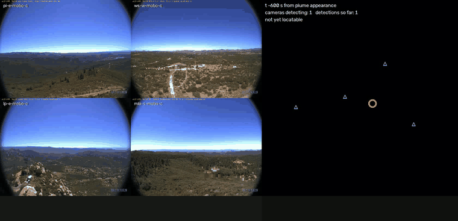
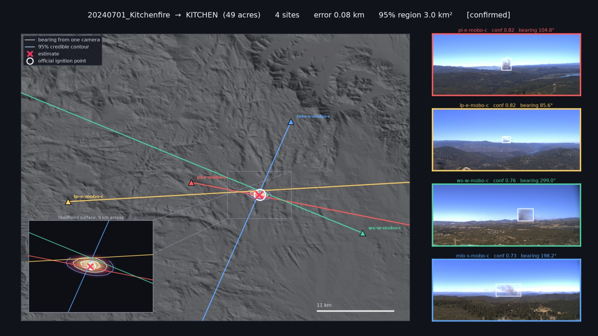
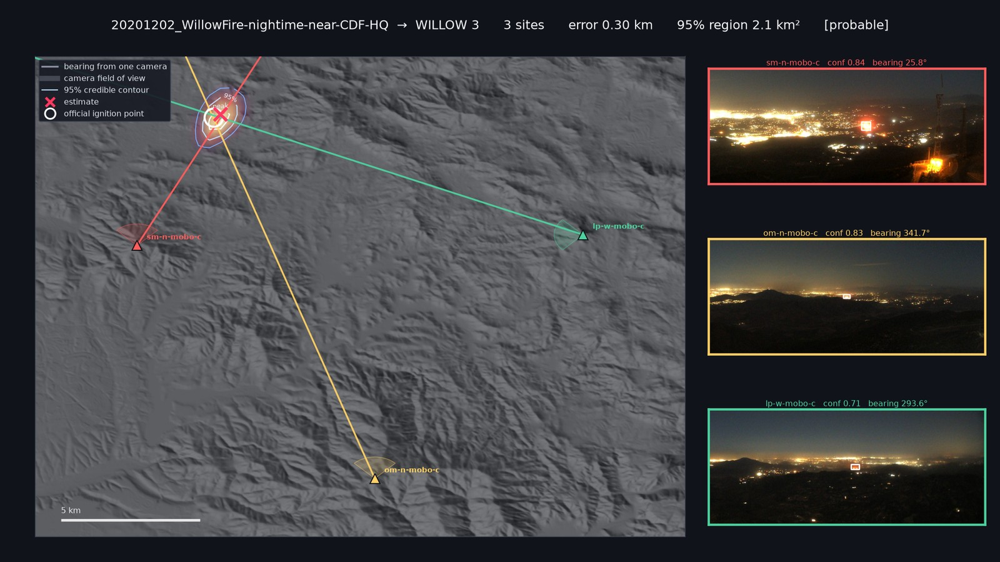
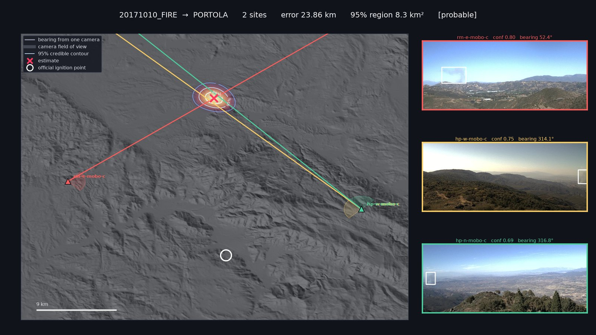
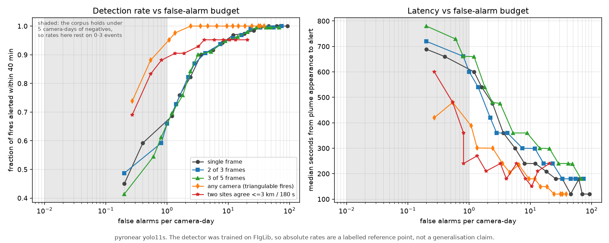

# plume-triangulation

[](https://github.com/rharnish/plume-triangulation/actions/workflows/ci.yml)

**Where is the fire, how fast can we say so, and can the model run on the camera?**

Wildfire smoke detection is usually reported as mAP on a held-out split. That number does
not tell an operator anything they can act on. This project measures three things that it
does: **how far off the located ignition point is, in kilometers, against official
coordinates**; **how many seconds until a real fire is called, at a false-alarm rate a
dispatcher could absorb**; and **what the detector costs in milliseconds and watts on an
ARM64 device with an NPU**.

Built on [HPWREN](https://www.hpwren.ucsd.edu/)'s Fire Ignition images Library — 189
sequences, 14,827 frames, 505 known camera positions — with ignition coordinates from the
interagency [WFIGS/IRWIN](https://data-nifc.opendata.arcgis.com/) incident feed.

---

## Results

### Geolocation: 1.90 km median where the ground truth is solid

Bearings from two or more sites, accumulated into a likelihood field over the ground, scored
in kilometers against the official ignition coordinate.

| set | n | median error | max | ≤1 km | ≤2 km | ≤5 km |
|---|---|---|---|---|---|---|
| all scoring fires | 26 | 2.58 km | 62.10 km | 6 | 12 | 19 |
| **name-confirmed truth** | 10 | **1.90 km** | **3.61 km** | | | |
| probable truth | 16 | 4.37 km | 62.10 km | | | |

Best is `20240701_Kitchenfire` at **0.08 km** from four sites. Every confirmed-tier fire
lands within 3.61 km; the probable tier carries the entire tail.



*The posterior over the ground as detections arrive: four camera views on the left, the
likelihood field with each site's bearing on the right, error against time below. A
spurious early crossing of two false-positive rays is outvoted as further evidence
accumulates. The static version, with the reading guide:*



*How to read these: each camera's most confident detection (right) casts a bearing (matching
color) from its tower; the bearings are accumulated into the likelihood field, whose peak is
the estimate (✗) and whose falloff is the 95% contour. The open circle is the official
coordinate. The inset appears only where the credible region is too small to see at the main
scale.*

The geometry holds up in conditions that are not benign. `20201202_WillowFire` is a night
ignition seen against continuous city light from three sites, and lands **0.30 km** from the
assigned coordinate (probable-tier truth).



**That split is the finding.** Where the probable-tier fires fail they fail in a diagnostic
shape — bearings agreeing with each other to within a few km² while sitting 20–60 km from the
assigned incident. Independent cameras do not agree by accident, so error much larger than
√area₉₅ indicts the *ground truth*, not the geometry. Geolocation error turns out to be an
audit of the weaker resolution tier.



*`20171010_FIRE` → PORTOLA: three bearings from two sites close on an 8 km² region, with the
assigned incident 24 km away and no ray passing near it. The geometry is not the thing that
is wrong here.*

### Seconds-to-alert vs false alarms per camera-day



The 40 minutes of pre-ignition frames in every sequence are negatives from the *same camera
under the same light* — the same haze, cumulus and glint the positives sit in.

| τ | FA/camera-day | fires alerted | median s to alert |
|---|---|---|---|
| 0.25 | 25.8 | 98% | 180 |
| 0.40 | 8.0 | 94% | 240 |
| 0.50 | 3.6 | 90% | 360 |
| 0.70 | 0.40 | 59% | 660 |

**The gap between what this detector does and what a network needs is three orders of
magnitude.** At τ=0.25 — an unremarkable default — 25.8 false alarms per camera-day is
**13,000 alerts a day** across 505 cameras. One per camera-week is 0.14/day, reached only past
τ=0.7, where 41% of fires are missed. That is what per-frame operation costs at scale, and it
is the argument for spending effort on temporal and cross-camera structure rather than another
point of AP.

Two results worth stating because they were *not* what was expected:

- **Persistence is cheap and it works.** 2-of-3 frames over threshold cuts the rate about a
  quarter at matched recall, for one extra minute of latency.
- **Cross-site agreement does not beat thresholding.** Requiring two sites to agree
  geometrically halves the false-alarm rate — but so does raising the threshold, more cheaply,
  and the any-camera curve dominates at every operating point measured. What survives is
  narrower and real: **geometry buys latency, not recall** (240 s vs ~426 s at a matched
  0.81 FA/camera-day). An earlier anecdote suggested otherwise; the measurement overruled it.

### Edge: Core ML on an Apple M3, measured in watts


Full write-up in **[docs/edge-m3.md](docs/edge-m3.md)**. A fanless M3 MacBook Air is a
defensible stand-in for a fielded camera: real ARM64, a real NPU, per-unit wattage from
`powermetrics`, and — being fanless — a genuine sustained-throughput curve rather than a burst
number.

| variant | unit | model latency | throughput | frames/joule |
|---|---|---|---|---|
| FP32 | ANE *(requested)* | 97.3 ms | 10.3 fps | — |
| FP16 | CPU | 48.6 ms | 20.6 fps | 2.3 |
| FP16 | GPU | 24.0 ms | 41.6 fps | 5.6 |
| **FP16** | **ANE** | **11.0 ms** | **91.0 fps** | **12.0** |
| INT8-weight | ANE | 10.4 ms | 96.7 fps | 12.8 |

- **FP32 silently does not use the NPU.** The compute plan places **0 of 241 ops** on the ANE,
  and requesting it returns the *CPU* at 97 ms and 0 mW ANE — with no error and no warning.
  Verify dispatch; never trust the requested setting.
- **INT8 buys size, not speed, on M3.** 10.4 ms against 11.0, and 7,574 mW against 7,566 — the
  same within run-to-run noise — for 9.3 MB against 18.2 MB.
  Through the M3 generation the ANE supports weight-only INT8; full INT8 activation compute
  arrived with A17 Pro and M4. Stating that distinction is the point.
- **Preprocessing is half the budget.** End-to-end is 20.2 ms against 11.0 model-only, so
  JPEG decode and letterbox cost ~9.4 ms — 47%.
- **Thermal throttle is real but mild.** 94 fps sustained for ~8 minutes, then a 9.8% step down;
  frames/joule *improves* (12.0 → 12.4) as clocks drop.

Priced downstream in kilometers: FP16 is free (2.28 km, identical recall). INT8-weight costs
2.67 km at 40 minutes and 3.57 km at 3 minutes — the accuracy loss lands where latency matters.

---

## Running it

```sh
python -m venv .venv && .venv/bin/pip install -r requirements.txt
./data/fetch.sh            # ~13 GB of FIgLib archives, idempotent
./data/fetch_dem.sh        # optional: ~435 MB of DEM tiles, for the terrain modules only
```

Then, roughly in pipeline order:

```sh
python -m src.figlib.ingest        # parse the filename clock, join cameras
python -m src.figlib.fires         # cluster event labels into real ignitions
python -m src.figlib.truth         # WFIGS/IRWIN join -- no credentials needed
python -m src.figlib.resolve       # disambiguate by bearing
./run_detect.sh                    # pyronear yolo11s over 189 sequences, 4 workers
python -m src.figlib.geolocate     # kilometers against official coordinates
python -m src.figlib.falsealarm    # the seconds-to-alert sweep
```

The Core ML work is macOS-only and installs separately (`requirements-edge.txt`); see
[docs/edge-m3.md](docs/edge-m3.md).

### Reproducing without the download

The full run needs ~13 GB of FIgLib archives, but the geometry does not. The camera table,
the sequence index, and the resolved ground truth are committed under `data/meta/`, and
`tests/fixtures/` carries one fire's real detections — enough to run bearings, the
likelihood field, and evidence accumulation end to end:

```sh
pip install -r requirements-dev.txt
pytest                     # ~3 s; geolocates 20240701_Kitchenfire to 0.08 km
```

CI runs this on every push. `tests/test_geom.py` pins the bearing and projection maths
against hand-checkable cases; `test_geolocation.py` and `test_accumulate.py` are the
end-to-end smoke tests, including that a confident wrong bearing perturbs the estimate
rather than capturing it.

## Map of the code

All modules live flat in [src/figlib/](src/figlib/) and run as `python -m src.figlib.<name>`.

| stage | modules |
|---|---|
| **Ingest & ground truth** | `ingest` `fires` `truth` `resolve` `wind` |
| **Detection** | `detect_yolo` (ONNX) · `detect_coreml` (Apple) · `detect_diff` (training-free floor) |
| **Geometry** | `geom` `geolocate` `accumulate` |
| **Plume masks** *(tested, lost)* | `masks` `plumefit` — segmentation-based bearings, see `NOTES.md` |
| **Terrain** *(pose audit)* | `terrain` `calibrate` `pose_validate` — see `NOTES.md` |
| **Evaluation** | `falsealarm` `quantization` `evolve` |
| **Edge** | `bench_edge` `power` |
| **Figures** | `viz` `viz_map` `viz_terrain` `animate` `fig_peaks` `fig_pose` `fig_triangulate` |

Two environment variables let a whole pipeline be re-scored against different inputs without
editing anything: `FIGLIB_DETS` points at an alternative detection directory (this is how
quantized variants are priced in kilometers) and `FIGLIB_CAMS` at an alternative camera table.

**[NOTES.md](NOTES.md) is the lab notebook** — running state, findings, and the reasoning
behind each decision, including the predictions that were refuted and the claims that had to be
corrected. It is the honest record, not a summary.

## Caveats worth reading before the numbers

- **The detector was trained on FIgLib.** pyronear's `yolo11s_rapid-raccoon_v8.1.0` lists
  `FIGLIB_ANNOTATED_RESIZED` as a training source, so detection and timing figures measure
  memorisation as well as detection. They are reported as a labeled reference point, not a
  generalisation claim. Geolocation is unaffected — a memorised detection still yields a valid
  bearing, and kilometer error tests geometry.
- **The corpus cannot resolve the rate that matters.** 40 minutes of negatives per sequence is
  **4.99 camera-days in total**. Rates below ~1 FA/camera-day rest on zero to three events, and
  one false alarm per camera-week is not measurable on FIgLib at all. A Poisson upper bound is
  carried in the JSON for every row so the ratios are never read as more than they are.
- **The camera metadata is a nameplate, not a calibration.** Across all 505 cameras, `az` is
  exactly 0/90/180/270 on **482** and `fov` exactly 90 or 60 on **483**; `pitch`, `roll` and
  `yaw` are non-zero on only **9**, **14** and **3**, and are literal `0.0` placeholders
  everywhere else. There is no focal length, principal point or distortion coefficient
  anywhere. Bearings are therefore only as good as a compass heading rounded to a quadrant,
  which is worth knowing before reading a kilometer figure. `NOTES.md` records the attempt to
  refine it against terrain, and why that failed.
- **"Minutes of warning gained" is not a claim this data supports.** Official
  `FireDiscoveryDateTime` minus annotated plume appearance has a median of **+1.0 min** — humans
  reported 7 of the 10 name-confirmed fires *before* the plume was annotated visible. What the
  WFIGS join buys is evidence that the FIgLib clock is a validated proxy for when a human knew.

## Attribution

- **FIgLib / HPWREN** — conceived, created and maintained by Hans-Werner Braun for HPWREN at UC
  San Diego. Use of this data requires a credit reference to <https://www.hpwren.ucsd.edu/>.
- **pyronear** — `yolo11s_rapid-raccoon_v8.1.0`, Apache 2.0.
- **WFIGS / IRWIN** — interagency wildland fire incident locations, NIFC open data.
- **Copernicus DEM GLO-30** — ESA, via the AWS Open Data registry.

## License

Code is MIT ([LICENSE](LICENSE)). The data and model weights above are used under
their own terms and are not redistributed here.
