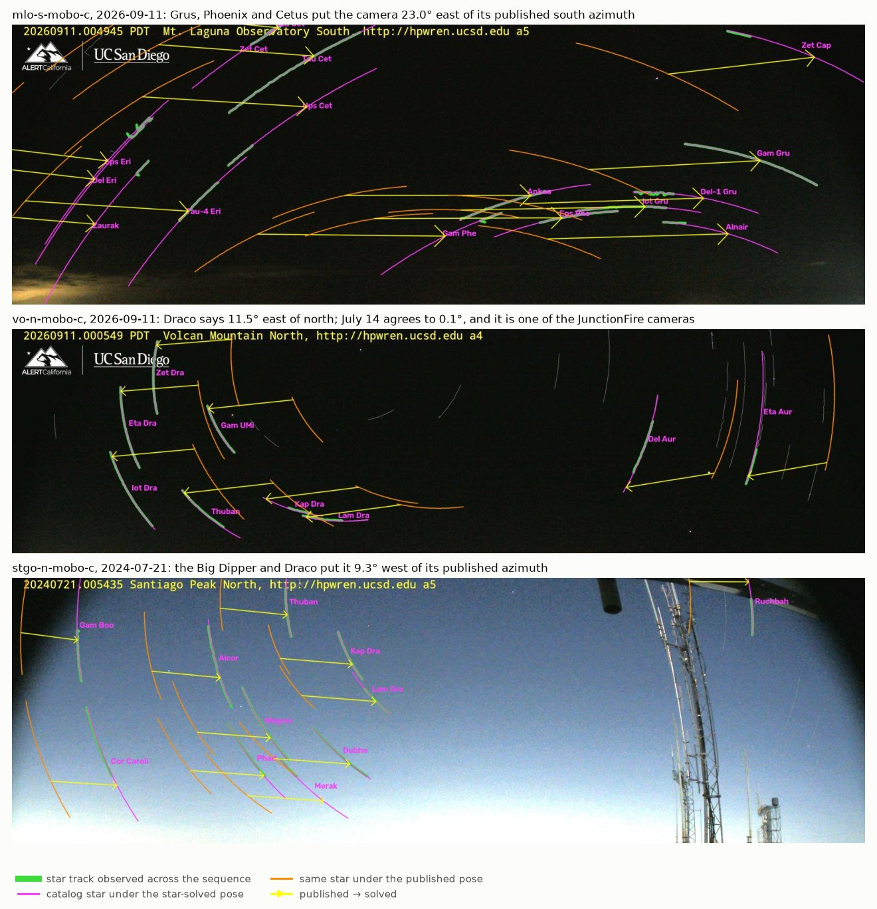
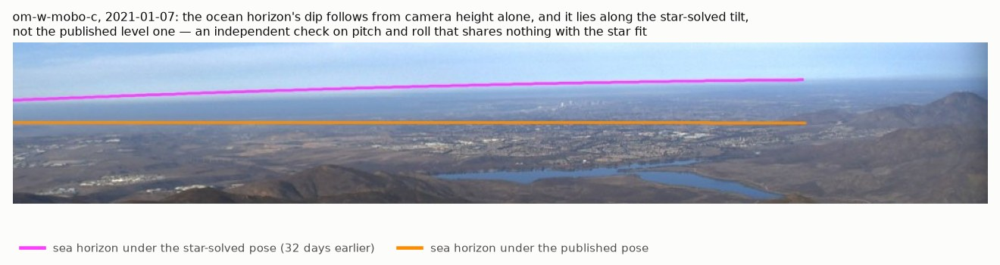
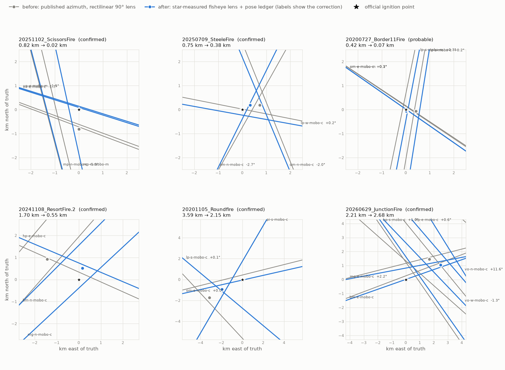
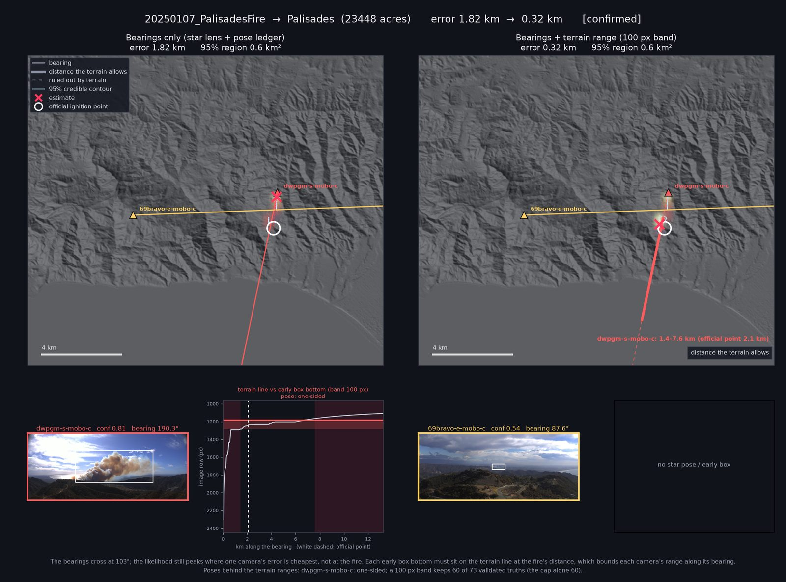
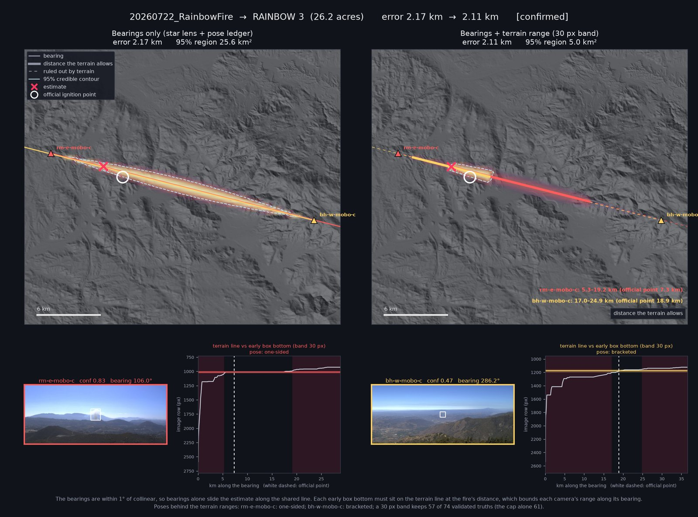

# plume-triangulation

[](https://github.com/rharnish/plume-triangulation/actions/workflows/ci.yml)

**Where is the fire, how fast can we say so, and can the model run on the camera?**


*The 2024 Kitchen fire, seen from four HPWREN towers. Each camera's most confident smoke
detection (right) casts a bearing from its tower; the bearings accumulate into a likelihood
field whose peak (✗) closes to **0.08 km** from the official ignition coordinate (open circle).*

Wildfire smoke detection is usually reported as mAP on a held-out split. That number does
not tell an operator anything they can act on. This project measures three things that it
does: **how far off the located ignition point is, in kilometers, against official
coordinates**; **how many seconds until a real fire is called, at a false-alarm rate a
dispatcher could absorb**; and **what the detector costs in milliseconds and watts on an
ARM64 device with an NPU**.

Built on [HPWREN](https://www.hpwren.ucsd.edu/)'s Fire Ignition images Library — 189
sequences, 14,827 frames, 505 known camera positions — with ignition coordinates from the
interagency [WFIGS/IRWIN](https://data-nifc.opendata.arcgis.com/) incident feed.

---

## Results

### Geolocation: 1.90 km upper median where the ground truth is solid

Bearings from two or more sites, accumulated into a likelihood field over the ground, scored
in kilometers against the official ignition coordinate. Medians in these tables are upper
medians: with an even count, the higher of the two middle values.

| set | n | upper median error | max | ≤1 km | ≤2 km | ≤5 km |
|---|---|---|---|---|---|---|
| all scoring fires | 26 | 2.58 km | 62.10 km | 6 | 12 | 19 |
| **name-confirmed truth** | 10 | **1.90 km** | **3.61 km** | | | |
| probable truth | 16 | 4.37 km | 62.10 km | | | |

*How to read the triangulation figures (the animation at the top and the stills below): each
camera's most confident detection (right) casts a bearing (matching color) from its tower; the bearings are accumulated into the likelihood field, whose peak is
the estimate (✗) and whose falloff is the 95% contour. The open circle is the official
coordinate. The inset appears only where the credible region is too small to see at the main
scale.*

*The animation is `20240701_Kitchenfire`, a frame a minute from t = −120 s to +2400 s, re-solved from each
camera's best detection so far. One ray has no depth; by +300 s three sites cross 1.33 km out.
From +660 s lp-e-mobo-c's best box is a bird, and its ray, 39° off, drags the estimate to
1.66 km until a stronger box on the plume replaces it at +1380 s. Four sites then close to
**0.08 km**.*

The geometry holds up in conditions that are not benign. `20201202_WillowFire` is a night
ignition seen against continuous city light from three sites, and lands **0.30 km** from the
assigned coordinate (probable-tier truth).


**The split between the tiers is the finding.** Every confirmed-tier fire lands within
3.61 km; the probable tier carries the entire tail. Where a probable-tier fire fails, the
failure has a shape worth reading: bearings agreeing with each other to within a few km²
while sitting 20–60 km from the assigned incident. That shape has two possible causes — a
wrong record, or a weak crossing angle — and a second official source tells them apart.


*`20171010_FIRE` → PORTOLA: three bearings from two sites close on an 8 km² region, with the
WFIGS coordinate 23.63 km away and no ray passing near it. CAL FIRE records the same fire at
33.50488, −117.02132 — Riverside County, De Portola Road east of Pauba Road, 23 acres —
**1.02 km from the estimate**, inside the 95% region. The WFIGS point falls outside it
entirely, at zero relative posterior density; it reads 33°18′00″ 116°59′59″, rounded to the
arcminute, and is filed in the wrong county.*

`python -m src.figlib.calfire` runs that cross-check over the corpus, picking each CAL FIRE
candidate by the WFIGS *name* and never by the estimate, so the comparison cannot borrow
credibility from the geometry it tests. On the 110 fires where both sources name the same
incident they agree to a median of **0.65 km**, and 72 agree within 1 km. The official
records are usually right, and PORTOLA is an outlier rather than a tier-wide failure — it is
also the only one of the four disagreements over 5 km that has a solve to arbitrate it.

The inverse case is the guard against reading too much into a large error. `20171207_FIRE.2`
→ LIBERTY has both sources agreeing to within 1.71 km while the estimate sits 62 km out, and
there the geometry really is what is wrong: two cameras 13° apart, a 155 km² credible region
smeared along the line of sight. A large error indicts the record only when the credible
region is small.

### Camera calibration from the night sky

The published camera table is a nameplate: azimuths rounded to a compass quadrant, a nominal
field of view, no lens model (see *Caveats*). Stars fix that without a site visit. A point
that drifts at the sidereal rate is a star, and matching a night of such tracks to a star
catalog under one shared pose measures a camera's azimuth, pitch, roll and lens together. No
constellation is guessed first: the pose search scores how many catalog stars land on *any*
track, then assigns stars to whole tracks and refits.



*Green: a star's track over the night. Magenta: that catalog star under the solved pose,
running inside the track. Orange: the same star under the published pose; the yellow arrows
run from one to the other.*

- **86 solves on 52 cameras**, from FIgLib's night sequences and moonless nights pulled from
  HPWREN's public CDN, at a median residual of 1.3 px and ~22 stars per solve.
- **33 of the 52 cameras point more than 1° from their published azimuth**, mlo-s-mobo-c by
  23°. Consecutive nights agree to 0.01°, except one weak lp-n-mobo-c solve (12 stars at
  2.6 px) that sits 0.25° from the nights either side, and nights two months apart agree to
  0.15°. Cameras do get re-aimed, though: Otay Mountain's south cameras solve 10.5° off in
  2019 and 0.4° in 2024,
  and Toro Peak West moved 7.5° between 2021 and 2026. So corrections are kept per camera
  *and* date, in a [ledger](data/meta/pose_ledger.json) that refuses to bridge a re-aim or a
  sensor change. [Every solve, with its lens scale](docs/figures/star_ledger.png).
- **One lens design, and not the one the pipeline assumed.** Every solve puts the focal scale at
  0.877–0.893 of nameplate: an equidistant fisheye spanning about ±55°, not a rectilinear ±45°.
  Near the frame edge that was worth up to 8° of bearing.
- **An independent check agrees.** A sea horizon's dip below level depends only on camera
  height, and on om-w-mobo-c it lies along the star-solved tilt, not the published level one.



Priced in kilometers, with the same detections and solver, on the name-confirmed fires:

| camera model | upper median error | ≤2 km |
|---|---|---|
| published azimuth, rectilinear lens | 1.90 km | 7 of 10 |
| star-measured fisheye lens | **1.70 km** | **8 of 10** |
| + per-camera star azimuth from the ledger | 1.70 km | 6 of 10 |



The lens is the clear gain: detections in the outer half of the frame go from a median bearing
miss of 4.4° to 3.5° ([every bearing](docs/figures/calibration_bearings.png)). The azimuth
ledger lands where detections are right: ScissorsFire goes from 0.58 km to **0.02 km**. It
also makes JunctionFire worse, and that is informative. Correcting vo-n-mobo-c by 11.6° puts
the ignition point outside that camera's field of view, and its low-confidence detection turns
out to be a cumulus cloud at the frame edge. With the cameras calibrated, **detection
selection** (edge-clipped boxes, best-confidence picking the wrong object) is what limits
kilometers now. The full account is in NOTES.md.

### How far along a bearing: terrain under the star pose

A bearing gives a direction, and normally only a second site gives the distance. With the pose
measured, the DEM can supply part of it. At every distance along the ray, terrain fixes the
lowest image row that smoke rising from there can show. That row is the source itself where it
is visible, or the crest in front of it where it is not. Usually it is not: most official
ignitions sit behind a nearer crest, and the first detections sit on that crest.


*Top: first detections (green) sit on the crest (white bar) that hides the official ignition
(white cross). The lines are DEM ridges projected through the star-solved pose, with no pixels
fitted. Bottom: a skyline predicted from the DEM and the star pose alone lands 6 px from the
image edge.*

So the bottom of the earliest boxes must sit on the terrain line at the fire's distance. It
can't be below the line, because smoke behind a crest can't be seen. It can't be far above
it either, because a young plume's foot is on the terrain it rises from. Each camera with a
star pose therefore gets one interval of distance along its bearing.

- **The interval contains the fire.** On 73 bearings within 5° of the official point, it
  contains the official distance on 60, with a median length of 0.92× that distance. At the
  official distance, the terrain row sits a median 3 px from the box bottom.
- **One camera still says something.** Each of the 118 confirmed and probable fires seen from
  a single site gets its own figure: bearing, miss across the ray (a median of 0.77 km on
  confirmed fires), and the interval. The interval contains the official point on 30 of 37
  confirmed bearings with a star pose.

Two sites can cross and still leave the estimate at the wrong point along one ray. That is
where the interval helps:



*`20250107_PalisadesFire`, from star-solved bearings on two sites crossing at 103°. Left:
bearings only, 1.82 km from the official point. Right: dwpgm-s-mobo-c's early box bottom meets
the terrain line only 1.4–7.6 km out (profile, bottom), which moves the estimate down its ray
to **0.32 km**. 69bravo-e has no star pose, so it gets no interval.*

The same mechanism fixes a failure bearings cannot. `20260722_RainbowFire` is seen by two
cameras looking straight at each other, so their bearings coincide and give no distance at
all:
- **Bearings alone:** the estimate is 5.82 km out.
- **With terrain, 30 px band:** 1.42 km, and the 95% region shrinks from 25.4 to 4.8 km²
  (1.42 km and 8.0 km² at 60 px).

Before this week's star solves it was 17 km, because Boucher Hill West's published azimuth was
1.16° off.



**Why it is an opt-in term, not the default.** It needs a band narrower than the 100 px
default to help Rainbow (1.42 km at 30 or 60 px), and a 30 px band drops 5 of the 73 validated
fires. On the 17 name-confirmed two-site fires across all of FIgLib, the median moves only
1.82 → 1.70 km. Where it hurts, the pose is to blame: Toro Peak West was re-aimed between
star solves. Matching skylines puts it 2.4° from today's pose at `20240724_GroveFire`, and an
interval drawn with the wrong pose excludes the fire (8.97 → 9.85 km). Every validated bearing
that moved from a years-old pose onto a fresh star solve contained the fire. The interval is
only as good as the pose under it.

### Seconds-to-alert vs false alarms per camera-day


The 40 minutes of pre-ignition frames in every sequence are negatives from the *same camera
under the same light* — the same haze, cumulus and glint the positives sit in.

| τ | FA/camera-day | fires alerted | median s to alert |
|---|---|---|---|
| 0.25 | 25.8 | 98% | 180 |
| 0.40 | 8.0 | 94% | 240 |
| 0.50 | 3.6 | 90% | 360 |
| 0.70 | 0.40 | 59% | 660 |

**The gap between what this detector does and what a network needs is three orders of
magnitude.** At τ=0.25 — an unremarkable default — 25.8 false alarms per camera-day is
**13,000 alerts a day** across 505 cameras. One per camera-week is 0.14/day, reached only past
τ=0.7, where 41% of fires are missed. That is what per-frame operation costs at scale, and it
is the argument for spending effort on temporal and cross-camera structure rather than another
point of AP.

Two results worth stating because they were *not* what was expected:

- **Persistence is cheap and it works.** 2-of-3 frames over threshold cuts the rate about a
  quarter at matched recall, for one extra minute of latency.
- **Cross-site agreement does not beat thresholding.** Requiring two sites to agree
  geometrically halves the false-alarm rate — but so does raising the threshold, more cheaply,
  and the any-camera curve dominates at every operating point measured. What survives is
  narrower and real: **geometry buys latency, not recall** (240 s vs ~426 s at a matched
  0.81 FA/camera-day). An earlier anecdote suggested otherwise; the measurement overruled it.

### Edge: Core ML on an Apple M3, measured in watts


Full write-up in **[docs/edge-m3.md](docs/edge-m3.md)**. A fanless M3 MacBook Air is a
defensible stand-in for a fielded camera: real ARM64, a real NPU, per-unit wattage from
`powermetrics`, and — being fanless — a genuine sustained-throughput curve rather than a burst
number.

| variant | unit | model latency | throughput | frames/joule |
|---|---|---|---|---|
| FP32 | ANE *(requested)* | 97.3 ms | 10.3 fps | — |
| FP16 | CPU | 48.6 ms | 20.6 fps | 2.3 |
| FP16 | GPU | 24.0 ms | 41.6 fps | 5.6 |
| **FP16** | **ANE** | **11.0 ms** | **91.0 fps** | **12.0** |
| INT8-weight | ANE | 10.4 ms | 96.7 fps | 12.8 |

- **FP32 silently does not use the NPU.** The compute plan places **0 of 241 ops** on the ANE,
  and requesting it returns the *CPU* at 97 ms and 0 mW ANE — with no error and no warning.
  Verify dispatch; never trust the requested setting.
- **INT8 buys size, not speed, on M3.** 10.4 ms against 11.0, and 7,574 mW against 7,566 — the
  same within run-to-run noise — for 9.3 MB against 18.2 MB.
  Through the M3 generation the ANE supports weight-only INT8; full INT8 activation compute
  arrived with A17 Pro and M4. Stating that distinction is the point.
- **Preprocessing is half the budget.** End-to-end is 20.2 ms against 11.0 model-only, so
  JPEG decode and letterbox cost ~9.2 ms — 45%.
- **Thermal throttle is real but mild.** 94 fps sustained for ~8 minutes, then a 9.8% step down;
  frames/joule *improves* (12.0 → 12.4) as clocks drop.

Priced downstream in kilometers: FP16 is free (2.28 km, identical recall). INT8-weight is not
measurably worse: 2.67 km against 2.28 at 40 minutes, but 3.57 km against 3.93 at 3 minutes,
with 9 fires inside 2 km against 6.

---

## Running it

```sh
python -m venv .venv && .venv/bin/pip install -r requirements.txt
./data/fetch.sh            # ~13 GB of FIgLib archives, idempotent
./data/fetch_dem.sh        # optional: ~435 MB of DEM tiles, for the terrain modules only
```

Then, roughly in pipeline order:

```sh
python -m src.figlib.ingest        # parse the filename clock, join cameras
python -m src.figlib.fires         # cluster event labels into real ignitions
python -m src.figlib.truth         # WFIGS/IRWIN join -- no credentials needed
python -m src.figlib.resolve       # disambiguate by bearing
./run_detect.sh                    # pyronear yolo11s over 189 sequences, 4 workers
python -m src.figlib.geolocate     # kilometers against official coordinates
python -m src.figlib.falsealarm    # the seconds-to-alert sweep
```

Star calibration, optionally:

```sh
python -m src.figlib.stars.nights 20260911 @cams.json   # moonless-night frames from HPWREN's public CDN
python -m src.figlib.stars.run_nights                   # track, star-solve, rebuild data/meta/pose_ledger.json
FIGLIB_LENS=fisheye FIGLIB_POSE_LEDGER=1 python -m src.figlib.geolocate
python -m src.figlib.compare_geolocation                # baseline vs calibrated, fire by fire
```

Terrain ranges along a bearing, optionally (needs `fetch_dem.sh`, the calibrated poses, and
the full corpus):

```sh
FIGLIB_CORPUS=all python -m src.figlib.terrain_range validate    # does the range contain the official point?
FIGLIB_CORPUS=all python -m src.figlib.fig_bearing               # one figure per single-site fire
FIGLIB_CORPUS=all python -m src.figlib.terrain_range figure 20250107_PalisadesFire
```

The Core ML work is macOS-only and installs separately (`requirements-edge.txt`); see
[docs/edge-m3.md](docs/edge-m3.md).

### Reproducing without the download

The full run needs ~13 GB of FIgLib archives, but the geometry does not. The camera table,
the sequence index, and the resolved ground truth are committed under `data/meta/`, and
`tests/fixtures/` carries one fire's real detections — enough to run bearings, the
likelihood field, and evidence accumulation end to end:

```sh
pip install -r requirements-dev.txt
pytest                     # ~3 s; geolocates 20240701_Kitchenfire to 0.08 km
```

CI runs this on every push. `tests/test_geom.py` pins the bearing and projection maths
against hand-checkable cases; `test_geolocation.py` and `test_accumulate.py` are the
end-to-end smoke tests, including that a confident wrong bearing perturbs the estimate
rather than capturing it.

## Map of the code

Modules live in [src/figlib/](src/figlib/), with star calibration in [src/figlib/stars/](src/figlib/stars/), and run as `python -m src.figlib.<name>`.

| stage | modules |
|---|---|
| **Ingest & ground truth** | `ingest` `fires` `truth` `resolve` `wind` |
| **Detection** | `detect_yolo` (ONNX) · `detect_coreml` (Apple) · `detect_diff` (training-free floor) |
| **Geometry** | `geom` `geolocate` `accumulate` |
| **Plume masks** *(tested, lost)* | `masks` `plumefit` — segmentation-based bearings, see `NOTES.md` · `open_vocab` `sam2_track` *(exploratory, with viewers)* |
| **Terrain** *(pose audit)* | `terrain` `calibrate` `pose_validate` — see `NOTES.md` · `terrain_range` (how far along one bearing?) · `ridge_feet` (terrain under the star pose; hidden ignitions) |
| **Star calibration** | `stars.tracks` `stars.solve` `stars.nights` `stars.fisheye` `stars.catalog` · `pose_ledger` `frame_sizes` `compare_geolocation` |
| **Evaluation** | `falsealarm` `quantization` `evolve` · `coverage` `bias` (is the 95% region honest?) |
| **Edge** | `bench_edge` `power` |
| **Figures** | `viz` `viz_map` `viz_terrain` `animate` `animate_triangulate` `fig_peaks` `fig_pose` `fig_triangulate` `fig_bearing` |

Two environment variables let a whole pipeline be re-scored against different inputs without
editing anything: `FIGLIB_DETS` points at an alternative detection directory (this is how
quantized variants are priced in kilometers) and `FIGLIB_CAMS` at an alternative camera table.
`FIGLIB_LENS=fisheye` and `FIGLIB_POSE_LEDGER=1` switch on the star-measured lens and the per-camera
azimuth corrections; `geolocate` writes those variants beside the baseline, never over it.
Two more select the data: `FIGLIB_CORPUS` scores separately fetched FIgLib archives in their
own directories, and `FIGLIB_TIER` restricts scoring to sequences the detector cannot have
trained on. Archive hashes and a per-run log live in `data/meta/` — see
[data/README.md](data/README.md#corpora-and-provenance).

**[NOTES.md](NOTES.md) is the lab notebook** — running state, findings, and the reasoning
behind each decision, including the predictions that were refuted and the claims that had to be
corrected. It is the honest record, not a summary.

## Caveats worth reading before the numbers

- **The detector was trained on FIgLib.** pyronear's `yolo11s_rapid-raccoon_v8.1.0` lists
  `FIGLIB_ANNOTATED_RESIZED` as a training source, so detection and timing figures measure
  memorisation as well as detection. They are reported as a labeled reference point, not a
  generalisation claim. Geolocation is unaffected — a memorised detection still yields a valid
  bearing, and kilometer error tests geometry.
- **The corpus cannot resolve the rate that matters.** 40 minutes of negatives per sequence is
  **4.99 camera-days in total**. Rates below ~1 FA/camera-day rest on zero to three events, and
  one false alarm per camera-week is not measurable on FIgLib at all. A Poisson upper bound is
  carried in the JSON for every row so the ratios are never read as more than they are.
- **The camera metadata is a nameplate, not a calibration.** Across all 505 cameras, `az` is
  exactly 0/90/180/270 on **482** and `fov` exactly 90 or 60 on **483**; `pitch`, `roll` and
  `yaw` are non-zero on only **9**, **14** and **3**, and are literal `0.0` placeholders
  everywhere else. There is no focal length, principal point or distortion coefficient
  anywhere. Bearings are therefore only as good as a compass heading rounded to a quadrant,
  which is worth knowing before reading a kilometer figure. `NOTES.md` records the attempt to
  refine it against terrain, and why that failed. Star tracks succeed where terrain did not; see
  *Camera calibration from the night sky*.
- **"Minutes of warning gained" is not a claim this data supports.** On the core corpus,
  official `FireDiscoveryDateTime` minus annotated plume appearance has a median of **+1.0 min**
  — humans reported 7 of the 10 name-confirmed fires *before* the plume was annotated visible. What the
  WFIGS join buys is evidence that the FIgLib clock is a validated proxy for when a human knew.

## Attribution

- **FIgLib / HPWREN** — conceived, created and maintained by Hans-Werner Braun for HPWREN at UC
  San Diego. Use of this data requires a credit reference to <https://www.hpwren.ucsd.edu/>.
- **pyronear** — `yolo11s_rapid-raccoon_v8.1.0`, Apache 2.0.
- **WFIGS / IRWIN** — interagency wildland fire incident locations, NIFC open data.
- **Copernicus DEM GLO-30** — ESA, via the AWS Open Data registry.
- **HYG Database** — star catalog, [astronexus/HYG-Database](https://github.com/astronexus/HYG-Database),
  CC BY-SA 4.0. `data/meta/bright_stars.json` is a filtered derivative (mag ≤ 4) under the same license.

## License

Code is MIT ([LICENSE](LICENSE)). The data and model weights above are used under
their own terms and are not redistributed here, except `data/meta/bright_stars.json`,
which is CC BY-SA 4.0 as derived from HYG.
