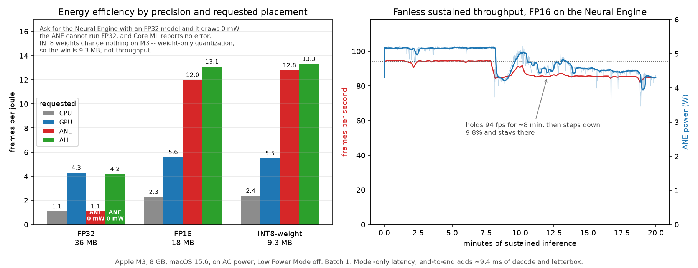

# Running the detector at the edge: measured on an Apple M3

A wildfire camera network is an edge-inference problem before it is a computer-vision
problem. There are hundreds of cameras on mountaintops, each one asking "is anything
burning?" about once a second, on power that arrives from a solar panel, inside a sealed
enclosure that cannot dump heat. What the model scores on a benchmark matters less than
what it costs per frame, per watt, and per hour of continuous operation.

This is what happened when the detector was ported to Apple silicon and actually measured.



## Why an M3 MacBook Air

It is a stand-in for a fielded camera in the four ways that matter, and honest about the
one way it is not.

- **Real ARM64**, like the Cortex-A78AE in a Jetson Orin — not an x86 desktop pretending.
- **A real NPU.** The 16-core Neural Engine turns "which compute unit should this run on"
  into a measured question across CPU, GPU and ANE, which is the same question Orin poses
  with its GPU and DLA.
- **Real power measurement.** `powermetrics` reports CPU, GPU and ANE wattage on separate
  rails.
- **Fanless, which is a feature here.** A sustained run on a machine that cannot spin up a
  fan produces a genuine thermal throttle curve. That is the sustained-throughput problem
  a sealed mountaintop enclosure has, and it is the single most transferable result on this
  bench — more so than on any rented GPU.

The limitation, stated rather than hidden: **through the M3 generation the Neural Engine
supports weight-only INT8; full INT8 activation compute arrived with A17 Pro and M4.** So
INT8 numbers here are about model size and memory bandwidth, not integer-compute
throughput. Knowing that distinction is the point — it is the same discipline as declining
to quote FP16 figures from a Pascal card.

Host for everything below: Apple M3, 8 GB, macOS 15.6 (24G84), Mac15,13, on AC power,
Low Power Mode off, batch size 1. Ambient was an indoor room at roughly 80 °F (27 °C) —
warm for an office, cooler than a sun-loaded enclosure, and worth stating because the
throttle curve in Result 3 is only meaningful relative to it.

## Method

**Export.** `best.pt` → Ultralytics Core ML export → ML Program, at 1024 px with NMS
outside the model. There is no ONNX → Core ML path any more; coremltools dropped that
converter, so the PyTorch checkpoint is the only supported route.

**The parity gate, before any number was believed.** Ultralytics folds its own
preprocessing into the export — the input becomes a 1024×1024 RGB *image* type with 1/255
scaling baked in — while the existing ONNX pipeline does letterboxing, colour conversion
and NMS itself. So the first thing measured was whether the two agree:

| | detections | matched | max Δconf | max Δcx |
|---|---|---|---|---|
| ONNX FP32 vs Core ML FP32 | 14 vs 14 | 14/14 | 0.0 | 0.0 |

Identical to stored precision. Everything after this is the hardware, not a conversion bug.

**One implementation, not two.** [`detect_coreml.py`](../src/figlib/detect_coreml.py) is a
drop-in for the ONNX detector — same letterbox, same NMS, same `Det` fields, same JSON on
disk. Bearings, the likelihood field, evidence accumulation and the false-alarm sweep all
run against Core ML detections unchanged, selected by an environment variable. That is what
makes "what did quantization cost?" answerable in kilometres and seconds instead of mAP,
and it removes a second implementation as a source of difference.

**Duration, not iteration count.** Every condition runs for a fixed wall-clock duration so
the power log has something to average over, and so thermal effects have time to appear.
The reason that matters is in the thermal section below.

## Result 1: a requested compute unit is only a request

| variant | ANE ops | GPU | CPU | asking for the ANE gives | ms/frame | ANE power |
|---|---|---|---|---|---|---|
| **FP32** | **0** | 241 | 0 | the **CPU** | 97.3 | **0 mW** |
| FP16 | 226 | 2 | 15 | the ANE | **11.0** | 4857 mW |
| INT8-weight | 226 | 2 | 15 | the ANE | 10.4 | 4978 mW |

**The Neural Engine cannot run FP32.** Request `CPU_AND_NE` with an FP32 model and every
operation lands on the CPU at 97 ms per frame — nearly 9× slower than the same model in
FP16 on the ANE — while Core ML reports no error, logs no warning, and returns correct
results the entire time. Anyone who benchmarks an FP32 model, requests the ANE, and
publishes the number as "Neural Engine performance" is wrong by an order of magnitude with
no signal that anything went astray.

Two independent instruments agree, which is why this is a finding rather than a guess:
`MLComputePlan` reports per-operation device placement (0 of 241 ops on the ANE for FP32),
and the ANE power rail reads exactly zero.

*Gotcha:* `MLComputePlan.load_from_path` wants a **compiled `.mlmodelc`**. Handed an
`.mlpackage` it aborts the process from C++ with `SIGABRT` rather than raising, so no
`except` block catches it. Compile via `MLModel.get_compiled_model_path()` first.

## Result 2: energy, not latency, is the edge constraint

Model-only latency, batch 1:

| placement | FP16 ms | fps | frames per joule |
|---|---|---|---|
| CPU | 48.6 | 20.6 | 2.3 |
| GPU | 24.0 | 41.6 | 5.6 |
| **ANE** | **11.0** | **91.0** | **12.0** |
| ALL (resolves to ANE) | 10.6 | 94.2 | 13.1 |

Total system draw barely moves across every condition measured — 7.0 to 9.6 W. What changes
is the work extracted per watt: **13.3 frames/joule on the ANE against 2.3 on the CPU, a
factor of 5.8.** For a solar-powered enclosure with a fixed daily energy budget, that ratio
*is* the design constraint. Latency only decides whether you can run at all.

**Weight-only INT8 buys size, not speed — measured, not cited.** Identical op placement,
10.4 ms against 11.0, 12.8 frames/joule against 12.0: every difference inside the run-to-run
noise. The only real gain is **9.3 MB against 18.2 MB** of model. This is exactly what the
M3 generation is documented to do, and it is worth having measured rather than assumed. On
an A17 Pro or M4 the same export should show a genuine speedup — a prediction this hardware
cannot test.

**Preprocessing becomes the bottleneck the moment the model leaves the CPU.** End-to-end
latency is 20.2 ms against 11.0 ms model-only, so JPEG decode plus letterbox costs about
**9.4 ms — roughly 47% of the frame budget**. Move inference to the NPU and the next thing
worth optimising is image handling, which no model-only benchmark would ever surface.

**Capacity.** 49 fps end-to-end means a single M3 could serve roughly **49 cameras at 1 fps
at about 7.4 W**. For context, the same 93-sequence detection pass takes **182 seconds on
the ANE** against roughly 90 minutes on four x86 CPU cores.

## Result 3: the fanless throttle curve

Twenty minutes of continuous FP16 inference on the Neural Engine:

| minutes | fps | ANE W | total W | thermal pressure |
|---|---|---|---|---|
| 0–3 | 94.0 | 5.13 | 7.86 | Nominal → Moderate |
| 3–6 | 94.3 | 5.16 | 7.72 | → **Heavy** |
| 6–10 | 90.2 | 4.79 | 7.34 | Heavy |
| 10–13 | 87.1 | 4.68 | 7.29 | Heavy |
| 13–16 | 85.9 | 4.54 | 7.08 | Heavy |
| 16–20 | 85.2 | 4.36 | 6.88 | Heavy |

Throughput holds at 94 fps for about eight minutes, steps down roughly 10%, and stays
there. This is with ~80 °F ambient; a sealed mountaintop enclosure in sun would cross into
throttle sooner and settle lower, so the eight-minute plateau is an indoor best case, not a
field number. Two observations matter more than the headline number.

**Thermal pressure reads *Heavy* at about four minutes — four minutes before throughput
moves.** A three-minute burst benchmark would have reported 94 fps and missed the entire
effect. This is the concrete argument for running every condition to a fixed duration
rather than a fixed iteration count.

**Throttling costs throughput but not efficiency.** Frames per joule goes **12.0 → 12.4**
while fps falls 94 → 85, because the part holds its thermal ceiling by dropping clocks and
power together (ANE draw falls 5.13 W → 4.36 W in step). For a battery- or solar-constrained
enclosure this is the benign form of throttling: you lose frame rate, not energy per frame.
A design that budgets joules per frame survives it; one that budgets frames per second does
not.

## Result 4: what quantization actually cost

The question an operator asks is not "how much mAP did you lose". It is whether the fire is
still located as accurately, still found as fast, and whether the console fills with more
false alarms. All three were already instrumented, so each variant was run through the same
pipeline over the same 93 sequences — with the FP32 reference restricted to that identical
set, since scoring a subset against a full-corpus baseline would confound quantization with
the choice of fires.

| variant | 3 min | 40 min | ≤2 km | false alarms/camera-day @0.25 | recall | median s to alert |
|---|---|---|---|---|---|---|
| FP32 | 21/26, 3.93 km | 26/26, 2.28 km | 12 | 25.9 | 0.979 | 240 |
| FP16 | 21/26, 4.01 km | 26/26, **2.28 km** | 12 | 25.9 | 0.979 | 240 |
| INT8-weight | 21/26, **3.57 km** | 26/26, 2.67 km | 13 | 24.7 | 0.979 | 180 |

**FP16 is free.** Identical median error, identical recall, identical false-alarm rate, half
the model size. There is no argument for shipping FP32 to this hardware: it is slower, less
efficient per watt, and cannot even reach the NPU.

**A prediction that was made, measured, and refuted.** On a 72-frame sample, INT8-weight
invented 17 detections and moved confidences by up to 0.39, so the expectation was that its
cost would appear in the false-alarm rate — which, given that this detector already produces
~26 false alarms per camera-day at a threshold of 0.25, would have mattered a great deal.
Across all 93 sequences that expectation is wrong, and the confidence histogram explains why:

| threshold | FP32 | FP16 | INT8-weight |
|---|---|---|---|
| 0.05 | 8731 | 8741 | 10698 (+22%) |
| 0.25 | 3436 | 3413 | 3975 (+16%) |
| 0.50 | 1594 | 1598 | 1719 (+8%) |
| **0.70** | **603** | **603** | **603** |

The extra detections are **low-confidence, thin out with threshold, and reach exact parity
at 0.70**. Quantization noise perturbs marginal detections and leaves confident ones
untouched — so nothing that would ever raise an alarm changes.

What those weak extra detections *do* change is early localisation, and they help it:
**3.57 km against 3.93 km at three minutes, with 9 fires inside 2 km against 6.** That is the
robust mixture behaving as designed — disagreement falls back on the uniform term and its
influence is bounded, so extra noisy bearings cost little while extra true ones accumulate.
Being honest about sample size: n = 26 fires, and the 40-minute figure moves the other way
(2.67 km against 2.28 km). The defensible claim is that weight-only INT8 is **not measurably
worse where it matters operationally**, not that it is better.

## What transfers to a Jetson Orin, and what does not

**The numbers do not transfer.** Orin is a different part with a different memory system and
different accelerators; quoting M3 latency as an Orin projection would be the same error as
quoting FP32 as ANE performance.

**One result actively must not be extrapolated.** Orin supports full INT8 activation
compute, which M3 does not. The finding that "INT8 buys size but not speed" is a *statement
about this silicon generation*, and the correct expectation on Orin is the opposite.

**The method transfers, and so does the shape of the problem.** Verify where operations
actually ran rather than trusting the setting requested. Measure by duration, because a
fanless or passively cooled enclosure changes its behaviour minutes in. Report energy per
frame alongside latency, because that is the constraint a solar-powered site actually has.
And price quantization in the units the deployment cares about — kilometres of location
error and seconds to alert — because a model that is 0.4 mAP worse but 90 metres more
accurate and two minutes faster is not worse.

## Reproducing this

Environment pins that matter — both were discovered the hard way:

- **`torch==2.7.0`.** torch 2.14 breaks the coremltools converter with a `TypeError` in the
  cast op. coremltools 9.0 warns that 2.7.0 is the newest version it has been tested with,
  and it means it.
- Ultralytics writes **every** export to the same path, so exporting FP16 will silently move
  the FP32 package out from under you. Rename between exports.

```sh
# on the Apple silicon host
python -m src.figlib.bench_edge latency          # 12 conditions -> out/bench_latency.json
python -m src.figlib.bench_edge thermal fp16 ane 20
python -m src.figlib.detect_coreml fp16 ane      # detections, drop-in with the ONNX pass
python -m src.figlib.detect_coreml int8w ane

# powermetrics needs root, so it runs alongside rather than from the harness:
sudo powermetrics --samplers cpu_power,gpu_power,ane_power,thermal -i 1000 -o ~/pm.txt

# then, anywhere
python -m src.figlib.power out/pm.txt            # joins watts to runs by wall clock
python -m src.figlib.quantization                # kilometres and seconds per variant
```

Captured artefacts: `out/bench_latency.json`, `out/bench_thermal_fp16_ane.json`,
`out/quantization.json`, `out/edge_provenance.json` (host, op placement, parity),
`out/edge/power_samples.csv` (7,468 samples), `out/edge/mac-requirements.txt`,
`out/edge/mac-sysinfo.txt`.

## Provenance

The detector is `pyronear/yolo11s_rapid-raccoon_v8.1.0` (Apache 2.0), which **was trained on
FIgLib**. Its absolute detection and timing figures on FIgLib therefore measure memorisation
as well as skill and are reported as a labelled reference point, not a generalisation claim.
Nothing on this page depends on that: latency, placement, power and thermals are properties
of the hardware, and the quantization comparison is a paired one in which the same
contamination sits on both sides.
