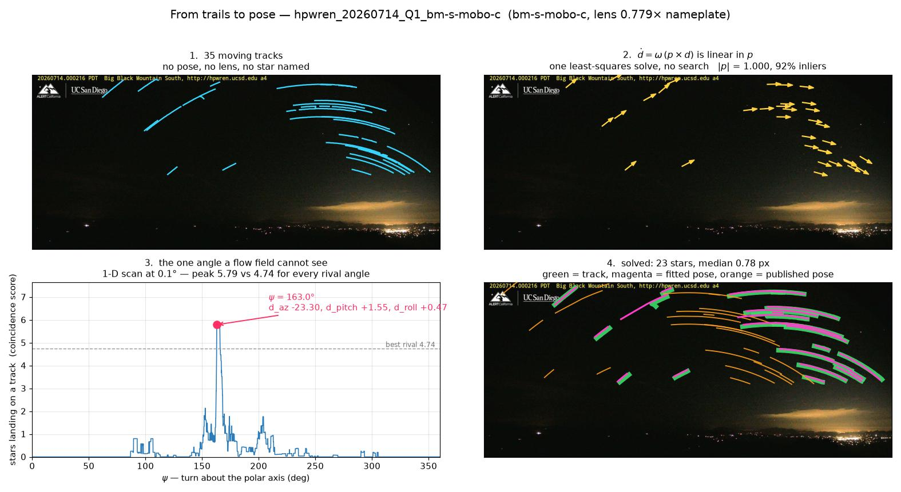
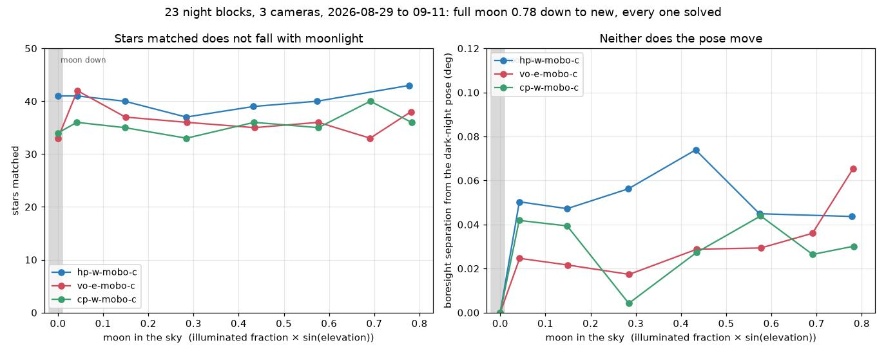
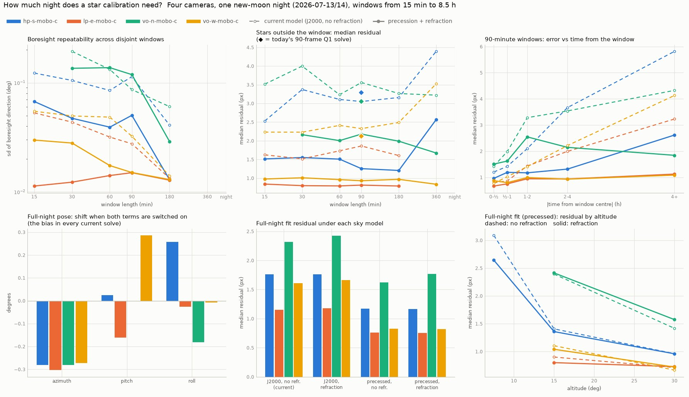

# Camera calibration from the night sky

The published HPWREN camera table is a nameplate. Azimuths are rounded to a compass quadrant,
the field of view is nominal, and there is no lens model. A bearing is only as good as that
table, so every kilometer figure in this project depends on it. Stars measure the real pose
without a site visit, from frames the cameras already record every night.


*Green: a star's track over the night. Magenta: that catalog star under the solved pose,
running inside the track. Orange: the same star under the published pose; the yellow arrows
run from one to the other.*

## How a solve works

A point that drifts at the sidereal rate is a star. Matching a night of such tracks to a star
catalog under one shared pose measures a camera's azimuth, pitch, roll and lens together. No
constellation is guessed first: the pose search scores how many catalog stars land on *any*
track, then assigns stars to whole tracks and refits.

## What the solves found

- **86 solves on 52 cameras** in the [ledger](../data/meta/pose_ledger.json), from FIgLib's
  night sequences and moonless nights pulled from HPWREN's public CDN, at a median residual of
  1.3 px and ~22 stars per solve. [Every solve, with its lens scale](figures/star_ledger.png).
- **33 of the 52 cameras point more than 1° from their published azimuth**, mlo-s-mobo-c by
  23°. Consecutive nights agree to 0.01°, except one weak lp-n-mobo-c solve (12 stars at
  2.6 px) that sits 0.25° from the nights either side. Nights two months apart agree to 0.15°.
- **Cameras do get re-aimed.** Otay Mountain's south cameras solve 10.5° off in 2019 and 0.4°
  in 2024, and Toro Peak West moved 7.5° between 2021 and 2026. So corrections are kept per
  camera *and* date, in a ledger that refuses to bridge a re-aim or a sensor change.
- **Not the lens the pipeline assumed.** Every ledger solve puts the focal scale at
  0.877–0.893 of nameplate: an equidistant fisheye spanning about ±55°, not a rectilinear ±45°.
  Near the frame edge that was worth up to 8° of bearing. Three Big Black Mountain cameras turn
  out to be a second lens group, at 0.774–0.779 ([below](#the-poles-length-measures-the-lens)).

## An independent check

A sea horizon's dip below level depends only on the camera's height. On om-w-mobo-c it lies
along the star-solved tilt, not the published level one.


## Pose from the trails, with no star named

Every trail in a frame is carried by one rotation of the sky, `ḋ = ω (p × d)`. Map the track
points into the camera's own frame through the lens alone, which needs no pose, and that
equation is linear in the celestial pole `p`. Least squares gives the pole in closed form,
with no search and no catalog. Against the 86 ledger solves the pole lands a median **0.29°**
from where they put it (81 of 86 within 2°).

The pole fixes two of the three angles. The last one, the turn about the pole, is invisible to
a flow field, so it becomes a 1-D scan at 0.1° instead of a 3-D grid search at 1°.



*bm-s-mobo-c, which had never solved. 1: tracks, with nothing named. 2: their velocities and the
closed-form pole. 3: the scan about the pole, where the peak clears the best rival angle by
5.79 to 4.74, a much thinner margin than an easy camera gets. 4: 23 stars at 0.78 px.*

### The pole's length measures the lens

The fit is given the sidereal rate, so `|p|` comes out at 1 only when the pixel-to-angle map is
right. That is why Big Black Mountain's south, west and east cameras never solved: they need
0.774–0.779 of nameplate, not the shared 0.886, a 150 px error at the frame edge.

The same number rejects frames with no coherent rotation. marconi-n, starr-n and sjh-n return
residuals at about 100% of the sidereal rate, so on the nights they were tried they show lit
cloud and noise, not a faint star field.

The measurement is weaker near the pole. Trails close to it carry little scale information, so
a north-facing camera's lens comes out 3–4% low. The solver never imposes the pole's lens: it
runs the published grid, the pole under the shared lens and the pole under the measured lens as
separate attempts, and keeps the best finished solve.

### More solves, none lost

On the 111 sequences the grid search attempted, running both methods takes **86 solves to 91
and 52 cameras to 55**. The 86 already solved keep their poses (median change 0.000°, max
0.094°). The five new solves are not yet in the ledger, so the kilometer figures in the README do
not use them.

## Moonlight does not matter

Three cameras that solve cleanly in the dark were re-solved on 23 night blocks from full moon
to new, all within two weeks. All 23 solve, star counts do not fall, and every pose stays
within 0.07° of that camera's dark-night pose.



That roughly quadruples the usable nights inside HPWREN's 90-day public window. One
qualification: the moon was above the frame on 20 of the 23 blocks, so a full moon *inside* the
frame is still untested.

## A second night is the better acceptance test

Two nights of one camera are independent measurements of one pose, and noise does not repeat
across them. Solves with 20+ stars agree with another night of the same camera to 0.01°, and
8–11-star solves to 0.3°. Star count does track reliability, but the ≥ 8 cutoff is a blunt
stand-in for checking that another night agrees.

## Prior work and other applications of astronomy to computer vision

A bearing needs only the pose, and stops there. The same frames support a much finer
alignment: Robert Quimby, Director of SDSU's Mount Laguna Observatory, fits a full
image-to-sky mapping on an HPWREN camera that predicts a star's pixel to about 0.5 px, reads a
celestial object's coordinates to a few hundredths of a degree, and resamples neighbouring
cameras onto a common grid so they pan as one panorama — [*Using the Stars for Altitude-Azimuth
Calibration of HPWREN Cameras*](https://www.hpwren.ucsd.edu/news/20240920/index.html) (HPWREN,
20 September 2024). Reprojection at that precision is what would let two towers' pixels be
compared directly, rather than only their bearings.

Solving a pose with nothing named in advance is a problem in astronomy that continues to be
refined. [astrometry.net](https://astrometry.net/) is the standard answer: it takes an image with
no prior on where it points and returns a calibrated position on the sky, by hashing geometric
patterns of four stars against an index built from a catalog. That index is built on a tangent
plane, which a super-wide field breaks — under an equidistant lens a group of stars 40° off the
boresight is sheared about 1.4:1 against its catalog shape, and 2:1 at the edge of these frames,
far past any hash tolerance. Yang et al. measure the cost directly: astrometry.net with a
second-order distortion tweak, on an all-sky frame, misses altitudes above 60° by as much as 5°,
and higher orders overfit. They fit a Kannala–Brandt series instead — odd powers of the radius,
with the optical centre offset from the zenith — and reach 0.4 px over 5170 images ([*Accurate
astrometry for images with super-wide fields of
view*](https://doi.org/10.1051/0004-6361/202452218), A&A 695, A50, 2025).

That series is worth naming, because the lens model in this project is the same one truncated
after two terms: `r = k·θ(1 + k1·θ²)`, axisymmetric, written forward where theirs is inverted, and
with the optical centre pinned to the frame centre rather than fitted as they fit it.
Kannala–Brandt is also the standard fisheye model in computer vision, which is the point of this
section: the correction a photogrammetrist reaches for and the one an all-sky astronomer reaches
for are the same series, arrived at from opposite ends.

The pole solve here does something in astrometry.net's spirit at a much smaller scale — trails
instead of point sources, and a closed-form rotation instead of an index — but the guarantee is
the same one worth wanting, that nothing about the answer was assumed going in.

Attitude from stars is also a shipped sensor, not only an analysis. Star trackers do exactly
this aboard spacecraft, fixing orientation to arcseconds from a frame of the sky, and their
lost-in-space mode is the blind case again. A fire camera has the easier version of that
problem: it is bolted down, it knows roughly where it points, and it photographs the sky every
clear night without being asked. Pose drift that a site visit would otherwise catch — a
re-aim, a loosened mount — is visible in imagery the network already stores, which makes
nightly self-calibration a reasonable thing for a detection system to expect of itself.

## The sky had moved since 2000

The star catalog is J2000, and the solver never precessed it. Over one 90-minute block the pose
absorbs the ~0.36° the sky has shifted since then. It absorbs it as a wrong rotation, though. A
whole-night study (four cameras, 600 solves on windows from 15 minutes to 8.5 hours) shows it
two ways:
- **An azimuth bias.** With precession on, every camera's boresight moves by about **−0.28° in
  azimuth**. The rest of the rotation lands in pitch or roll, depending on which way the
  camera faces.
- **Drift across the night.** A 90-minute pose predicts stars 4+ hours later 3–6 px off
  without precession, and 1–2.6 px off with it.

With precession and refraction both on, calibration window length hardly matters. On the east
and west cameras a 15-minute window predicts the rest of the night at 0.8–1.0 px, and its
boresight repeats to about 0.01–0.02°. North-facing cameras still want an hour or more, because
stars near the pole move slowly.



Since 2026-09-25 proper motion, precession and refraction are **on by default**. The catalog
file now states its own frame (ICRS), equinox and epoch (2000.0), and the solver derives the
corrections from that header. The ledger has been re-solved from the same 86 sequences: azimuth
corrections moved by a median of **−0.21°** (−0.04° to −0.32°; older FIgLib-era solves move
less because less precession had built up by then), and every entry records the sky model it
was solved under. An independent check against Skyfield puts the corrected star positions
within 0.005° of the full IAU chain. Poses quoted elsewhere in these docs from before that date
are J2000 poses. The details are in [NOTES.md](../NOTES.md).

## Running it

```sh
python -m src.figlib.stars.nights 20260911 @cams.json   # moonless-night frames from HPWREN's public CDN
python -m src.figlib.stars.run_nights                   # track, star-solve, rebuild data/meta/pose_ledger.json
python -m src.figlib.stars.moon_test                    # the moon-phase ladder
python -m src.figlib.stars.cross_night                  # night-against-night agreement
python -m src.figlib.stars.fig_solve_process            # the four-stage figure
python -m src.figlib.stars.nights --night 20260713 vo-w-mobo-c   # a whole night (Q7, Q8, Q1, Q2)
python -m src.figlib.stars.window_ablation hpwren_20260713_N_vo-w-mobo-c   # windowed solves; --summary to score
python -m src.figlib.stars.fig_window_ablation          # the window/sky-model figure
```

The full account, including the sign convention that had to be measured rather than derived, is
in [NOTES.md](../NOTES.md).
